# ClickHouse Query Execution Pipeline

---
tags:
  - clickhouse
  - vectorized-processing
  - query-execution
  - simd
  - performance
  - block-processing
---

## Query Execution Overview

ClickHouse's query execution pipeline is fundamentally different from traditional row-based databases. Instead of processing one row at a time, ClickHouse processes data in **vectorized blocks**, enabling massive performance improvements through SIMD instructions and cache optimization.

## Traditional vs Vectorized Execution

### PostgreSQL Row-by-Row Processing

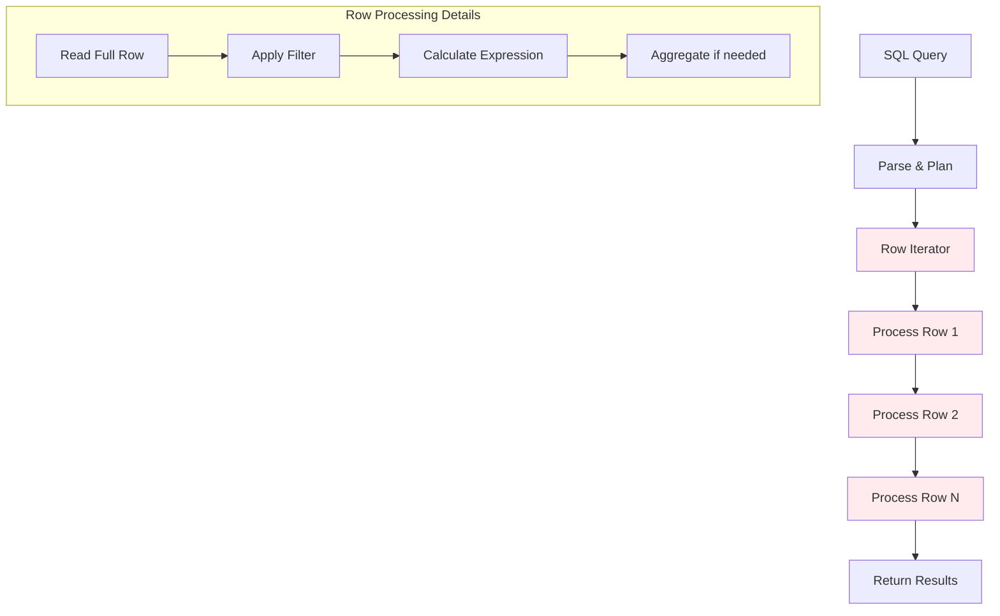

**Row-by-Row Example**:
```python
# Traditional processing approach
total = 0
for row in query_results:
    if row.order_date >= '2024-01-01':
        result = row.price * row.quantity
        total += result
return total
```

### ClickHouse Vectorized Processing

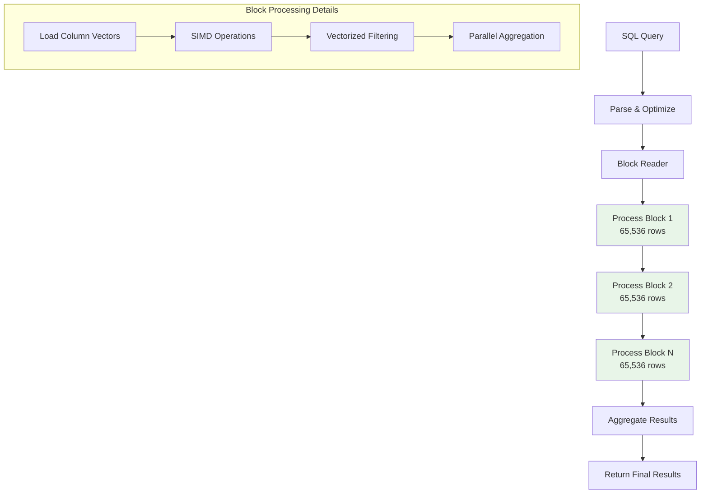

**Vectorized Example**:
```python
# ClickHouse vectorized approach
price_vector = [29.99, 15.50, 89.99, 45.00]  # 65K values
quantity_vector = [2, 1, 3, 1]                # 65K values
date_vector = ['2024-01-15', '2024-01-16', ...]

# Single SIMD instruction processes multiple values
result_vector = simd_multiply(price_vector, quantity_vector)
filtered_results = simd_filter(result_vector, date_filter)
```

## Detailed Query Execution Pipeline

### 1. Query Parsing and Analysis

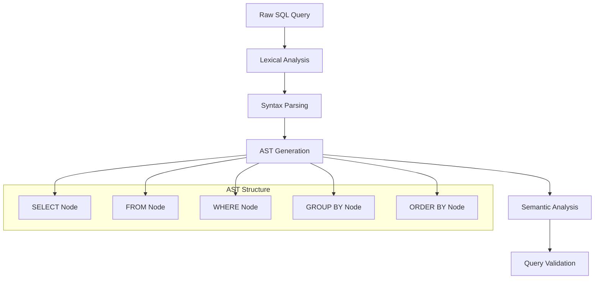

**Example Query Parsing**:
```sql
SELECT product_category, SUM(price * quantity) 
FROM orders 
WHERE order_date >= '2024-01-01'
GROUP BY product_category
ORDER BY SUM(price * quantity) DESC;
```

**Parsed AST Structure**:
- **SELECT**: Projection with aggregation function
- **FROM**: Table identification and metadata lookup
- **WHERE**: Filter predicate for partition pruning
- **GROUP BY**: Aggregation key identification
- **ORDER BY**: Sort specification for final results

### 2. Query Optimization

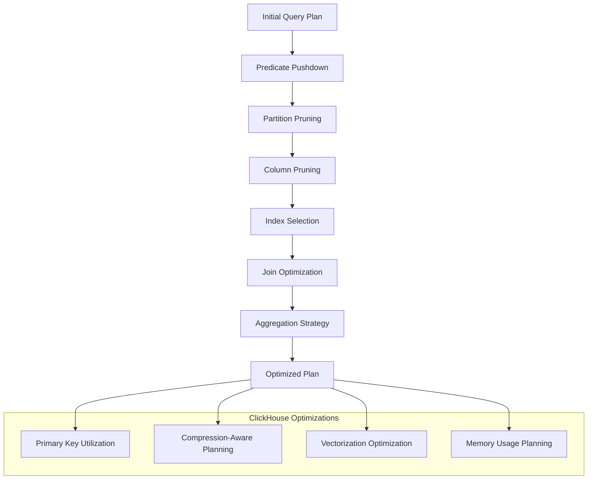

**Key Optimizations Applied**:

**Partition Pruning**:
```sql
-- Original query
WHERE order_date >= '2024-01-01'

-- Optimizer identifies relevant partitions
-- Only scans: 202401_*, 202402_*, 202403_* partitions
-- Skips: 202311_*, 202312_* partitions
```

**Column Pruning**:
```sql
-- Only reads required columns from storage
-- Required: product_category, price, quantity, order_date
-- Skipped: customer_id, shipping_address, order_notes, etc.
```

**Primary Key Optimization**:
```sql
-- If ORDER BY matches primary key order
ORDER BY (order_date, customer_id)
-- Optimizer can use merge-sort instead of full sort
```

### 3. Data Retrieval and Block Formation

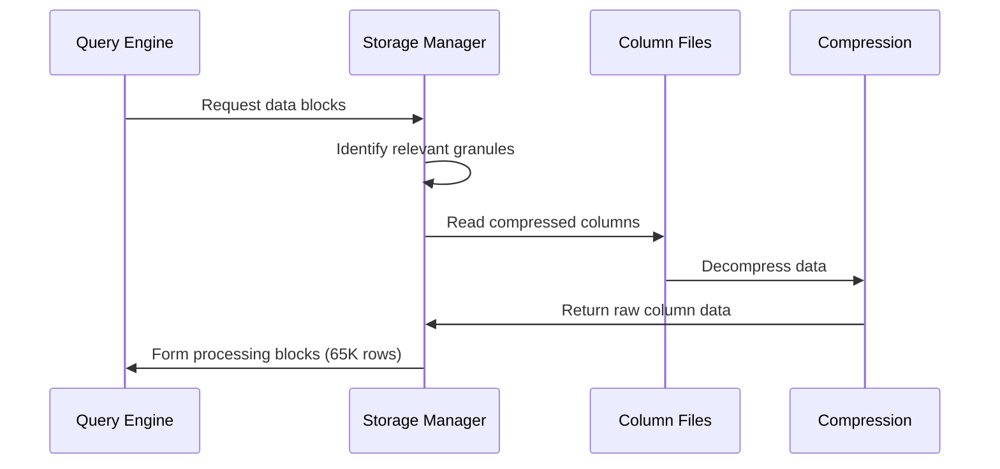

**Block Formation Process**:

1. **Granule Identification**: Storage manager identifies granules containing relevant data
2. **Column Reading**: Only required columns are read from disk
3. **Decompression**: Data decompressed in streaming fashion
4. **Block Assembly**: Data organized into processing blocks

**Default Block Parameters**:
```yaml
max_block_size: 65536              # Rows per processing block
min_chunk_bytes_for_parallel_parsing: 10485760  # 10MB minimum for parallelization
preferred_block_size_bytes: 1000000 # Target block size in bytes
```

### 4. Vectorized Operations

#### SIMD (Single Instruction, Multiple Data) Processing

```mermaid
graph LR
    subgraph "Traditional CPU Instructions"
        A1[price[0] * qty[0]]
        A2[price[1] * qty[1]]
        A3[price[2] * qty[2]]
        A4[price[3] * qty[3]]
    end
    
    subgraph "SIMD Vector Instructions"
        B[prices[0-3] × quantities[0-3]<br/>Single Instruction]
    end
    
    style A1 fill:#ffebee
    style A2 fill:#ffebee
    style A3 fill:#ffebee
    style A4 fill:#ffebee
    style B fill:#e8f5e8
```

**Vector Processing Example**:
```cpp
// Simplified ClickHouse vector operation
void vectorized_multiply(
    const Float64* prices,    // Price column
    const UInt32* quantities, // Quantity column
    Float64* results,         // Output column
    size_t count             // Block size (65536)
) {
    // Process in SIMD chunks
    for (size_t i = 0; i < count; i += 4) {
        // Load 4 values at once
        __m256d price_vec = _mm256_load_pd(&prices[i]);
        __m256d qty_vec = _mm256_load_pd(&quantities[i]);
        
        // Single instruction processes 4 multiplications
        __m256d result_vec = _mm256_mul_pd(price_vec, qty_vec);
        
        // Store 4 results at once
        _mm256_store_pd(&results[i], result_vec);
    }
}
```

#### Cache-Optimized Processing

**Memory Access Pattern**:
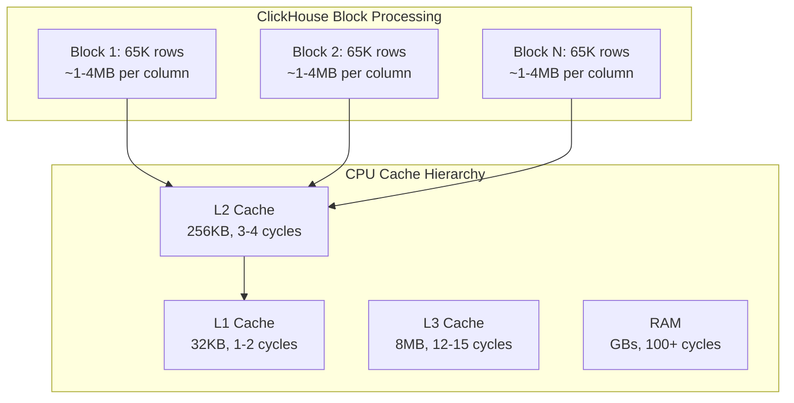

**Why 65,536 Rows Per Block?**
- **Cache Fit**: Block size designed to fit in L2/L3 cache
- **SIMD Alignment**: Optimized for vector instruction processing
- **Memory Bandwidth**: Balances throughput with memory pressure

### 5. Aggregation and Grouping

#### Hash Table-Based Aggregation

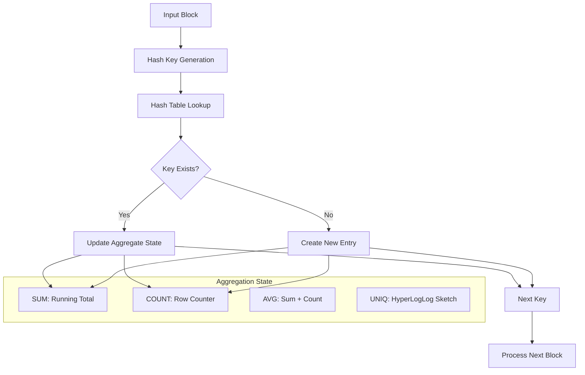

**Aggregation Example**:
```sql
-- Query
SELECT product_category, SUM(price), COUNT(*), uniq(customer_id)
FROM orders
GROUP BY product_category;

-- Internal aggregation state per group
Electronics: {
    sum_price: 150750.50,
    count: 1247,
    uniq_customers: HyperLogLog_State_Electronics
}
Books: {
    sum_price: 89234.75,
    count: 892,
    uniq_customers: HyperLogLog_State_Books
}
```

#### Memory Management for Large Aggregations

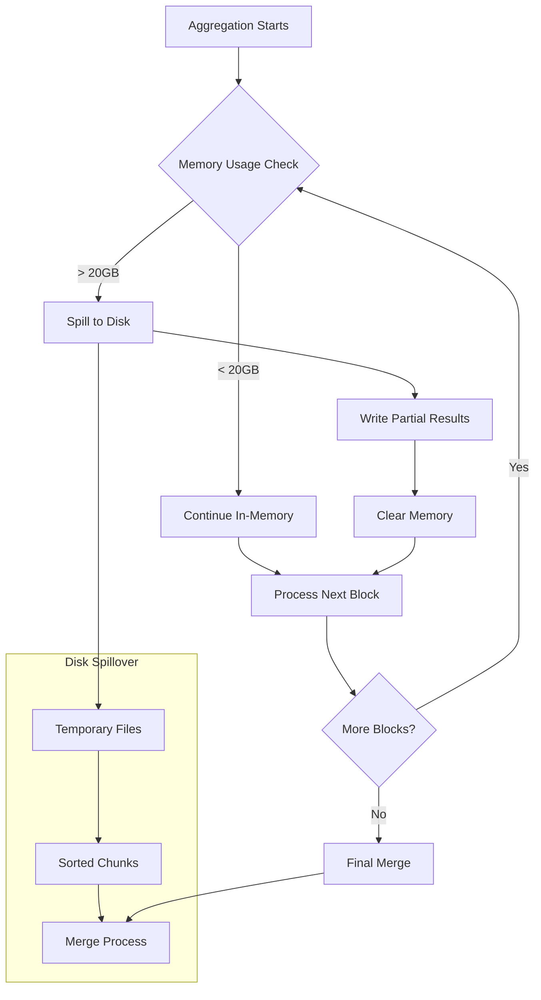

### 6. Sorting and Order By

#### Multi-threaded Parallel Sort

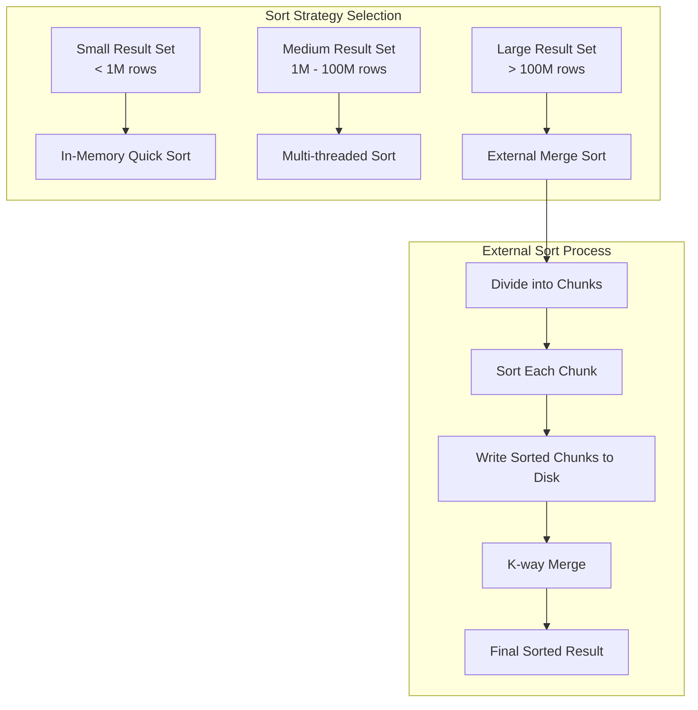

**Sort Optimization Example**:
```sql
-- Query with ORDER BY
SELECT product_category, SUM(revenue)
FROM orders
GROUP BY product_category
ORDER BY SUM(revenue) DESC
LIMIT 10;

-- Optimizer applies:
-- 1. Partial sort during aggregation
-- 2. Top-K optimization (only keep top 10)
-- 3. Parallel sorting across threads
```

### 7. Result Presentation and Client Communication

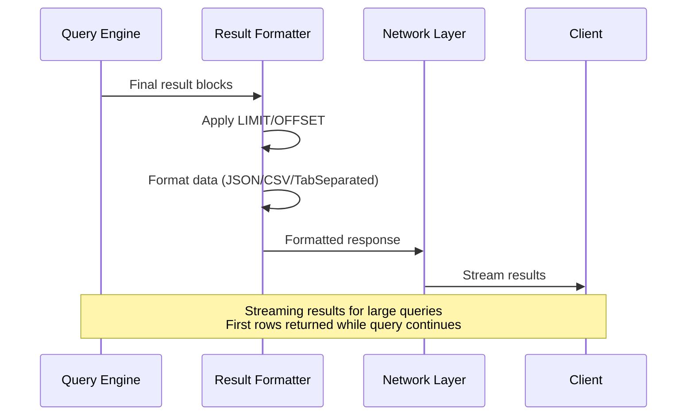

## Performance Characteristics

### Vectorization Performance Gains

| Operation Type | Scalar Processing | Vectorized Processing | Speedup |
|----------------|-------------------|----------------------|---------|
| **Arithmetic Operations** | 1 op/instruction | 4-8 ops/instruction | 4-8x |
| **Comparisons/Filters** | 1 comparison/instruction | 4-8 comparisons/instruction | 4-8x |
| **String Operations** | Variable | SIMD string processing | 2-4x |
| **Aggregations** | Linear scaling | Cache-optimized + SIMD | 3-10x |

### Memory Access Optimization

**Cache Hit Rates**:
- **L1 Cache**: >90% hit rate for block processing
- **L2 Cache**: >80% hit rate for column data
- **L3 Cache**: >70% hit rate for working set

**Memory Bandwidth Utilization**:
- **Sequential Access**: 10-20 GB/s sustained throughput
- **Random Access**: Minimized through columnar layout
- **Compression Decompression**: 5-15 GB/s depending on algorithm

## Query Processing Settings

### Block Size Configuration

```sql
-- Adjust block size for different workloads
SET max_block_size = 65536;          -- Default: Good for most cases
SET max_block_size = 32768;          -- Smaller: Less memory, more overhead
SET max_block_size = 131072;         -- Larger: More memory, better vectorization

-- Memory-constrained environments
SET max_memory_usage = 5000000000;   -- 5GB limit per query
SET max_bytes_before_external_sort = 2000000000;  -- External sort threshold
```

### Parallel Processing Configuration

```sql
-- Thread configuration
SET max_threads = 16;                -- Parallel execution threads
SET max_insert_threads = 4;          -- Parallel insertion threads
SET max_final_threads = 8;           -- FINAL optimization threads

-- Parallel aggregation
SET group_by_two_level_threshold = 100000;     -- Switch to two-level aggregation
SET group_by_two_level_threshold_bytes = 50000000; -- Memory threshold for two-level

-- Join optimization
SET join_algorithm = 'hash';         -- Hash join (default)
SET max_bytes_in_join = 1000000000; -- 1GB join hash table limit
```

### Pipeline Execution Monitoring

```sql
-- Monitor query execution pipeline
SELECT 
    query_id,
    query,
    query_duration_ms,
    memory_usage,
    read_rows,
    read_bytes,
    ProfileEvents.Values[indexOf(ProfileEvents.Names, 'SelectedRows')] as selected_rows,
    ProfileEvents.Values[indexOf(ProfileEvents.Names, 'SelectedBytes')] as selected_bytes
FROM system.query_log
WHERE event_time >= now() - INTERVAL 1 HOUR
  AND type = 'QueryFinish'
ORDER BY query_duration_ms DESC;

-- Analyze pipeline execution details  
EXPLAIN PIPELINE 
SELECT product_category, SUM(price * quantity)
FROM orders 
WHERE order_date >= '2024-01-01'
GROUP BY product_category;
```

## Advanced Query Execution Features

### Adaptive Query Processing

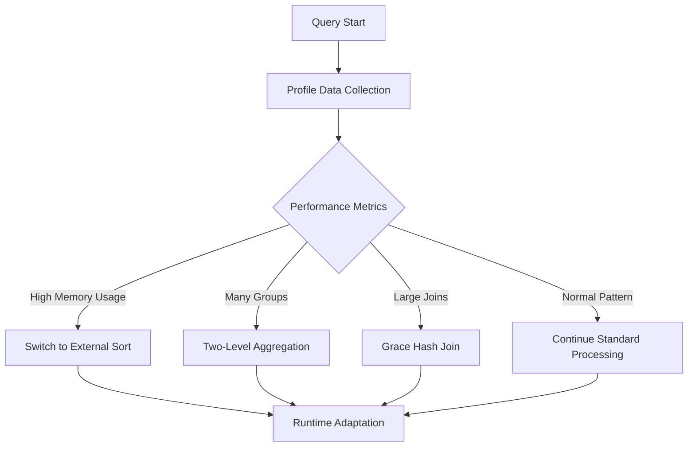

**Adaptive Behaviors**:
- **Memory Pressure**: Automatically spill large operations to disk
- **Cardinality Detection**: Switch aggregation algorithms based on group count
- **Join Strategy**: Choose optimal join algorithm based on data size
- **Parallel Degree**: Adjust thread count based on system load

### Query Result Streaming

```sql
-- Enable result streaming for large queries
SET max_result_rows = 0;             -- No limit on result size
SET result_overflow_mode = 'break';   -- Handle large results
SET output_format_parallel_formatting = 1; -- Parallel result formatting

-- Stream results as they become available
SELECT product_category, daily_revenue, cumulative_revenue
FROM (
    SELECT 
        product_category,
        sum(revenue) as daily_revenue,
        sum(revenue) OVER (PARTITION BY product_category ORDER BY date) as cumulative_revenue
    FROM daily_sales
    ORDER BY date, product_category
)
-- Results stream to client as each day is processed
```

### Query Cancellation and Timeout

```sql
-- Query timeout settings
SET max_execution_time = 300;        -- 5 minutes max execution
SET timeout_before_checking_execution_speed = 10; -- Check speed after 10 seconds
SET min_execution_speed = 1000000;   -- Minimum 1M rows/second
SET max_execution_speed = 0;         -- No speed limit

-- Cancel slow queries automatically
SET timeout_overflow_mode = 'break'; -- Cancel on timeout
```

## Execution Plan Analysis

### Understanding EXPLAIN Output

```sql
-- Basic execution plan
EXPLAIN 
SELECT customer_id, SUM(total_amount), COUNT(*)
FROM orders 
WHERE order_date >= '2024-01-01'
GROUP BY customer_id;

/*
Output:
Expression (Projection + Before ORDER BY)
  Aggregating
    Expression (Before GROUP BY)
      Filter (WHERE)
        ReadFromMergeTree (orders)
*/

-- Detailed pipeline analysis
EXPLAIN PIPELINE
SELECT customer_id, SUM(total_amount), COUNT(*)
FROM orders 
WHERE order_date >= '2024-01-01'
GROUP BY customer_id;

/*
Output shows:
- Number of threads per stage
- Data flow between pipeline stages  
- Memory usage per stage
- Parallelization strategy
*/
```

### Performance Analysis Tools

```sql
-- Analyze query performance characteristics
SELECT 
    name,
    value,
    description
FROM system.events
WHERE name IN (
    'Query',
    'SelectedRows', 
    'SelectedBytes',
    'FilteredRows',
    'CompressedReadBufferBytes',
    'UncompressedCacheHits',
    'UncompressedCacheMisses'
);

-- Profile query execution stages
SET send_logs_level = 'debug';
SET log_queries = 1;
SET log_query_settings = 1;

-- Your query here - detailed logs will show:
-- - Time spent in each pipeline stage
-- - Memory allocation patterns  
-- - I/O operations and compression ratios
-- - Thread utilization across stages
```

## Query Execution Best Practices

### Optimize for Vectorization

```sql
-- Good: Operates on entire columns
SELECT product_category, AVG(price)
FROM orders
WHERE order_date >= '2024-01-01'
GROUP BY product_category;

-- Suboptimal: Row-by-row function calls
SELECT product_category, 
       avgIf(price, price > 0)  -- Conditional aggregation still vectorized
FROM orders  
WHERE order_date >= '2024-01-01'
GROUP BY product_category;

-- Avoid: Complex nested queries that break vectorization
SELECT * FROM (
    SELECT *, ROW_NUMBER() OVER (PARTITION BY customer_id ORDER BY order_date) as rn
    FROM orders
) WHERE rn = 1;  -- Use LIMIT 1 BY instead for better performance
```

### Memory-Conscious Query Design

```sql
-- Memory-efficient aggregation
SELECT 
    toStartOfMonth(order_date) as month,
    product_category,
    SUM(price) as revenue,
    uniq(customer_id) as unique_customers  -- Uses HyperLogLog, constant memory
FROM orders
GROUP BY month, product_category
ORDER BY month, revenue DESC;

-- Memory-intensive pattern to avoid
SELECT 
    customer_id,
    groupArray(order_date) as all_order_dates,  -- Stores all values in memory
    groupArray(product_name