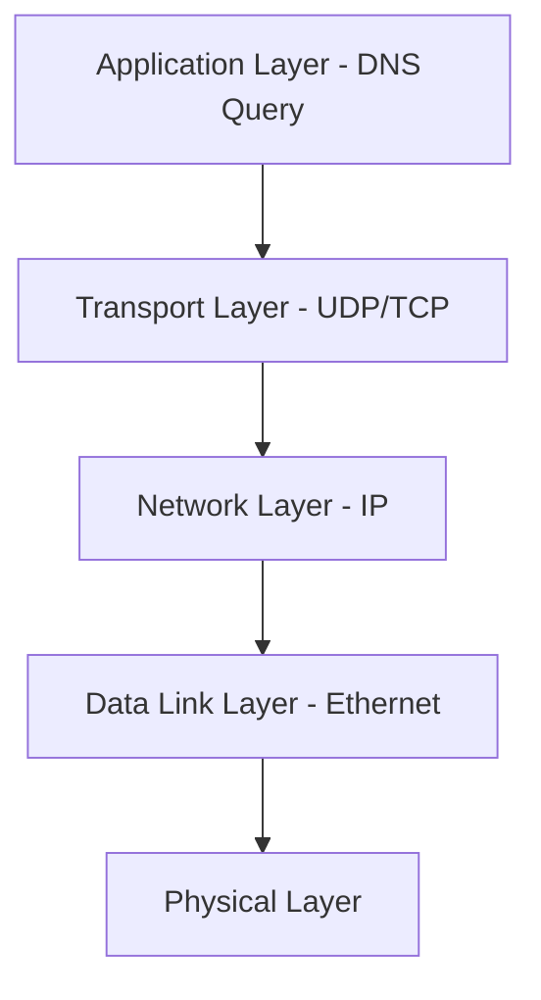
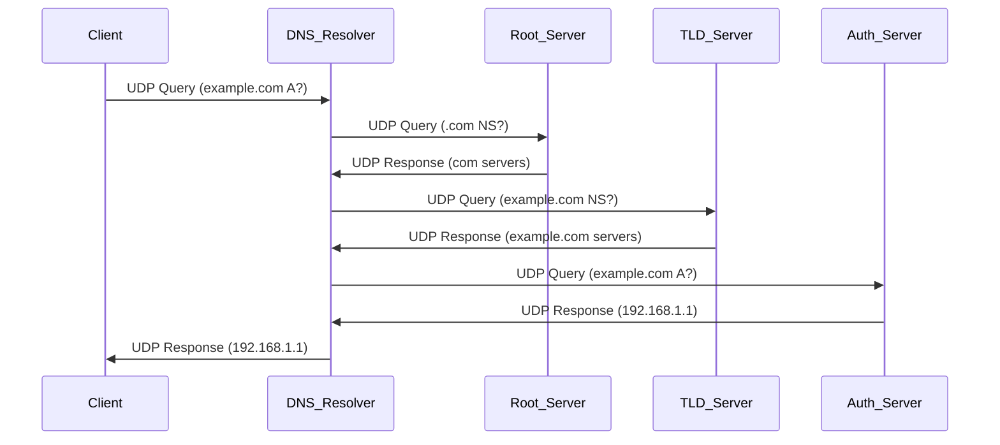

---
tags:
  - dns-network-stack
  - transport-layer
  - udp-tcp
  - packet-structure
---

## DNS Network Stack Overview

DNS operates primarily at **Application Layer (Layer 7)** but utilizes **UDP (Layer 4)** for transport, with **TCP fallback** for larger responses.



## Transport Protocols

### UDP (Primary)
- **Port**: 53
- **Packet size limit**: 512 bytes (original), 4096 bytes (EDNS)
- **Advantage**: Low latency, connectionless
- **Use case**: Standard queries and responses

### TCP (Fallback)
- **Port**: 53
- **When used**: 
  - Response > 512 bytes
  - Zone transfers (AXFR/IXFR)
  - DNS over TLS (DoT)
- **Overhead**: Connection establishment

## DNS Packet Structure

### Header Format (12 bytes)
```
 0  1  2  3  4  5  6  7  8  9  A  B  C  D  E  F
+--+--+--+--+--+--+--+--+--+--+--+--+--+--+--+--+
|                      ID                       |
+--+--+--+--+--+--+--+--+--+--+--+--+--+--+--+--+
|QR|   Opcode  |AA|TC|RD|RA|   Z    |   RCODE   |
+--+--+--+--+--+--+--+--+--+--+--+--+--+--+--+--+
|                    QDCOUNT                    |
+--+--+--+--+--+--+--+--+--+--+--+--+--+--+--+--+
|                    ANCOUNT                    |
+--+--+--+--+--+--+--+--+--+--+--+--+--+--+--+--+
|                    NSCOUNT                    |
+--+--+--+--+--+--+--+--+--+--+--+--+--+--+--+--+
|                    ARCOUNT                    |
+--+--+--+--+--+--+--+--+--+--+--+--+--+--+--+--+
```

### Key Fields
- **ID**: Query identifier for matching responses
- **QR**: Query (0) or Response (1)
- **RD**: Recursion Desired
- **RA**: Recursion Available
- **TC**: Truncated (switch to TCP)

## Query Flow Through Network Stack



## Network Performance Characteristics

### UDP Benefits
- **RTT**: Single round-trip for simple queries
- **Overhead**: 8-byte UDP header vs 20-byte TCP header
- **Connection state**: None - fire and forget

### TCP Overhead
- **3-way handshake**: +1.5 RTT before DNS query
- **Connection teardown**: +1 RTT after response
- **Total penalty**: +2.5 RTT per query

### Size Constraints
- **Original DNS**: 512-byte UDP limit
- **EDNS0**: Advertises larger UDP buffer (typically 4096 bytes)
- **TCP fallback**: Triggered by TC (Truncated) flag

## Security Considerations at Network Layer

### DNS over HTTPS (DoH)
- **Transport**: HTTPS (TCP 443)
- **Encryption**: TLS 1.2+
- **Overhead**: HTTP/2 framing + TLS

### DNS over TLS (DoT)
- **Transport**: TLS over TCP (port 853)
- **Encryption**: Direct TLS connection
- **Performance**: Better than DoH due to no HTTP overhead

### Traditional DNS Vulnerabilities
- **Plain text**: All queries visible
- **Cache poisoning**: Forged responses
- **Man-in-the-middle**: Response manipulation

## Caching Behavior

### Client-side Caching
- **OS resolver cache**: Typically 60-300 seconds
- **Browser cache**: Separate DNS cache with shorter TTLs

### Recursive Resolver Caching
- **TTL-based**: Cache duration from authoritative response
- **Negative caching**: Cache NXDOMAIN responses
- **Cache hierarchy**: Different TTLs for different record types


## Network Optimization Patterns

### Query Minimization (RFC 7816)
- Send minimal information to each level
- Reduces information leakage
- May increase query count but improves privacy

### Aggressive NSEC Caching
- Cache negative responses more aggressively
- Reduces queries for non-existent domains

### Connection Reuse
- TCP connection pooling for DoH/DoT
- Reduces handshake overhead for multiple queries

## Error Handling at Network Layer

### UDP Timeout Handling
- **Initial timeout**: 1-2 seconds
- **Retry logic**: Exponential backoff
- **Server selection**: Round-robin or priority-based

### TCP Fallback Triggers
- **TC flag set**: Response truncated
- **UDP timeout**: After retry attempts
- **Large query**: EDNS0 buffer exceeded

---

**Related**: Network troubleshooting tools - dig, nslookup, tcpdump for DNS analysis