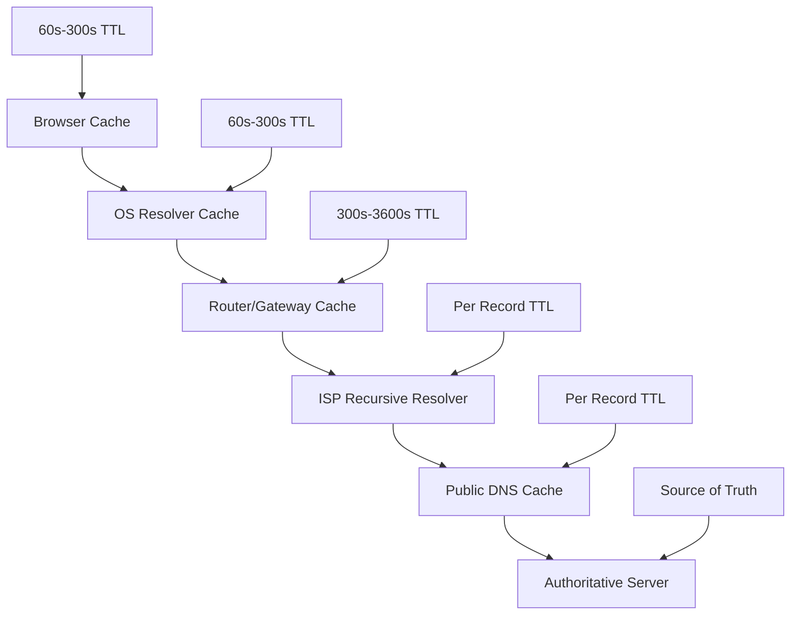
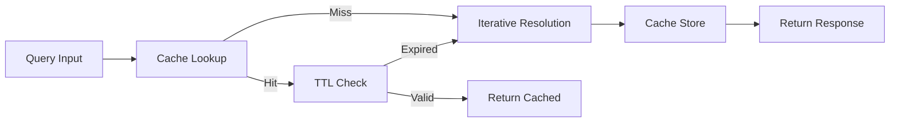
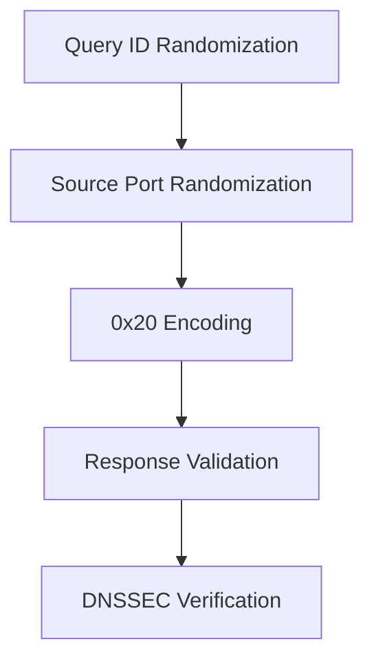

---
tags:
  - dns-network-stack
  - dns-caching
  - performance-optimization
  - cache-hierarchy
  - ttl-management
---

# DNS Caching Architecture

Multi-layer caching system reduces query latency and DNS infrastructure load. Cache hierarchy spans from browser to authoritative servers.

## Cache Hierarchy Overview



## Browser Cache Layer

### Cache Characteristics
- **Duration**: 60-300 seconds (browser dependent)
- **Isolation**: Per-tab or per-process caching
- **Override**: Separate from OS resolver cache
- **Size**: Limited entries (typically 1000-2000)

### Cache Behavior
```
Cache Key: (hostname, record_type)
Storage: In-memory hash table
Eviction: LRU + TTL expiration
```

### Browser-Specific Implementations
- **Chrome**: 60s default, max 300s
- **Firefox**: 60s default, configurable
- **Safari**: Follows OS cache more closely
- **Edge**: Similar to Chrome behavior

## OS Resolver Cache

### Windows DNS Client
```
Service: DNS Client (dnscache)
Location: %SystemRoot%\System32\dns
Default TTL: Minimum of record TTL or 86400s
Cache size: ~2MB default
```

### Linux systemd-resolved
```
Location: /run/systemd/resolve/
Default TTL: Per record, max 30s-5m
Cache entries: ~4096 default
Negative cache: 30s for NXDOMAIN
```

### macOS mDNSResponder
```
Process: mDNSResponder daemon
Cache duration: Record TTL, min 30s
Flush command: sudo dscacheutil -flushcache
```

## Router/Gateway Cache

### Consumer Router Caching
- **Cache size**: 50-500 entries
- **TTL handling**: Often ignores record TTL
- **Default duration**: 300-3600 seconds
- **Firmware dependency**: Varies by manufacturer

### Enterprise Gateway Caching
- **Policy-based**: Custom TTL overrides
- **Size**: Thousands of entries
- **Monitoring**: Cache hit/miss metrics
- **Integration**: LDAP/AD integration

## Recursive Resolver Architecture



### Cache Structure
```
Key: (qname, qtype, qclass)
Value: {
    rdata: response_data,
    ttl: time_to_live,
    timestamp: cache_time,
    authority: authoritative_flag
}
```

### ISP Recursive Resolvers
- **Cache capacity**: 10M-100M+ records
- **Geographic distribution**: Regional cache clusters
- **Refresh strategy**: Proactive pre-expiry refresh
- **Negative caching**: NXDOMAIN/NODATA per RFC 2308

### Public DNS Services

#### Google Public DNS (8.8.8.8)
- **Cache TTL**: Respects record TTL (min 30s)
- **Negative cache**: 300s for NXDOMAIN
- **Cache sharing**: Global anycast infrastructure
- **Security**: DNSSEC validation

#### Cloudflare DNS (1.1.1.1)
- **Cache TTL**: Respects record TTL (min 60s)
- **Privacy focus**: Purge logs within 24h
- **Performance**: Sub-10ms response times
- **Security**: Malware/phishing filtering

## TTL Management Strategies

### Authoritative Server TTL Settings
```
Record Type     Typical TTL    Reasoning
A/AAAA         300-3600s      Balance change flexibility/performance
CNAME          300-3600s      May need rapid alias changes  
MX             3600-86400s    Mail routing stability
NS             86400s+        Delegation stability
SOA            86400s+        Zone parameter stability
TXT (SPF)      300-3600s      Policy change flexibility
SRV            300-3600s      Service endpoint changes
```

### Dynamic TTL Patterns
- **Short TTL**: Planned maintenance (60-300s)
- **Long TTL**: Stable services (3600-86400s)
- **Adaptive TTL**: Traffic-based adjustments

## Cache Coherence Mechanisms

### Cache Poisoning Prevention


### Cache Validation
- **Bailiwick checking**: Responses must match query authority
- **Query ID matching**: 16-bit transaction ID verification
- **Source validation**: Response from queried server
- **DNSSEC**: Cryptographic response validation

## Negative Caching (RFC 2308)

### NXDOMAIN Caching
- **Duration**: SOA minimum TTL (typically 300-3600s)
- **Scope**: Entire domain non-existence
- **Storage**: Separate negative cache structure

### NODATA Caching
- **Duration**: SOA minimum TTL
- **Scope**: Record type non-existence for domain
- **Efficiency**: Prevents repeated queries for missing types

## Cache Performance Optimization

### Cache Hit Ratio Calculation
```
Hit Ratio = (Cache Hits) / (Total Queries) × 100%
Target: >85% for recursive resolvers
Factors: TTL settings, query patterns, cache size
```

### Prefetching Strategies
- **TTL-based**: Refresh at 75-90% of TTL
- **Popular records**: Proactive refresh for high-query domains
- **Predictive**: Machine learning for query prediction

### Cache Warming
- **Cold start**: Pre-populate common records
- **Zone walking**: Enumerate popular domains
- **Query replay**: Historical query pattern replay

## Memory Management

### Cache Size Limits
```
Layer                Memory Limit    Eviction Policy
Browser             10-50MB         LRU + TTL
OS Resolver         1-10MB          LRU + TTL  
Recursive Resolver  1-100GB         LRU + TTL + Frequency
```

### Eviction Algorithms
- **LRU**: Least recently used
- **TTL expiry**: Time-based removal
- **Frequency-based**: Adaptive replacement cache (ARC)
- **Size-based**: Large record penalty

## Cache Synchronization

### Multi-Server Cache Consistency
- **Cache clusters**: Shared cache state
- **Anycast routing**: Geographic load distribution
- **Replication delay**: Eventual consistency model
- **Partition tolerance**: Independent cache operation

## Monitoring and Metrics

### Key Performance Indicators
```
Metric              Target Range    Monitoring
Cache Hit Ratio     >85%           Per-layer tracking
Average TTL         300-3600s      Record type breakdown
Cache Size          <80% capacity  Memory utilization
Query Latency       <10ms          P95/P99 percentiles
```

### Cache Analytics
- **Query patterns**: Popular domains, record types
- **Geographic distribution**: Regional cache performance
- **Time-based patterns**: Daily/weekly query cycles
- **Anomaly detection**: Cache poisoning attempts

## Security Considerations

### Cache Poisoning Attacks
- **Birthday attack**: Query ID collision
- **Response injection**: Forged responses
- **Subdomain enumeration**: Cache side-channel attacks

### Mitigation Strategies
- **Query randomization**: ID, source port, case variation
- **Response validation**: Strict bailiwick checking
- **Rate limiting**: Query frequency controls
- **DNSSEC**: Cryptographic validation

## Troubleshooting Cache Issues

### Common Problems
- **Stale records**: Long TTL with changed data
- **Cache pollution**: Incorrect records cached
- **Negative cache hits**: Blocking valid resolutions
- **Memory pressure**: Cache eviction under load

### Diagnostic Commands
```bash
# Windows
ipconfig /displaydns
ipconfig /flushdns

# Linux
systemd-resolve --status
systemd-resolve --flush-caches

# macOS  
sudo dscacheutil -cachedump
sudo dscacheutil -flushcache
```

---

**Related**: Network Protocol Stack, DNS packet structure, query optimization patterns---
tags:
  - dns-network-stack
  - dns-caching
  - performance-optimization
  - cache-hierarchy
  - ttl-management
---

# DNS Caching Architecture

Multi-layer caching system reduces query latency and DNS infrastructure load. Cache hierarchy spans from browser to authoritative servers.

## Cache Hierarchy Overview


## Browser Cache Layer

### Cache Characteristics
- **Duration**: 60-300 seconds (browser dependent)
- **Isolation**: Per-tab or per-process caching
- **Override**: Separate from OS resolver cache
- **Size**: Limited entries (typically 1000-2000)

### Cache Behavior
```
Cache Key: (hostname, record_type)
Storage: In-memory hash table
Eviction: LRU + TTL expiration
```

### Browser-Specific Implementations
- **Chrome**: 60s default, max 300s
- **Firefox**: 60s default, configurable
- **Safari**: Follows OS cache more closely
- **Edge**: Similar to Chrome behavior

## OS Resolver Cache

### Windows DNS Client
```
Service: DNS Client (dnscache)
Location: %SystemRoot%\System32\dns
Default TTL: Minimum of record TTL or 86400s
Cache size: ~2MB default
```

### Linux systemd-resolved
```
Location: /run/systemd/resolve/
Default TTL: Per record, max 30s-5m
Cache entries: ~4096 default
Negative cache: 30s for NXDOMAIN
```

### macOS mDNSResponder
```
Process: mDNSResponder daemon
Cache duration: Record TTL, min 30s
Flush command: sudo dscacheutil -flushcache
```

## Router/Gateway Cache

### Consumer Router Caching
- **Cache size**: 50-500 entries
- **TTL handling**: Often ignores record TTL
- **Default duration**: 300-3600 seconds
- **Firmware dependency**: Varies by manufacturer

### Enterprise Gateway Caching
- **Policy-based**: Custom TTL overrides
- **Size**: Thousands of entries
- **Monitoring**: Cache hit/miss metrics
- **Integration**: LDAP/AD integration

## Recursive Resolver Architecture


### Cache Structure
```
Key: (qname, qtype, qclass)
Value: {
    rdata: response_data,
    ttl: time_to_live,
    timestamp: cache_time,
    authority: authoritative_flag
}
```

### ISP Recursive Resolvers
- **Cache capacity**: 10M-100M+ records
- **Geographic distribution**: Regional cache clusters
- **Refresh strategy**: Proactive pre-expiry refresh
- **Negative caching**: NXDOMAIN/NODATA per RFC 2308

### Public DNS Services

#### Google Public DNS (8.8.8.8)
- **Cache TTL**: Respects record TTL (min 30s)
- **Negative cache**: 300s for NXDOMAIN
- **Cache sharing**: Global anycast infrastructure
- **Security**: DNSSEC validation

#### Cloudflare DNS (1.1.1.1)
- **Cache TTL**: Respects record TTL (min 60s)
- **Privacy focus**: Purge logs within 24h
- **Performance**: Sub-10ms response times
- **Security**: Malware/phishing filtering

## TTL Management Strategies

### Authoritative Server TTL Settings
```
Record Type     Typical TTL    Reasoning
A/AAAA         300-3600s      Balance change flexibility/performance
CNAME          300-3600s      May need rapid alias changes  
MX             3600-86400s    Mail routing stability
NS             86400s+        Delegation stability
SOA            86400s+        Zone parameter stability
TXT (SPF)      300-3600s      Policy change flexibility
SRV            300-3600s      Service endpoint changes
```

### Dynamic TTL Patterns
- **Short TTL**: Planned maintenance (60-300s)
- **Long TTL**: Stable services (3600-86400s)
- **Adaptive TTL**: Traffic-based adjustments

## Cache Coherence Mechanisms

### Cache Poisoning Prevention


### Cache Validation
- **Bailiwick checking**: Responses must match query authority
- **Query ID matching**: 16-bit transaction ID verification
- **Source validation**: Response from queried server
- **DNSSEC**: Cryptographic response validation

## Negative Caching (RFC 2308)

### NXDOMAIN Caching
- **Duration**: SOA minimum TTL (typically 300-3600s)
- **Scope**: Entire domain non-existence
- **Storage**: Separate negative cache structure

### NODATA Caching
- **Duration**: SOA minimum TTL
- **Scope**: Record type non-existence for domain
- **Efficiency**: Prevents repeated queries for missing types

## Cache Performance Optimization

### Cache Hit Ratio Calculation
```
Hit Ratio = (Cache Hits) / (Total Queries) × 100%
Target: >85% for recursive resolvers
Factors: TTL settings, query patterns, cache size
```

### Prefetching Strategies
- **TTL-based**: Refresh at 75-90% of TTL
- **Popular records**: Proactive refresh for high-query domains
- **Predictive**: Machine learning for query prediction

### Cache Warming
- **Cold start**: Pre-populate common records
- **Zone walking**: Enumerate popular domains
- **Query replay**: Historical query pattern replay

## Memory Management

### Cache Size Limits
```
Layer                Memory Limit    Eviction Policy
Browser             10-50MB         LRU + TTL
OS Resolver         1-10MB          LRU + TTL  
Recursive Resolver  1-100GB         LRU + TTL + Frequency
```

### Eviction Algorithms
- **LRU**: Least recently used
- **TTL expiry**: Time-based removal
- **Frequency-based**: Adaptive replacement cache (ARC)
- **Size-based**: Large record penalty

## Cache Synchronization

### Multi-Server Cache Consistency
- **Cache clusters**: Shared cache state
- **Anycast routing**: Geographic load distribution
- **Replication delay**: Eventual consistency model
- **Partition tolerance**: Independent cache operation

## Monitoring and Metrics

### Key Performance Indicators
```
Metric              Target Range    Monitoring
Cache Hit Ratio     >85%           Per-layer tracking
Average TTL         300-3600s      Record type breakdown
Cache Size          <80% capacity  Memory utilization
Query Latency       <10ms          P95/P99 percentiles
```

### Cache Analytics
- **Query patterns**: Popular domains, record types
- **Geographic distribution**: Regional cache performance
- **Time-based patterns**: Daily/weekly query cycles
- **Anomaly detection**: Cache poisoning attempts

## Security Considerations

### Cache Poisoning Attacks
- **Birthday attack**: Query ID collision
- **Response injection**: Forged responses
- **Subdomain enumeration**: Cache side-channel attacks

### Mitigation Strategies
- **Query randomization**: ID, source port, case variation
- **Response validation**: Strict bailiwick checking
- **Rate limiting**: Query frequency controls
- **DNSSEC**: Cryptographic validation

## Troubleshooting Cache Issues

### Common Problems
- **Stale records**: Long TTL with changed data
- **Cache pollution**: Incorrect records cached
- **Negative cache hits**: Blocking valid resolutions
- **Memory pressure**: Cache eviction under load

### Diagnostic Commands
```bash
# Windows
ipconfig /displaydns
ipconfig /flushdns

# Linux
systemd-resolve --status
systemd-resolve --flush-caches

# macOS  
sudo dscacheutil -cachedump
sudo dscacheutil -flushcache
```

---

**Related**: Network Protocol Stack, DNS packet structure, query optimization patterns