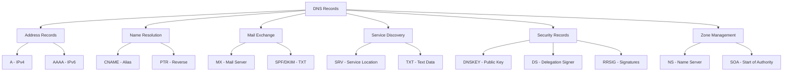
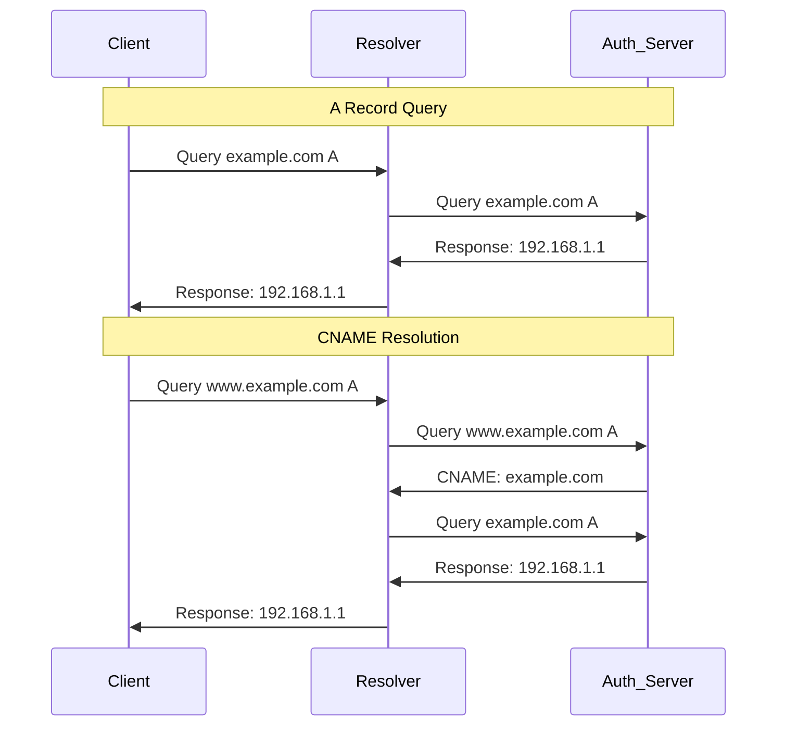

---
tags:
  - dns-network-stack
  - dns-records
  - resource-records
  - dns-structure
  - transport-layer
---

# DNS Record Types

DNS resource records (RR) structure domain name resolution. Each record type serves specific purpose in DNS hierarchy.

## Record Structure Format
```
NAME    TTL    CLASS    TYPE    RDATA
```

- **NAME**: Domain name (FQDN or relative)
- **TTL**: Time to live (seconds)
- **CLASS**: IN (Internet) - standard class
- **TYPE**: Record type identifier
- **RDATA**: Type-specific data

## Record Categories



## Address Records

### A Record (IPv4)
- **Purpose**: Maps domain to IPv4 address
- **Format**: `example.com. 300 IN A 192.168.1.1`
- **TTL**: Usually 300-3600 seconds
- **Usage**: Primary web/service resolution

### AAAA Record (IPv6)
- **Purpose**: Maps domain to IPv6 address
- **Format**: `example.com. 300 IN AAAA 2001:db8::1`
- **Size**: 128-bit address vs 32-bit IPv4
- **Dual-stack**: Often paired with A records

## Name Resolution Records

### CNAME Record (Canonical Name)
- **Purpose**: Alias one domain to another
- **Format**: `www.example.com. 300 IN CNAME example.com.`
- **Restriction**: Cannot coexist with other records at same name
- **Chain limit**: Typically 10 CNAME hops maximum

### PTR Record (Pointer)
- **Purpose**: Reverse DNS - IP to domain
- **Format**: `1.1.168.192.in-addr.arpa. 300 IN PTR example.com.`
- **Usage**: Email validation, security verification
- **IPv6**: Uses `ip6.arpa` domain

## Zone Management Records

### SOA Record (Start of Authority)
- **Purpose**: Zone authority and parameters
- **Format**: 
```
example.com. 86400 IN SOA ns1.example.com. admin.example.com. (
    2024082301  ; serial
    3600        ; refresh
    1800        ; retry
    604800      ; expire
    86400       ; minimum TTL
)
```
- **Serial**: Version number for zone transfers
- **Refresh**: Secondary server refresh interval

### NS Record (Name Server)
- **Purpose**: Delegates zone to name servers
- **Format**: `example.com. 86400 IN NS ns1.example.com.`
- **Delegation**: Required at zone boundaries
- **Glue records**: A/AAAA for in-zone name servers

## Mail Exchange Records

### MX Record (Mail Exchange)
- **Purpose**: Specifies mail servers for domain
- **Format**: `example.com. 3600 IN MX 10 mail.example.com.`
- **Priority**: Lower numbers = higher priority
- **Fallback**: Multiple MX records for redundancy

### TXT Record (Text Data)
- **Purpose**: Arbitrary text data
- **SPF**: `"v=spf1 include:_spf.google.com ~all"`
- **DKIM**: `"v=DKIM1; k=rsa; p=MIGfMA0G..."`
- **DMARC**: `"v=DMARC1; p=quarantine; ruf=mailto:dmarc@example.com"`
- **Verification**: Domain ownership validation

## Service Discovery Records

### SRV Record (Service)
- **Purpose**: Service location information
- **Format**: `_service._proto.domain. TTL IN SRV priority weight port target`
- **Example**: `_sip._tcp.example.com. 3600 IN SRV 10 5 5060 sip.example.com.`
- **Fields**:
  - Priority: Service preference (lower = preferred)
  - Weight: Load distribution
  - Port: Service port number
  - Target: Server hostname

### CAA Record (Certification Authority Authorization)
- **Purpose**: Specify allowed certificate authorities
- **Format**: `example.com. 3600 IN CAA 0 issue "letsencrypt.org"`
- **Flags**: Critical flag (0/128)
- **Tag**: issue, issuewild, iodef

## Security Records (DNSSEC)

### DNSKEY Record
- **Purpose**: Public key for zone signing
- **Format**: Contains algorithm, key data
- **Types**: ZSK (Zone Signing Key), KSK (Key Signing Key)
- **Algorithm**: RSA/SHA-256, ECDSA most common

### DS Record (Delegation Signer)
- **Purpose**: Establishes trust chain
- **Location**: Parent zone points to child DNSKEY
- **Hash**: SHA-1, SHA-256 digest of DNSKEY

### RRSIG Record
- **Purpose**: Digital signature of RRset
- **Coverage**: Signs all records of same type/name
- **Expiration**: Signature validity period

## Record Interaction Patterns



## Packet Size Considerations

### UDP Limitations
- **Original limit**: 512 bytes total packet
- **EDNS0**: Advertise larger buffer (4096 bytes typical)
- **TC flag**: Truncation triggers TCP fallback

### Record Size Impact
- **A/AAAA**: Fixed size (4/16 bytes)
- **TXT**: Variable, can be large (SPF/DKIM)
- **SRV**: Medium size with target name
- **DNSKEY**: Large RSA keys may force TCP

## Caching Behavior by Type

### Short TTL Records
- **A/AAAA**: 300-3600 seconds (frequent changes)
- **MX**: 3600-86400 seconds (stable mail routing)

### Long TTL Records
- **NS**: 86400+ seconds (stable delegation)
- **SOA**: 86400+ seconds (zone parameters)

### Negative Caching
- **NXDOMAIN**: Cached per SOA minimum TTL
- **NODATA**: No record of requested type exists

## Common Query Patterns

### Web Resolution
1. Query A/AAAA for domain
2. Optional CNAME resolution
3. Return IP addresses

### Mail Delivery
1. Query MX for recipient domain
2. Query A/AAAA for mail server
3. Optional PTR verification

### Service Discovery
1. Query SRV for service
2. Query A/AAAA for target servers
3. Connect to service ports

---

**Related**: Network Protocol Stack, DNS packet structure, EDNS0 extensions