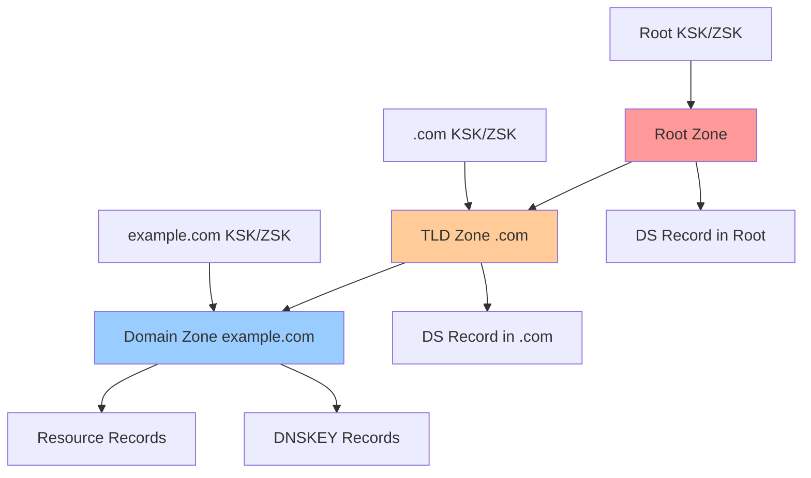
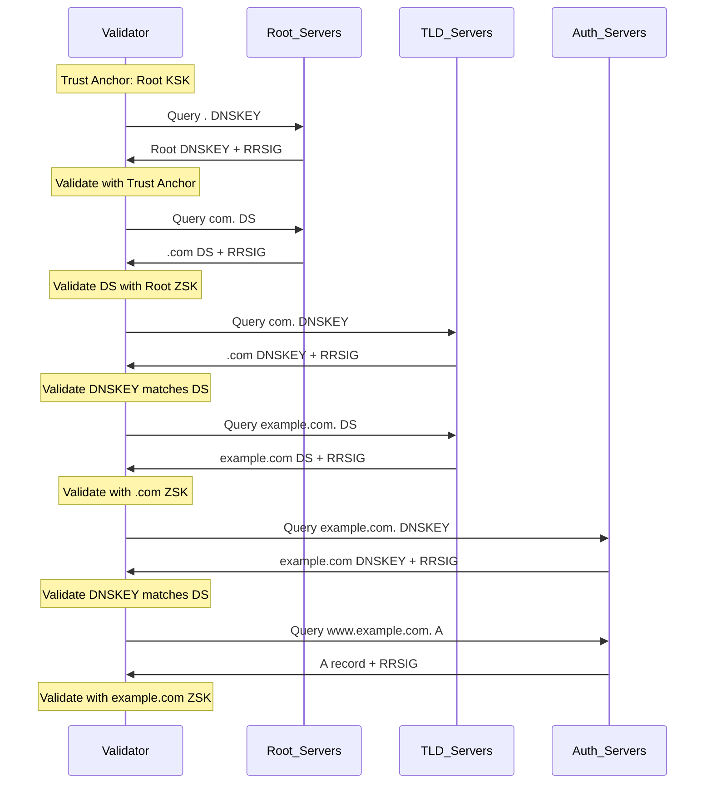

---
tags:
  - dns-network-stack
  - dns-security
  - dnssec
  - cryptographic-validation
  - trust-chain
  - dns-records
---

# DNS Security (DNSSEC)

DNS Security Extensions provide cryptographic authentication for DNS responses. Prevents cache poisoning and ensures response integrity through digital signatures.

## DNSSEC Overview



## Cryptographic Key Types

### Zone Signing Key (ZSK)
- **Purpose**: Signs zone resource records
- **Algorithm**: RSA/SHA-256, ECDSA/SHA-256, Ed25519
- **Size**: 1024-2048 bit RSA, 256 bit ECDSA
- **Rotation**: Every 1-3 months

### Key Signing Key (KSK)
- **Purpose**: Signs DNSKEY RRset only
- **Algorithm**: Same as ZSK options
- **Size**: 2048-4096 bit RSA, 256 bit ECDSA
- **Rotation**: Every 1-2 years

### Combined Signing Key (CSK)
- **Purpose**: Single key for both KSK and ZSK functions
- **Usage**: Simpler key management
- **Trade-off**: Less security isolation

## DNSSEC Record Types

### DNSKEY Record
```
example.com. 3600 IN DNSKEY 257 3 8 AwEAAc...
Flags: 256 (ZSK) or 257 (KSK)
Protocol: Always 3
Algorithm: Crypto algorithm ID
Public Key: Base64 encoded key data
```

### RRSIG Record
```
example.com. 300 IN RRSIG A 8 2 300 20241201000000 20241101000000 12345 example.com. signature_data
Type Covered: Original record type (A, MX, etc)
Algorithm: Signing algorithm
Labels: Number of labels in original owner name
Original TTL: TTL from signed RRset
Signature Expiration: YYYYMMDDHHMMSS format
Signature Inception: When signature becomes valid
Key Tag: Key identifier
Signer Name: Zone that created signature
Signature: Base64 encoded signature
```

### DS Record (Delegation Signer)
```
example.com. 86400 IN DS 12345 8 2 1A2B3C...
Key Tag: References child zone DNSKEY
Algorithm: Must match DNSKEY algorithm
Digest Type: 1=SHA1, 2=SHA256, 4=SHA384
Digest: Hash of child DNSKEY record
```

### NSEC Record (Next Secure)
```
a.example.com. 3600 IN NSEC b.example.com. A RRSIG NSEC
Next Domain: Lexicographically next domain
Type Bit Maps: Record types present at this name
```

### NSEC3 Record (Hashed Next Secure)
```
H1234567890ABCDEF.example.com. 3600 IN NSEC3 1 0 10 AABBCCDD H9876543210FEDCBA A RRSIG
Hash Algorithm: Usually SHA-1
Flags: Opt-out flag for unsigned delegations  
Iterations: Hash iteration count
Salt: Random salt value
Next Hashed Owner: Next domain hash
Type Bit Maps: Record types at original name
```

## Trust Chain Establishment



## Validation Process

### Signature Verification Steps
1. **Obtain DNSKEY**: Retrieve signing key for zone
2. **Verify DNSKEY**: Check DS record in parent zone
3. **Reconstruct RRset**: Canonical form of signed records
4. **Verify signature**: Cryptographic validation of RRSIG
5. **Check timestamps**: Signature inception/expiration
6. **Cache result**: Store validation state

### Canonical RRset Formation
```
Canonicalization Rules:
- Convert to lowercase (except RDATA)
- Sort RRs by RDATA content  
- Remove duplicate RRs
- Set TTL to RRSIG Original TTL
```

## Negative Response Authentication

### NSEC Proof of Non-existence
```
Query: nonexistent.example.com A

Response includes:
- NSEC record proving gap in namespace
- RRSIG for NSEC record
- Covers range: m.example.com -> p.example.com
- Proves nonexistent.example.com doesn't exist
```

### NSEC3 Hashed Proof
```
Query: nonexistent.example.com A

NSEC3 proves:
- Hash(nonexistent.example.com) falls in gap
- Between H1234... and H5678... hashes
- Prevents zone enumeration
- Opt-out for unsigned delegations
```

## Key Management Lifecycle

### Key Generation
```bash
# RSA key pair generation
dnssec-keygen -a RSASHA256 -b 2048 example.com

# ECDSA key pair generation  
dnssec-keygen -a ECDSAP256SHA256 example.com

# Ed25519 key generation
dnssec-keygen -a ED25519 example.com
```

### Key Rollover Procedures

#### ZSK Rollover (Pre-publish)

```mermaid
gantt
    title ZSK Rollover Timeline
    dateFormat X
    axisFormat %d
    
    section Phase 1
    Publish New ZSK    :0, 7
    
    section Phase 2  
    Sign with Both     :7, 14
    
    section Phase 3
    Remove Old ZSK     :14, 21
```


#### KSK Rollover (Double-DS)

```mermaid
gantt
    title KSK Rollover Timeline
    dateFormat X
    axisFormat %d
    
    section Phase 1
    Generate New KSK   :0, 1
    Publish DS Parent  :1, 8
    
    section Phase 2
    Sign with New KSK  :8, 15
    
    section Phase 3  
    Remove Old DS      :15, 22
    Remove Old KSK     :22, 23
```


### Automated Key Management
- **OpenDNSSEC**: Policy-driven key management
- **BIND**: Automatic key rollover with `dnssec-policy`
- **PowerDNS**: Built-in key management
- **Cloud providers**: Managed DNSSEC services

## Algorithm Support

### Current Algorithms
```
Algorithm ID    Name                Status
8              RSA/SHA-256         Recommended
10             RSA/SHA-512         Optional
13             ECDSA P-256/SHA-256 Recommended
14             ECDSA P-384/SHA-384 Optional
15             Ed25519             Recommended
16             Ed448               Optional
```

### Algorithm Migration
- **Deprecation timeline**: SHA-1 algorithms phased out
- **Transition period**: Support multiple algorithms
- **Validator support**: Check resolver compatibility

## Performance Impact

### Query Overhead
```
Standard DNS Query:    ~50-100 bytes
DNSSEC Query Response: ~500-2000 bytes
Multiplication factor: 5-20x larger responses
```

### Validation Processing
- **CPU overhead**: 10-30% for signature verification
- **Memory usage**: Key storage and cache
- **Latency impact**: 5-50ms additional validation time

### UDP Fragmentation Issues
- **Original limit**: 512 bytes
- **EDNS0 buffer**: 4096 bytes typical
- **TCP fallback**: Large responses trigger TCP
- **Fragmentation**: IP-level fragmentation problems

## Security Benefits

### Attack Prevention
- **Cache poisoning**: Cryptographic response validation
- **Man-in-the-middle**: Signature verification prevents tampering
- **Response forgery**: Cannot forge valid signatures
- **Domain hijacking**: Parent DS records prevent unauthorized changes

### Limitations
- **Last-mile security**: No protection for stub-to-recursive queries
- **Key compromise**: Compromised keys allow forgery
- **Algorithmic weakness**: Cryptographic algorithm vulnerabilities
- **Implementation bugs**: Software vulnerabilities

## Deployment Considerations

### Zone Signing Process
```bash
# BIND example
dnssec-signzone -o example.com -K keydir example.com.zone
# Generates signed zone file with DNSSEC records

# Automatic signing (BIND 9.16+)
dnssec-policy "default";
```

### Resolver Configuration
```bash
# BIND resolver
dnssec-validation auto;
trust-anchors {
    "." initial-key 257 3 8 "AwEAAagAI...";
};

# Unbound
auto-trust-anchor-file: "/etc/unbound/root.key"
```

### Monitoring Requirements
- **Signature expiration**: Alert before RRSIG expiry
- **Key rollover status**: Track rollover progress
- **Validation failures**: Monitor SERVFAIL responses
- **Parent DS synchronization**: Verify DS record propagation

## Troubleshooting DNSSEC

### Common Validation Failures
```
SERVFAIL response codes:
- Signature verification failure
- Missing DNSKEY records  
- Expired signatures
- Broken trust chain
- Algorithm not supported
```

### Diagnostic Tools
```bash
# Drill (ldns)
drill -S example.com A
drill -T example.com A  # Trace validation path

# dig with DNSSEC
dig +dnssec +multi example.com A
dig +trace +dnssec example.com A

# DNSViz online tool
dnsviz.net/d/example.com/dnssec/
```

### Validation States
- **Secure**: Valid DNSSEC chain
- **Insecure**: No DNSSEC signing
- **Bogus**: DNSSEC validation failure
- **Indeterminate**: Cannot determine status

## Future Developments

### Post-Quantum Cryptography
- **Algorithm transition**: Quantum-resistant algorithms
- **Key size impact**: Larger keys and signatures
- **Migration timeline**: Coordinated ecosystem transition

### Protocol Enhancements
- **Compact signatures**: Reduce response size
- **Online signing**: Dynamic signature generation
- **Trust anchor updates**: RFC 5011 automated updates

---

**Related**: DNS Record Types, Network Protocol Stack, DNS caching with validation