---
tags:
  - design-pattern
  - oo-programming
  - java
---
# Adapter Pattern

## Intent

Convert the interface of a class into another interface that clients expect.

The Adapter pattern allows otherwise incompatible classes to work together without modifying their source code.

---

## Problem

You have an existing class whose functionality you want to reuse, but its interface does not match what the client expects.

### Example

Your application expects:

```java
public interface PaymentProcessor {
    void pay(double amount);
}
```

But a third-party library provides:

```java
public class LegacyPaymentGateway {
    public void makePayment(double value) {
        // ...
    }
}
```

The client cannot use `LegacyPaymentGateway` directly because the interfaces are incompatible.

---

## Solution

Create an adapter that implements the expected interface and delegates calls to the existing class.

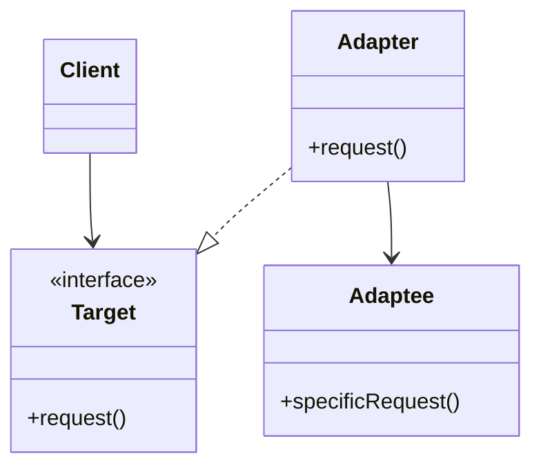

---

## Structure

### Object Adapter (Composition)

Uses composition and delegation.

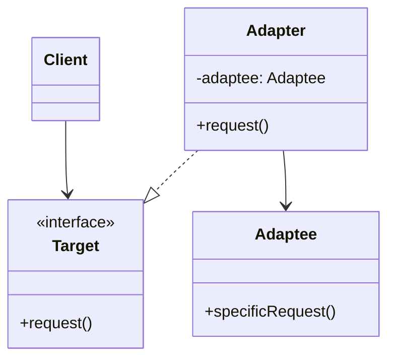

This is the most common form.

---

## Example

### Existing Interface

```java
public interface Printer {
    void print(String text);
}
```

### Legacy Class

```java
public class LegacyPrinter {

    public void printDocument(String text) {
        System.out.println(text);
    }
}
```

### Adapter

```java
public class PrinterAdapter implements Printer {

    private final LegacyPrinter legacyPrinter;

    public PrinterAdapter(LegacyPrinter legacyPrinter) {
        this.legacyPrinter = legacyPrinter;
    }

    @Override
    public void print(String text) {
        legacyPrinter.printDocument(text);
    }
}
```

### Client

```java
Printer printer =
    new PrinterAdapter(new LegacyPrinter());

printer.print("Hello");
```

---

## Sequence of Calls

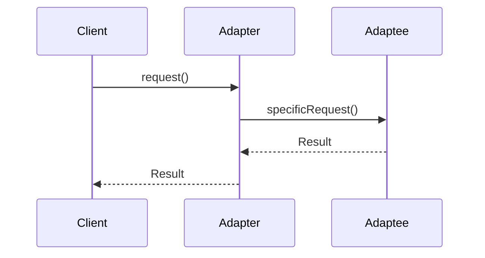

---

## Real-World Analogy

### Travel Adapter Plug

A laptop charger from one country may not fit a wall socket in another country.

The power adapter converts one interface into another.

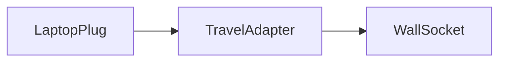

The charger remains unchanged.
The wall socket remains unchanged.
The adapter bridges the incompatibility.

---

## Benefits

### Reuse Existing Code

You can integrate legacy or third-party components without modifying them.

### Open/Closed Principle

New adapters can be introduced without changing existing code.

### Decoupling

Clients depend on the target interface rather than concrete implementations.

### Incremental Migration

Useful when replacing old systems gradually.

---

## Drawbacks

### Additional Indirection

Adds another layer to the design.

### Increased Complexity

Too many adapters can make the system harder to understand.

### Potential Performance Cost

Usually negligible, but every call passes through another object.

---

## Types of Adapters

### Object Adapter (Preferred)

Uses composition.

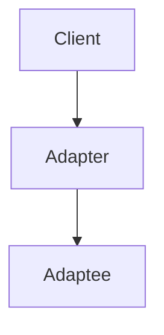

Advantages:

- Flexible
- Works with final classes
- Follows composition over inheritance

---

### Class Adapter

Uses inheritance.

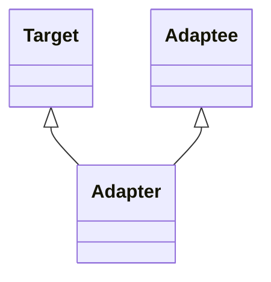

Advantages:

- Slightly simpler

Disadvantages:

- Requires multiple inheritance (or interface inheritance)
- Less flexible

---

## Adapter vs Facade

### Adapter

Changes an interface.

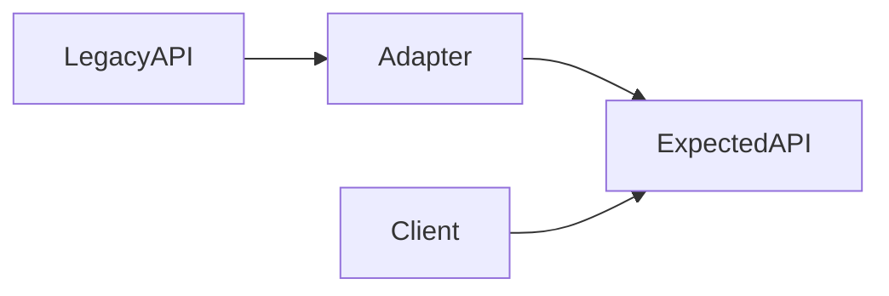

Purpose:

> Make incompatible interfaces work together.

---

### Facade

Simplifies an interface.

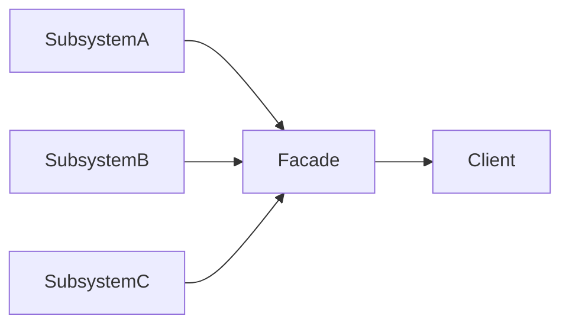

Purpose:

> Hide complexity behind a simpler interface.

---

## Adapter vs Decorator

### Adapter

Changes the interface.

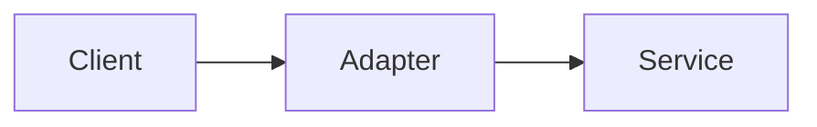

---

### Decorator

Keeps the same interface and adds behavior.

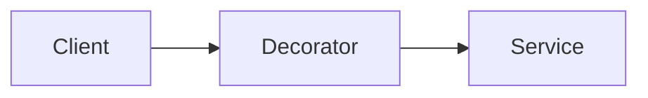

---

## Adapter vs Proxy

### Adapter

Makes interfaces compatible.

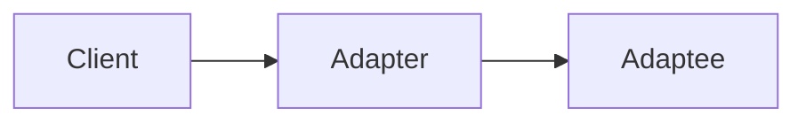

---

### Proxy

Controls access to an object.

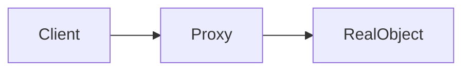

---

## Common Use Cases

### Legacy System Integration

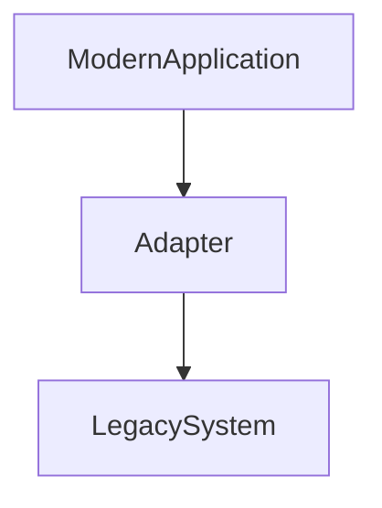

---

### Third-Party Libraries

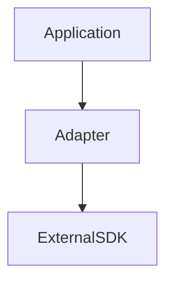

---

### Database Drivers

JDBC acts as an adapter layer.

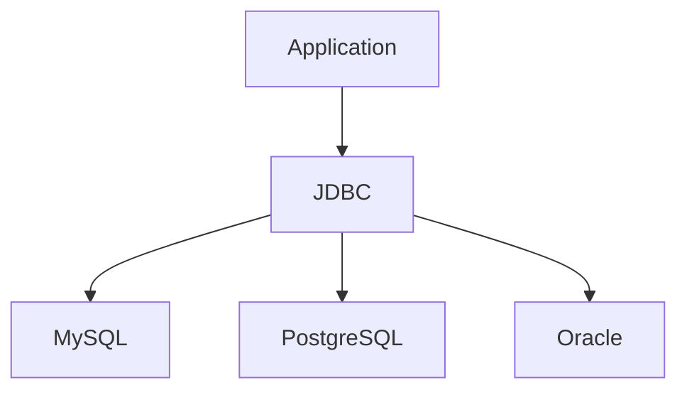

Applications use a common interface while drivers adapt vendor-specific implementations.

---

### Logging Frameworks

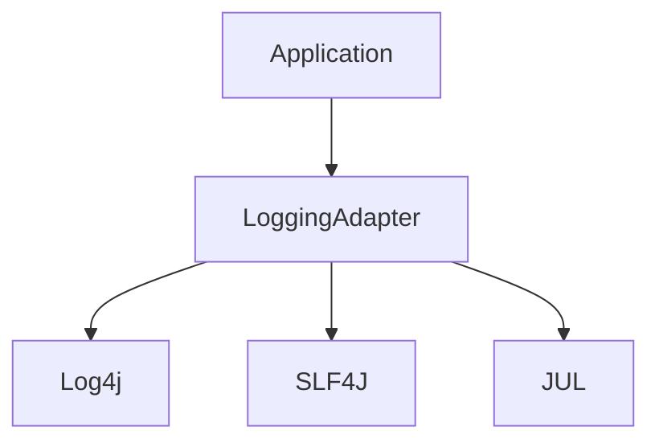

---

## Recognition

You probably need an Adapter when:

- You want to use an existing class but its interface doesn't match.
- You are integrating a third-party library.
- You are migrating from a legacy system.
- You want to isolate vendor-specific APIs.
- You cannot modify the existing class.

---

## Rule of Thumb

> Use an Adapter when you need to make two incompatible interfaces work together without changing either side.

Think of it as a translator sitting between two parties that speak different languages.

---

## Related Patterns

- [[Facade pattern]]
- [[Decorator Pattern]]
- [[Proxy Pattern]]
- [[Bridge Pattern]]