---
tags:
  - design-pattern
  - oo-programming
  - java
---
# Composite Pattern

## Intent

> Compose objects into **tree structures** to represent part-whole hierarchies, allowing clients to treat individual objects and compositions **uniformly**.

---

## Classification

|Property|Value|
|---|---|
|Category|**Structural**|
|Complexity|**Medium**|
|Frequency of Use|**Very Common**|
|Introduced In|**GoF (1994)**|

---

## Problem

The Composite pattern addresses the difficulty of managing hierarchical structures where clients must distinguish between simple elements and complex containers.

### Symptoms

- **Type Checking Overload**: Client code is filled with `if/else` or `instanceof` checks to determine if an object is a leaf or a container.
- **Recursive Logic Duplication**: Operations like `draw()`, `print()`, or `calculate()` are implemented separately for individual items and recursively for groups.
- **Tight Coupling**: Clients depend on concrete classes (`Leaf`, `Container`) rather than abstractions, making the system rigid.

### Example Scenario

```text
A graphics application needs to render shapes. A "Group" can contain individual shapes (Circle, Square) and other Groups. 
Without Composite, the client must write:
  if (obj is Circle) drawCircle();
  else if (obj is Group) { for (child in group) draw(child); }
This logic repeats everywhere rendering is needed.
```

---

## Solution

Define a common **Component** interface for both simple (Leaf) and complex (Composite) objects. The Composite stores children and delegates operations to them recursively, while the Leaf performs the actual work.

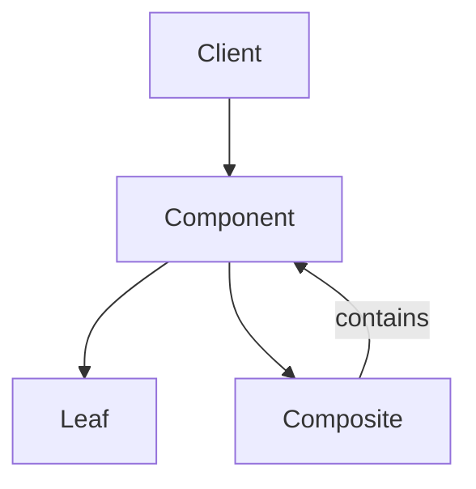

---

## Structure

### UML Diagram

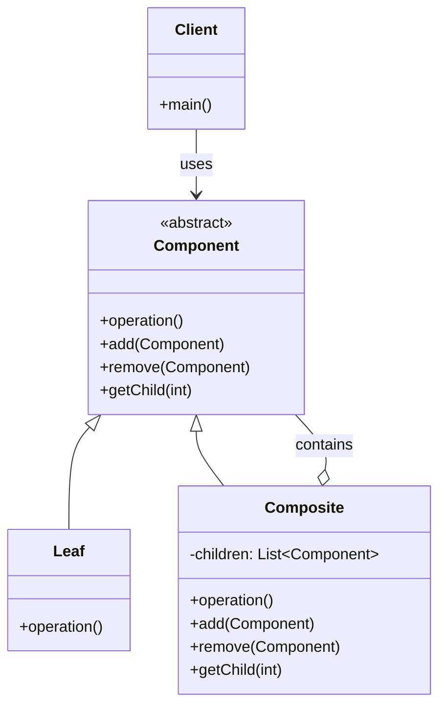

---

## Participants

### Component (Abstract Class/Interface)

Responsibilities:

- Declares the interface for objects in the composition.
- Implements default behavior for child management (often throwing exceptions for Leaves).

### Leaf

Responsibilities:

- Represents individual objects with no children.
- Defines the primitive behavior for the `operation()`.

### Composite

Responsibilities:

- Stores child components (Leaves or other Composites).
- Implements child-related operations by delegating work to children.
- Implements `operation()` to iterate over children.

---

## Collaboration

### Runtime Interaction

The client interacts only with the `Component` interface. When `operation()` is called on a Composite, it recursively calls `operation()` on its children.

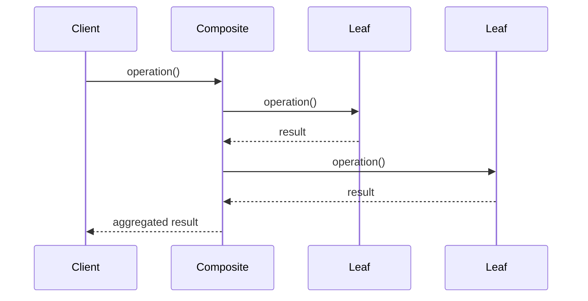

---

## Implementation

### Example (Java)

```java
// Component
abstract class Graphic {
    public abstract void draw();
    public void add(Graphic g) { throw new UnsupportedOperationException(); }
    public void remove(Graphic g) { throw new UnsupportedOperationException(); }
}

// Leaf
class Circle extends Graphic {
    public void draw() { System.out.println("Drawing Circle"); }
}

// Composite
class Group extends Graphic {
    private List<Graphic> children = new ArrayList<>();
    
    public void add(Graphic g) { children.add(g); }
    
    public void draw() {
        for (Graphic g : children) {
            g.draw(); // Recursive call
        }
    }
}
```

### Key Points

- **Uniformity**: Client code treats `Circle` and `Group` identically.
- **Recursion**: The `Group` class handles traversal internally.
- **Safety**: Leaf nodes throw exceptions for `add/remove` to prevent invalid operations.

---

## Object Graph

At runtime, the structure forms a tree where Composites hold references to other Components.

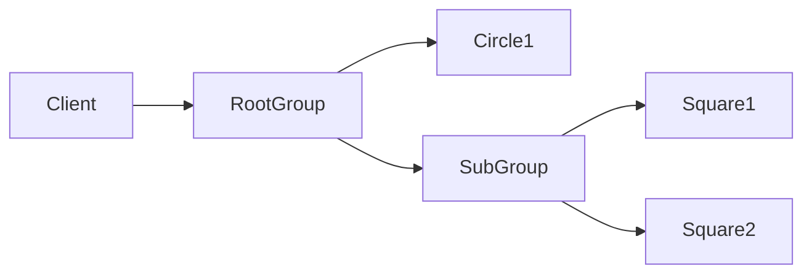

---

## Before Applying Pattern

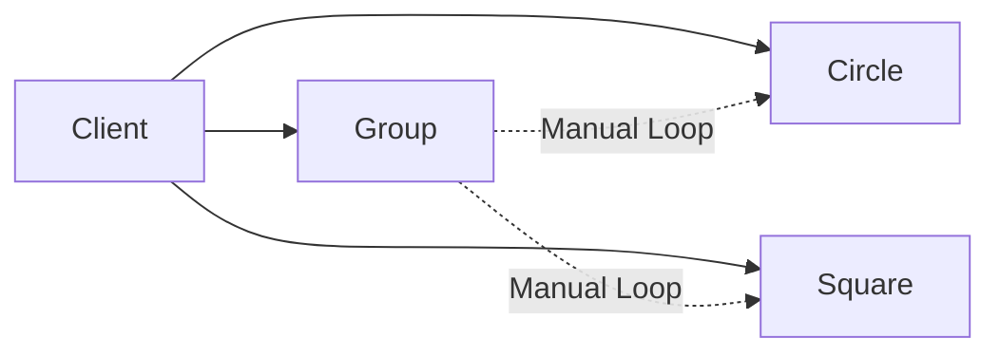

Problems:

- **Tight coupling**: Client knows concrete types.
- **Repeated logic**: Traversal code is duplicated in every client.
- **Difficult maintenance**: Adding new shapes requires updating all client loops.

---

## After Applying Pattern

```mermaid
graph LR
    Client --> Graphic
    Graphic --> Circle
    Graphic --> Square
    Graphic --> Group
    Group --> Graphic : contains
```

Benefits:

- **Lower coupling**: Client depends only on `Graphic`.
- **Better maintainability**: New shapes added without changing client.
- **Simpler API**: Single `draw()` method for all types.

---

## Real-World Analogy

### Analogy

A **File System**: Files (Leaves) and Directories (Composites). You can `delete()` or `move()` a single file or an entire directory tree using the same command.

```mermaid
graph TD
    User["User"] --> FileSystem["File System Command"]
    FileSystem --> File["File"]
    FileSystem --> Directory["Directory"]
    Directory --> FileSystem : contains
```

---

## Benefits

### 1. Uniform Treatment

Clients treat simple and complex objects identically, simplifying code logic.

### 2. Open/Closed Principle

New component types (Leaves or Composites) can be added without modifying existing client code.

### 3. Simplified Client Code

Recursive traversal is encapsulated within the Composite, removing complex loops from the client.

---

## Drawbacks

### 1. Over-Generalization

The common interface may force Leaf nodes to implement methods they don't use (e.g., `addChild`), potentially causing runtime errors if not handled carefully.

### 2. Design Complexity

Making the Component interface sufficiently general to cover all cases can be challenging and may lead to vague abstractions.

### 3. Performance Overhead

Deeply nested trees can incur performance costs due to recursive traversal and dynamic dispatch.

---

## Recognition

You probably need this pattern when:

- You are modeling a **part-whole hierarchy** (e.g., UI widgets, file systems).
- You want clients to ignore the difference between compositions and individual objects.
- Your code contains repetitive `instanceof` checks for tree nodes.
- You need to apply an operation recursively across a structure.

### Code Smells

- **Large switch statements** checking object types.
- **Tight coupling** to concrete leaf/composite classes.
- **Repeated workflows** for traversing trees.
- **Duplicate recursion logic** in multiple client classes.

---

## Common Use Cases

### Use Case 1: GUI Frameworks

Containers (Panels) and Widgets (Buttons) both implement `render()`.

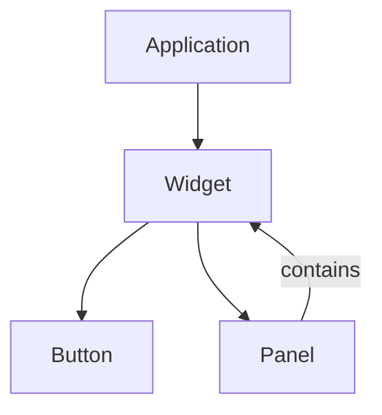

### Use Case 2: File Systems

Files and Directories both support `getSize()` and `delete()`.

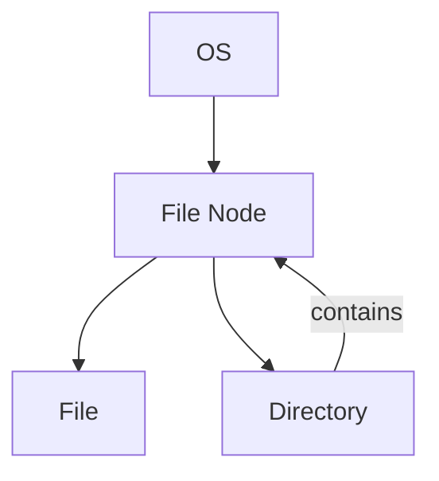

### Use Case 3: Organization Charts

Employees and Departments both have `getSalary()` and `printInfo()`.

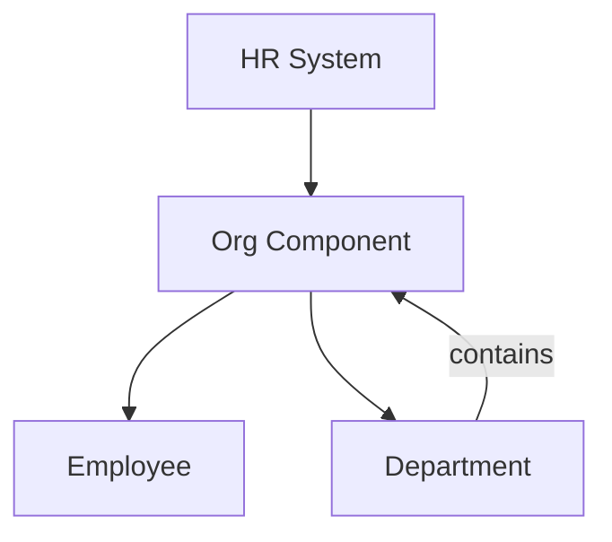

---

## Trade-Offs

|Advantage|Cost|
|---|---|
|Uniform client interface|Leaf nodes may have unused methods|
|Easy to add new components|Harder to restrict component types|
|Encapsulated recursion|Potential performance overhead|

---

## Comparison with Related Patterns

### vs Decorator

|Composite|Decorator|
|---|---|
|**Purpose**: Represent part-whole hierarchies|**Purpose**: Add responsibilities dynamically|
|**Structure**: Tree of many children|**Structure**: Chain of wrappers (one child)|
|**Use Case**: File systems, UI layouts|**Use Case**: Adding borders, logging, scrolling|

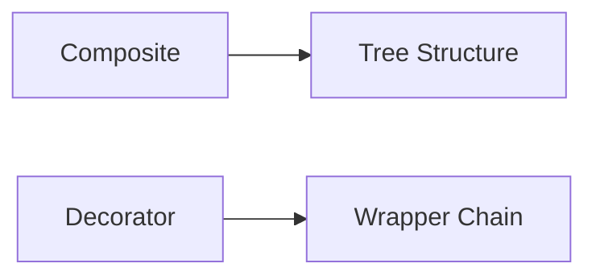

### vs Proxy

|Composite|Proxy|
|---|---|
|**Purpose**: Structure objects uniformly|**Purpose**: Control access to an object|
|**Structure**: Many children|**Structure**: One subject|
|**Use Case**: Hierarchies|**Use Case**: Lazy loading, access control|

---

## Refactoring Recipe

1. **Identify the problem**: Look for type checks in client code handling tree nodes.
2. **Locate the varying behavior**: Identify operations common to leaves and composites.
3. **Extract abstractions**: Create a `Component` interface/base class.
4. **Introduce the pattern**: Move child management to a new `Composite` class.
5. **Move responsibilities**: Implement primitive behavior in `Leaf`.
6. **Simplify client code**: Remove type checks and use the `Component` interface.

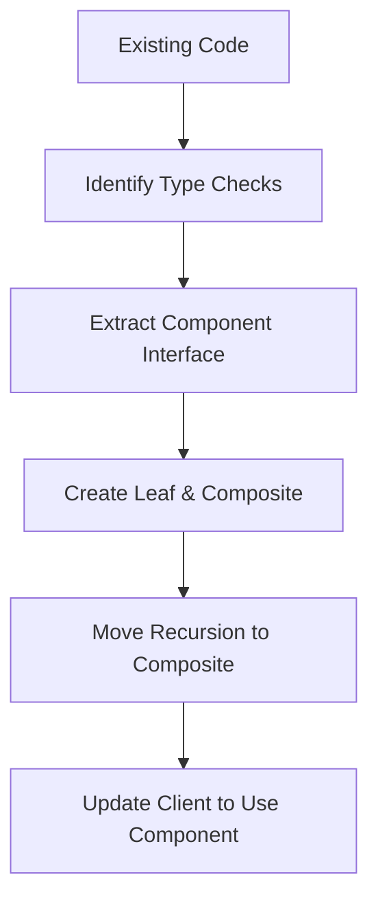

---

## Performance Considerations

|Aspect|Impact|
|---|---|
|CPU|**Medium** (Recursive calls)|
|Memory|**Low/Medium** (List storage in Composites)|
|Complexity|**Low** (for client), **Medium** (design)|

Notes:

- Deep trees may cause stack overflow in languages with limited recursion depth.
- Iterative traversal can be used as an optimization for very deep structures.

---

## Concurrency Considerations

- **Thread Safety**: Modifying the tree (adding/removing children) while traversing requires synchronization.
- **Shared State**: If components hold shared state, concurrent modifications can lead to inconsistencies.
- **Immutable Trees**: Consider making the structure immutable after construction to avoid locking overhead.

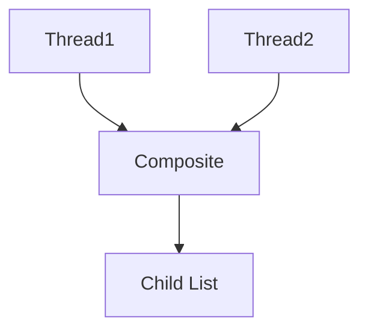

---

## Testing Strategy

### Unit Tests

- Test `Leaf` operations in isolation.
- Test `Composite` delegation (mock children).
- Verify recursive behavior with nested composites.

### Integration Tests

- Test full tree traversal from root to leaves.
- Verify operations on mixed trees (leaves and composites).

### Edge Cases

- Empty composite (no children).
- Single-level tree.
- Very deep recursion depth.

---

## Interview Notes

### When to Mention

- Designing a UI toolkit or file system.
- Discussing how to eliminate `instanceof` checks.
- Solving problems involving hierarchical data aggregation.

### Common Interview Question

> Why would you use **Composite** instead of **Decorator**?

Answer:

- **Composite** is for **part-whole hierarchies** (trees).
- **Decorator** is for **adding responsibilities** (wrapping).
- Composite manages **many children**; Decorator manages **one delegate**.

---

## Rule of Thumb

> "Treat **one** object and **many** objects exactly the same."

---

## Related Patterns
<!-- TODO: these design patterrns are not covered yet, they're just here for reference when I do cover them --> 

- [[Decorator]] (Often used together; Decorator adds behavior to Components)
- [[Iterator]] (Used to traverse Composite structures)
- [[Visitor]] (Applies operations across a Composite without changing classes)
- [[Flyweight]] (Shares leaf instances to reduce memory)

---

## References

- *Design Patterns: Elements of Reusable Object-Oriented Software* (GoF)
- *Head First Design Patterns*
- *Pattern-Oriented Software Architecture, Volume 1*
- Refactoring.guru - Composite Pattern
