---
tags:
  - design-pattern
  - oo-programming
  - java
---
# Facade Pattern

## Intent

Provide a **unified, simplified interface** to a set of interfaces in a subsystem.

The Facade pattern hides the complexity of a subsystem and exposes a single entry point for clients.

---

## Problem

A subsystem may contain many classes that must be used in a specific order.

Without a facade, clients must understand:

- Which classes exist
- How they interact
- The correct sequence of operations
- Internal implementation details

This leads to:

- Tight coupling
- Complex client code
- Poor maintainability

---

## Solution

Introduce a **Facade** class that encapsulates the interaction with the subsystem.

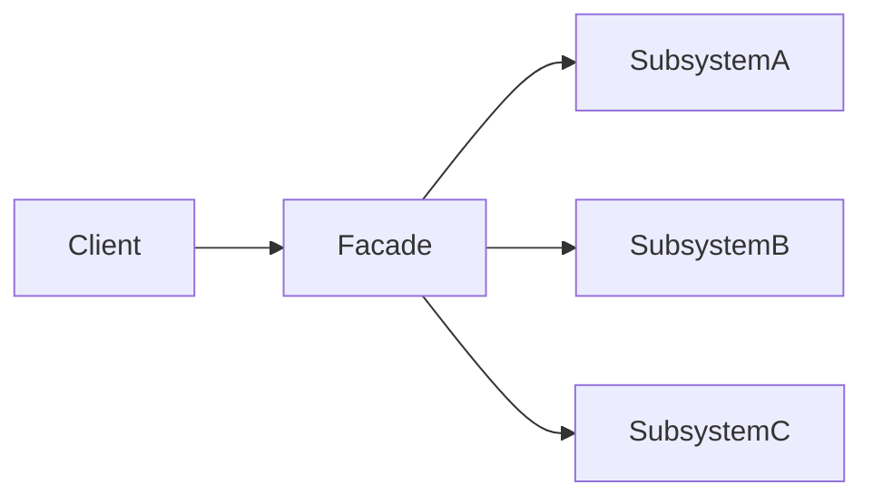

Clients communicate only with the facade.

---

## Structure

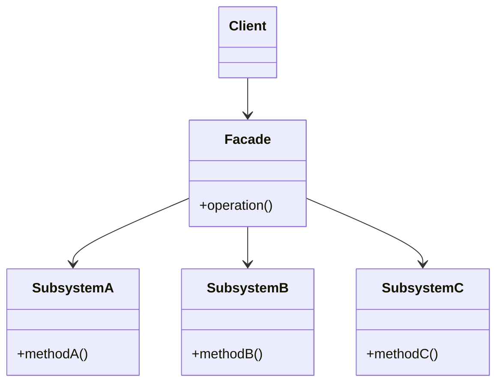

---

## Example

### Without Facade

```java
VideoFile file = new VideoFile("movie.mp4");

Codec sourceCodec = CodecFactory.extract(file);

Buffer buffer =
    BitrateReader.read(file, sourceCodec);

File result =
    BitrateReader.convert(buffer, destinationCodec);

AudioMixer mixer = new AudioMixer();
mixer.fix(result);
```

The client must coordinate every subsystem component.

### With Facade

```java
VideoConverter converter = new VideoConverter();

File result =
    converter.convert("movie.ogg", "mp4");
```

The facade handles all complexity internally.

---

## Sequence of Calls

### Without Facade

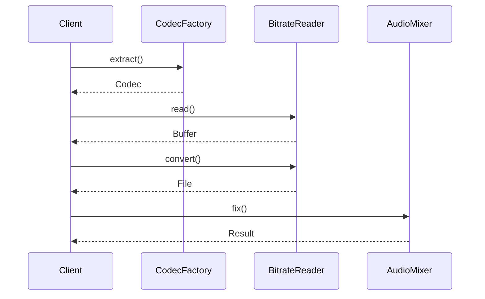

### With Facade

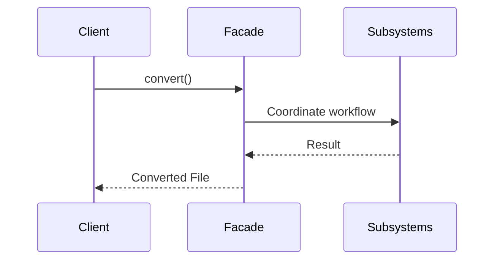

---

## Real-World Analogy

### Hotel Front Desk

A hotel contains many departments:

- Housekeeping
- Billing
- Maintenance
- Room Service

Customers interact only with the front desk.

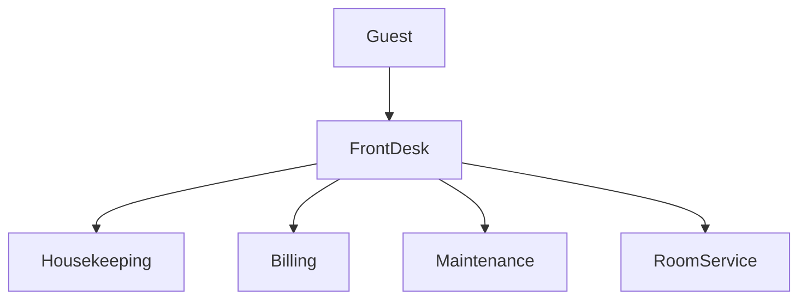

The front desk acts as a facade.

---

## Benefits

### Simpler API

Clients interact with a small, focused interface.

```java
paymentService.process(order);
```

instead of multiple subsystem calls.

### Reduced Coupling

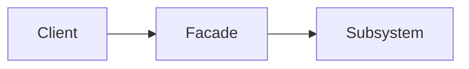

Instead of:

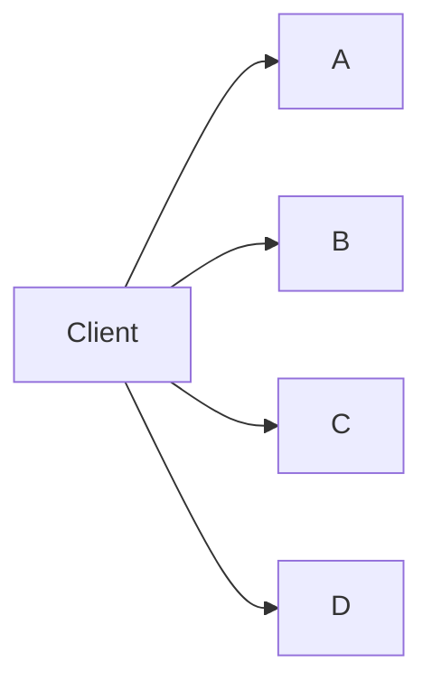

### Encapsulation

Internal subsystem changes do not necessarily affect clients.

### Better Layering

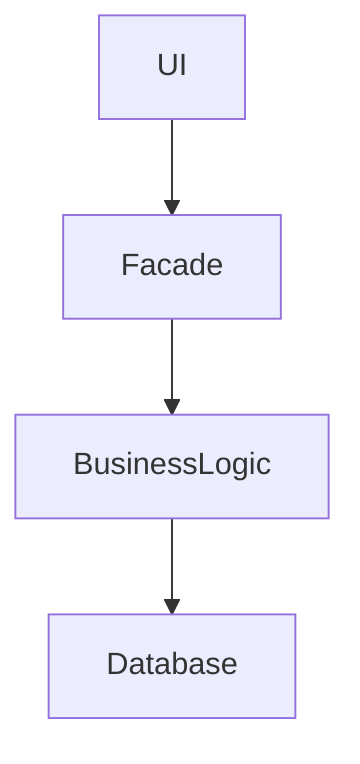

---

## Drawbacks

### God Object Risk

A facade can become too large and accumulate unrelated responsibilities.

```java
ApplicationFacade facade = new ApplicationFacade();
```

### Limited Functionality

The facade often exposes only common use cases.

Advanced clients may still need direct access to subsystem classes.

---

## Facade vs Adapter

| Facade | Adapter |
|----------|----------|
| Simplifies an interface | Converts an interface |
| Hides complexity | Resolves incompatibility |
| Works with an existing subsystem | Makes two interfaces work together |

### Facade

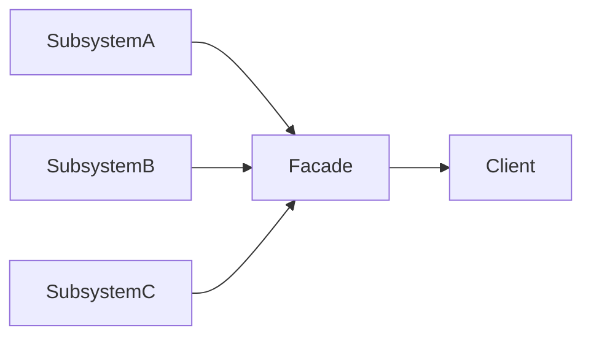

### Adapter

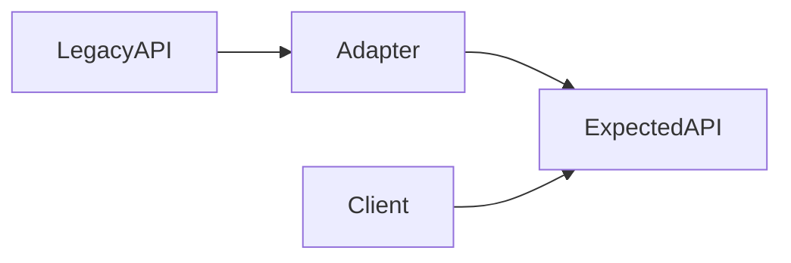

---

## Facade vs Mediator

### Facade

Coordinates access **from outside** the subsystem.

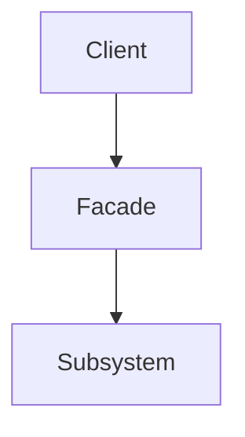

### Mediator

Coordinates communication **between objects**.

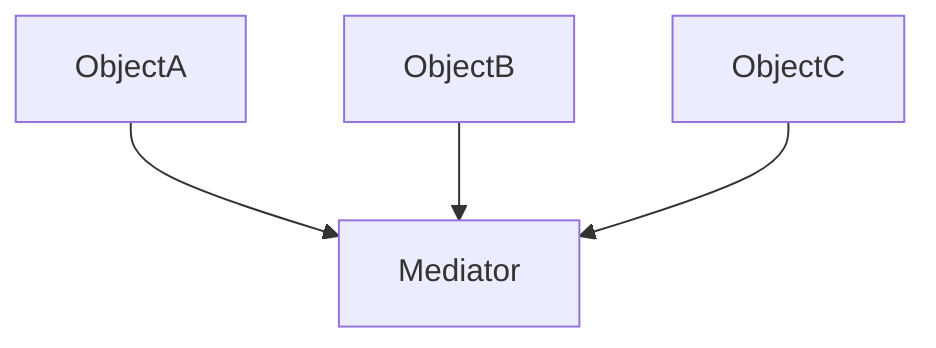

---

## Common Use Cases

### Repository Layer

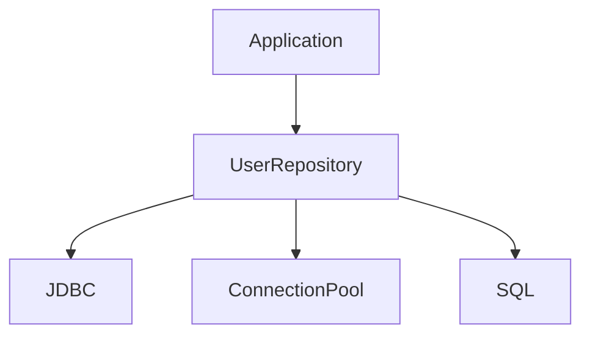

### Compiler

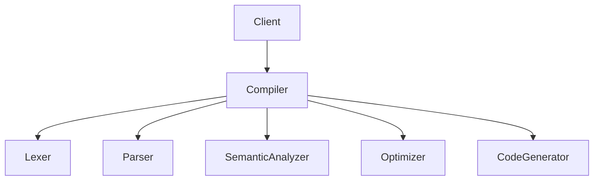

### Home Theater

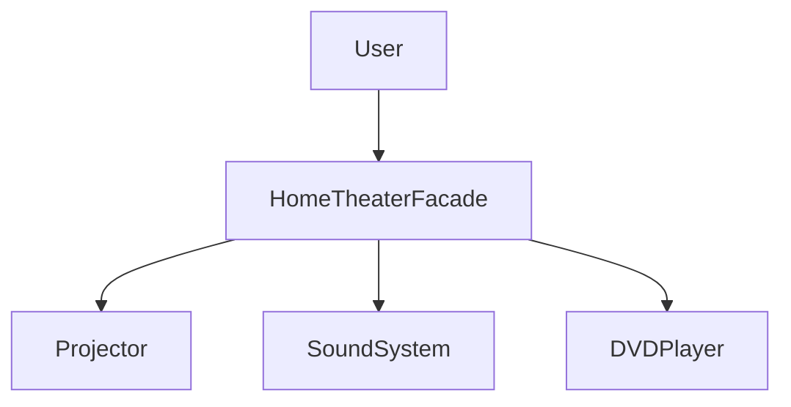

---

## Recognition

You probably need a Facade when:

- A subsystem contains many classes.
- Client code knows too much about implementation details.
- Object creation requires many steps.
- Clients repeatedly perform the same sequence of operations.
- You want a stable API over a changing subsystem.

---

## Rule of Thumb

> Use a Facade when you want to provide a simple entry point to a complex subsystem while reducing coupling between clients and implementation details.

---

## Related Patterns

- [[Adapter pattern]]
- [[Mediator Pattern]]
- [[Abstract Factory Pattern]]
- [[Proxy Pattern]]