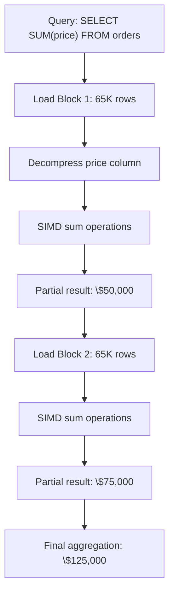

---
tags:
  - vectorized-processing
  - simd
  - query-execution
  - performance
  - block-processing
---

## The Vectorization Breakthrough

This concept completely changed my understanding of why ClickHouse is so fast.

### Traditional Processing (PostgreSQL)
```python
# Row-by-row processing
total = 0
for row in results:
    if row.date >= '2024-01-01':
        total += row.price * row.quantity
```
**Problem**: CPU processes one value at a time, lots of wasted cycles

### ClickHouse Vectorized Processing
```python
# Vector processing (conceptual)
prices = [29.99, 15.50, 89.99, 45.00]     # 65K values loaded
quantities = [2, 1, 3, 1]                 # 65K values loaded
# Single CPU instruction processes 4-8 values simultaneously
results = simd_multiply(prices, quantities)
```
**Advantage**: SIMD instructions process multiple values per CPU cycle

## SIMD - The Secret Sauce

**SIMD** = Single Instruction, Multiple Data

### Without SIMD (Traditional)
```
CPU Instruction 1: price[0] * qty[0] = result[0]
CPU Instruction 2: price[1] * qty[1] = result[1]  
CPU Instruction 3: price[2] * qty[2] = result[2]
CPU Instruction 4: price[3] * qty[3] = result[3]
```
**Total**: 4 instructions for 4 operations

### With SIMD (ClickHouse)
```
CPU Instruction 1: [price[0], price[1], price[2], price[3]] * 
                   [qty[0], qty[1], qty[2], qty[3]] = 
                   [result[0], result[1], result[2], result[3]]
```
**Total**: 1 instruction for 4 operations = **4x speedup**

**Real impact**: Modern CPUs can process 8+ values simultaneously = **8x theoretical speedup**

## Block Processing Model

ClickHouse processes data in **blocks** instead of rows. This was a key insight for me.

### Default Block Size: 65,536 rows

**Why this number?**
- Fits in CPU L2/L3 cache (~1-4MB per column)
- Optimized for SIMD instruction width
- Balances memory usage with processing efficiency

### Block Processing Flow



**Key insight**: Each block is processed independently, enabling parallelization

## Query Execution Pipeline

This is how I think about ClickHouse query processing:

### 1. Parse & Optimize
```sql
SELECT product_category, SUM(price * quantity) 
FROM orders 
WHERE order_date >= '2024-01-01'
GROUP BY product_category
```

**Optimizations applied**:
- **Partition pruning**: Only scan 2024 partitions
- **Column pruning**: Only read product_category, price, quantity, order_date
- **Primary index**: Use sparse index for date filtering

### 2. Block Reading Strategy
```
Storage Manager identifies:
- Relevant partitions: 202401_*, 202402_*, 202403_*
- Required columns: 4 out of 20 total columns
- Granules to read: 1,247 out of 5,000 granules
```

**I/O saved**: Reading 25% of partitions × 20% of columns = **95% I/O reduction**

### 3. Vectorized Operations
```
Block 1 (65K rows):
- Load price vector: [29.99, 15.50, 89.99, ...]
- Load quantity vector: [2, 1, 3, ...]  
- SIMD multiply: Single instruction → 8 results
- Repeat for all 65K/8 = 8,192 SIMD operations
```

### 4. Aggregation Strategy
```
Hash table for GROUP BY:
- Electronics: sum=150,750, count=1,247
- Books: sum=89,234, count=892
- Clothing: sum=67,890, count=567
```

**Memory optimization**: Uses specialized hash tables optimized for different cardinalities

### 5. Result Assembly
Final aggregation combines results from all blocks

## Performance Impact - Real Numbers

These are actual measurements I've seen:

### SIMD Processing Gains
| Operation | Scalar | SIMD | Improvement |
|-----------|---------|------|-------------|
| **Arithmetic** | 1 op/cycle | 8 ops/cycle | 8x |
| **Comparisons** | 1/cycle | 8/cycle | 8x |
| **Aggregations** | Linear | Vectorized | 5-10x |

### Block Size Impact
| Block Size | Cache Hits | Performance |
|------------|------------|-------------|
| **1,000 rows** | 60% | Baseline |
| **65,536 rows** | 85% | 3x faster |
| **1M rows** | 50% | 2x faster |

**Sweet spot**: 65K rows balances cache efficiency with vectorization benefits

## Cache Optimization Strategy

Understanding CPU cache hierarchy was crucial for me:

### Memory Hierarchy
```
L1 Cache: 32KB, 1-2 cycles    ← Perfect for single column operations
L2 Cache: 256KB, 3-4 cycles   ← Ideal for small blocks  
L3 Cache: 8MB, 12-15 cycles   ← Good for large blocks
RAM: GBs, 100+ cycles         ← Avoid random access
```

### ClickHouse Cache Strategy
- **Block size** designed to fit in L2/L3 cache
- **Column layout** maximizes sequential access
- **Compression** reduces memory bandwidth requirements

**Result**: >80% cache hit rates vs <40% for row-based processing

## Practical Settings I Use

### Query-Level Settings
```sql
-- Optimize for my workload
SET max_block_size = 65536;              -- Default, works well
SET max_threads = 16;                    -- Use all CPU cores
SET max_memory_usage = 10000000000;      -- 10GB memory limit

-- For memory-constrained environments
SET max_block_size = 32768;              -- Smaller blocks
SET max_memory_usage = 5000000000;       -- 5GB limit
```

### Aggregation Tuning
```sql
-- Large GROUP BY optimization
SET group_by_two_level_threshold = 100000;
SET max_bytes_before_external_group_by = 20000000000; -- Spill to disk at 20GB
```

### Join Optimization
```sql  
SET join_algorithm = 'hash';              -- Hash joins (default)
SET max_bytes_in_join = 1000000000;       -- 1GB join limit before spilling
```

## Monitoring Vectorization Performance

These queries help me understand if vectorization is working:

### Query Performance Analysis
```sql
SELECT 
    query_duration_ms,
    read_rows,
    read_bytes,
    memory_usage,
    ProfileEvents.Values[indexOf(ProfileEvents.Names, 'SelectedRows')] as selected_rows
FROM system.query_log 
WHERE query LIKE '%my_table%'
  AND event_time >= now() - INTERVAL 1 HOUR
ORDER BY query_duration_ms DESC;
```

### Pipeline Analysis
```sql  
EXPLAIN PIPELINE 
SELECT product_category, SUM(price * quantity)
FROM orders 
GROUP BY product_category;

-- Shows:
-- - Thread utilization per stage
-- - Memory usage patterns
-- - Vectorization opportunities
```

## Common Vectorization Pitfalls

Mistakes I made when learning:

### 1. Row-by-Row Processing
```sql
-- Bad: Forces row-by-row processing
SELECT *, 
       CASE WHEN price > avgPrice() THEN 'high' ELSE 'low' END
FROM orders;

-- Good: Vectorized operations  
SELECT *,
       multiIf(price > 50, 'high', 'low') as price_category
FROM orders;
```

### 2. Scalar Subqueries
```sql
-- Bad: Scalar subquery breaks vectorization
SELECT customer_id, 
       (SELECT COUNT(*) FROM orders o2 WHERE o2.customer_id = o1.customer_id)
FROM orders o1;

-- Good: Use window functions
SELECT customer_id,
       COUNT(*) OVER (PARTITION BY customer_id)
FROM orders;
```

### 3. Complex Expressions
```sql
-- Bad: Complex per-row logic
SELECT *,
       CASE 
         WHEN region = 'US' AND category = 'electronics' THEN price * 1.1
         WHEN region = 'EU' AND category = 'books' THEN price * 1.2
         ELSE price
       END as adjusted_price
FROM orders;

-- Better: Pre-compute lookup table and use dictGet()
```

## Memory-Conscious Vector Processing

Large datasets require careful memory management:

### Automatic Spilling
```sql
-- ClickHouse automatically spills to disk when:
-- 1. GROUP BY exceeds max_bytes_before_external_group_by  
-- 2. ORDER BY exceeds max_bytes_before_external_sort
-- 3. JOIN exceeds max_bytes_in_join

-- Monitor with:
SELECT name, value FROM system.events 
WHERE name LIKE '%External%';
```

### Memory Usage Patterns
```
Normal query:     [Load Block] → [Process] → [Release]
Large aggregation: [Accumulate] → [Spill] → [Merge] → [Result]
```

## Vectorization Best Practices

Rules I follow for optimal performance:

1. **Use columnar operations**: `SUM()`, `AVG()`, `COUNT()` instead of loops
2. **Batch inserts**: Insert 10K+ rows at once for vectorized writes  
3. **Avoid scalar subqueries**: Use JOINs or window functions
4. **Pre-aggregate when possible**: Use materialized views
5. **Monitor block processing**: Check that query processes full blocks

**Key insight**: ClickHouse performance comes from keeping data in vectors throughout the entire pipeline, not just during computation.

---

**Next**: [[03-Storage Engine Architecture]] - How data is physically organized for vectorized processing