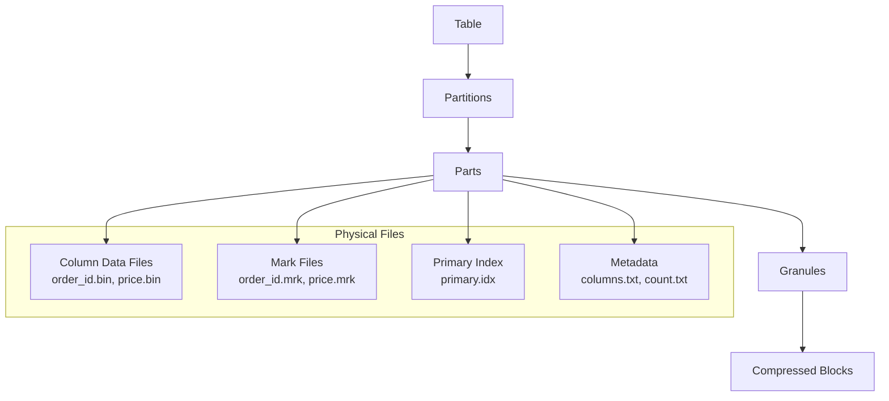
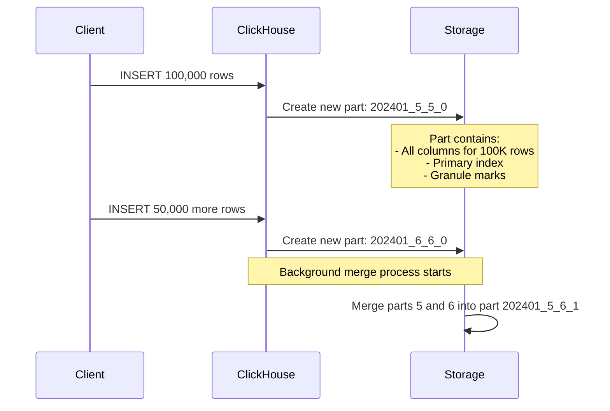
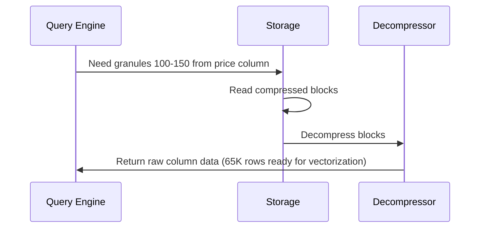

---
tags:
  - storage-engine
  - mergetree
  - granules
  - parts
  - sparse-index
  - background-merges
---

## Physical Data Organization

Understanding how ClickHouse organizes data on disk was crucial for me to optimize queries and troubleshoot performance issues.

## Hierarchical Storage Structure



### Real File System Layout
```
/var/lib/clickhouse/data/ecommerce/orders/
├── 202401_1_1_0/                 # January 2024 partition, part 1
│   ├── columns.txt               # Column definitions
│   ├── count.txt                 # Row count in this part
│   ├── primary.idx               # Sparse primary index
│   ├── order_id.bin              # Column data (compressed)
│   ├── order_id.mrk             # Granule marks/offsets
│   ├── customer_id.bin
│   ├── customer_id.mrk
│   ├── price.bin
│   ├── price.mrk
│   └── checksums.txt             # Data integrity
├── 202401_2_2_0/                 # Same partition, part 2 
├── 202402_1_1_0/                 # February partition
└── detached/                     # Broken or manually detached parts
```

**Key insight**: Each column is stored in separate `.bin` files, enabling columnar reads

## Granules - The Processing Unit

**Granule** = Group of 8,192 consecutive rows (default)

### Why 8,192 Rows?
```yaml
# Default setting
index_granularity: 8192

# This means:
# - Sparse index entry every 8,192 rows  
# - Minimum read unit is 8,192 rows
# - Compression block size aligned with granules
```

**Trade-offs I learned**:
- **Smaller granules**: More precise filtering, larger index overhead
- **Larger granules**: More efficient compression, less precise filtering

### Granule Processing Example
```sql
-- Query: Find orders from customer 12345
SELECT * FROM orders WHERE customer_id = 12345;

-- ClickHouse process:
-- 1. Check primary index to identify relevant granules
-- 2. Read entire granules (8,192 rows each)
-- 3. Apply filter within each granule  
-- 4. Return matching rows
```

**Important**: ClickHouse reads **entire granules** even if query only needs 10 rows

## Parts and Background Merges

### Part Creation Process


### Part Naming Convention
```
202401_5_6_1
  |    | | |
  |    | | └── Level (merge depth)
  |    | └── Max block number
  |    └── Min block number  
  └── Partition ID
```

### Background Merge Strategy
```
Many small parts → Fewer large parts → Optimal query performance

Example progression:
Insert 1: Part_1_1_0 (10K rows)
Insert 2: Part_2_2_0 (15K rows)  
Insert 3: Part_3_3_0 (20K rows)
         ↓ Background merge
Merged:   Part_1_3_1 (45K rows)
```

**Benefits of merging**:
- Fewer files to scan during queries
- Better compression ratios
- More efficient primary index

## Sparse Primary Index

This is completely different from PostgreSQL dense indexes:

### Dense Index (PostgreSQL)
```
Every row has index entry:
Row 1: customer_id=100 → pointer to row 1
Row 2: customer_id=101 → pointer to row 2
Row 3: customer_id=102 → pointer to row 3
...
```
**Memory usage**: Large index, every row indexed

### Sparse Index (ClickHouse) 
```
One index entry per granule:
Granule 1: customer_id=100 → rows 1-8,192
Granule 2: customer_id=500 → rows 8,193-16,384  
Granule 3: customer_id=900 → rows 16,385-24,576
...
```
**Memory usage**: Tiny index, fits entirely in RAM

### Index Usage Example
```sql
CREATE TABLE orders (
    order_id UInt32,
    customer_id UInt32,
    order_date Date,
    price Decimal(10,2)
) ENGINE = MergeTree()
ORDER BY (order_date, customer_id);  -- Primary key

-- Query: SELECT * FROM orders WHERE order_date = '2024-01-15' AND customer_id = 12345
-- Index lookup:
-- 1. Find granules with order_date >= '2024-01-15'
-- 2. Within those granules, find customer_id >= 12345  
-- 3. Read those granules and apply exact filtering
```

### Index Effectiveness
```
Good queries (use primary key prefix):
✓ WHERE order_date = '2024-01-15'
✓ WHERE order_date >= '2024-01-01' AND customer_id = 12345
✓ WHERE order_date BETWEEN '2024-01-01' AND '2024-01-31'

Poor queries (don't use primary key):
✗ WHERE customer_id = 12345  (skips order_date)
✗ WHERE price > 100          (not in primary key)
✗ WHERE product_name = 'iPhone' (not in primary key)
```

## Data Reading Process

Step-by-step breakdown of how ClickHouse reads data:

### 1. Partition Pruning
```sql
-- Query with date filter
SELECT SUM(price) FROM orders WHERE order_date >= '2024-01-15';

-- ClickHouse eliminates partitions:
Skip: 202312_* (December 2023)  
Skip: 202401_* up to 2024-01-14
Read: 202401_* from 2024-01-15
Read: 202402_*, 202403_*, ... (all future partitions)
```

### 2. Primary Index Lookup
```
Index entries for 202401 partition:
Granule 1: order_date='2024-01-01' → offset 0
Granule 2: order_date='2024-01-08' → offset 67,108  
Granule 3: order_date='2024-01-15' → offset 134,216
Granule 4: order_date='2024-01-22' → offset 201,324


Index entries for 202401 partition:
Granule 1: order_date='2024-01-01' → offset 0
Granule 2: order_date='2024-01-08' → offset 67,108  
Granule 3: order_date='2024-01-15' → offset 134,216
Granule 4: order_date='2024-01-22' → offset 201,324

Query needs: order_date >= '2024-01-15'
Result: Read granules 3, 4, 5, ... (all from offset 134,216 onwards)
```

### 3. Column File Reading
```
For each selected granule:
1. Read mark file (.mrk) to get exact byte offsets  
2. Read only required column files (.bin)
3. Decompress data blocks
4. Apply final filtering within granule
```

**Example for SUM(price) query**:
- Skip: order_id.bin, customer_id.bin, product_name.bin
- Read: order_date.bin (for filtering), price.bin (for aggregation)
- **I/O savings**: Read 2 columns instead of 20 = 90% I/O reduction

## Compression Integration

### Block-Level Compression
```
Raw granule data → Compression algorithm → Compressed blocks → Disk storage

Example compression flow:
Granule 1 (8,192 rows × price column):
Raw data: 65,536 bytes (8 bytes per Decimal)
↓ Delta encoding (prices are similar)
Delta data: ~8,000 bytes  
↓ ZSTD compression
Compressed: ~3,200 bytes
Final ratio: 20:1 compression
```

### Compression-Aware Reading


**Key insight**: Decompression happens in streaming fashion, not all at once

## Storage Engine Settings I Use

### Basic MergeTree Configuration
```sql
CREATE TABLE my_orders (
    order_id UInt32,
    customer_id UInt32, 
    order_date Date,
    price Decimal(10,2),
    status Enum8('pending'=1, 'shipped'=2, 'delivered'=3)
) ENGINE = MergeTree()
ORDER BY (order_date, customer_id)           -- Primary key for sparse index
PARTITION BY toYYYYMM(order_date)            -- Monthly partitions
SETTINGS 
    index_granularity = 8192,                -- Default granule size
    merge_with_ttl_timeout = 3600,           -- Merge frequency with TTL
    max_parts_to_merge_at_once = 100;        -- Background merge aggressiveness
```

### Partition Strategy
```sql
-- Time-based partitioning (most common for analytics)
PARTITION BY toYYYYMM(order_date)            -- Monthly: 202401, 202402, ...
PARTITION BY toYYYYMMDD(order_date)          -- Daily: 20240115, 20240116, ...

-- Custom partitioning  
PARTITION BY (toYYYYMM(order_date), region)  -- Per month per region
PARTITION BY intDiv(customer_id, 10000)      -- Customer ID ranges
```

**Partitioning rules I follow**:
- Keep partitions between 10MB - 10GB each
- Align with common query patterns
- Avoid high cardinality (>1000 partitions)

## Monitoring Storage Health

### Check Part Structure
```sql
-- See how data is organized
SELECT 
    partition,
    name,
    rows,
    bytes_on_disk,
    data_compressed_bytes,
    data_uncompressed_bytes,
    compression_codec,
    modification_time
FROM system.parts 
WHERE table = 'orders' AND active = 1
ORDER BY partition, name;

-- Look for:
-- - Too many small parts (merge backlog)  
-- - Poor compression ratios
-- - Old parts not being merged
```

### Monitor Background Merges
```sql
-- Active merge operations
SELECT 
    database,
    table, 
    elapsed,
    progress,
    num_parts,
    result_part_name,
    is_mutation
FROM system.merges
WHERE is_done = 0;

-- Merge performance history
SELECT 
    table,
    count() as merge_count,
    avg(elapsed) as avg_merge_time_seconds,
    sum(bytes_read_uncompressed) as total_bytes_merged
FROM system.part_log
WHERE event_time >= now() - INTERVAL 1 DAY
  AND event_type = 'MergeParts'
GROUP BY table
ORDER BY avg_merge_time_seconds DESC;
```

### Granule Analysis
```sql
-- Check if granule size is optimal
SELECT 
    table,
    avg(rows) as avg_rows_per_part,
    avg(rows) / 8192 as avg_granules_per_part,
    count() as total_parts
FROM system.parts
WHERE database = 'my_database' AND active = 1
GROUP BY table;

-- Ideal: 10-1000 granules per part
-- Too few: Consider smaller inserts  
-- Too many: Parts may be too large
```

## Common Storage Issues & Solutions

### Issue: Too Many Small Parts
```
Symptoms: 
- Queries getting slower over time
- Many parts with <100K rows each
- High merge_pool activity

Causes:
- Frequent small inserts (1K-10K rows)
- Insufficient merge_pool capacity

Solutions:
-- Batch inserts larger
SET max_insert_block_size = 1048576;  -- 1M rows per insert

-- Increase merge capacity  
SET background_pool_size = 16;        -- More merge threads
```

### Issue: Inefficient Primary Key
```
Problem query:
SELECT * FROM orders WHERE customer_id = 12345;
-- But primary key is ORDER BY (order_date, customer_id)

Solutions:
1. Reorder primary key: ORDER BY (customer_id, order_date)  
2. Add skip index: ALTER TABLE orders ADD INDEX customer_idx customer_id TYPE bloom_filter
3. Use different table design
```

### Issue: Partition Pruning Not Working
```sql
-- Bad: Uses function on partition column
SELECT * FROM orders WHERE toYear(order_date) = 2024;

-- Good: Direct comparison
SELECT * FROM orders WHERE order_date >= '2024-01-01' AND order_date < '2025-01-01';

-- Verify partition pruning:
EXPLAIN SELECT * FROM orders WHERE order_date >= '2024-01-01';
-- Should show: "Partition filter: (order_date >= '2024-01-01')"
```

## Performance Optimization Strategies

### 1. Optimize Data Layout
```sql
-- Align primary key with query patterns
-- Common pattern: time-series analysis
ORDER BY (timestamp, device_id)

-- Common pattern: user analytics  
ORDER BY (user_id, timestamp)

-- Common pattern: categorical analysis
ORDER BY (category, timestamp)
```

### 2. Right-Size Granules
```sql
-- For time-series data with high cardinality
SETTINGS index_granularity = 4096;    -- Smaller granules, more precise filtering

-- For large scan workloads
SETTINGS index_granularity = 16384;   -- Larger granules, better compression
```

### 3. Manage Merge Performance
```sql
-- Control merge behavior
SETTINGS 
    max_bytes_to_merge_at_max_space_in_pool = 161061273600,  -- 150GB max merge
    max_replicated_merges_in_queue = 100,                   -- Queue size
    merge_selecting_sleep_ms = 5000;                        -- Merge frequency
```

## Storage Engine Mental Models

### 1. The Filing Cabinet Analogy
- **Partitions** = Filing cabinet drawers (by date/category)
- **Parts** = File folders within drawers  
- **Granules** = Pages within folders
- **Columns** = Different colored pages (red=prices, blue=dates)
- **Sparse index** = Drawer labels + folder tabs (not individual page numbers)

### 2. The Warehouse Analogy  
- **Background merges** = Warehouse reorganization during off-hours
- **Parts** = Pallets of goods
- **Granules** = Boxes on pallets
- **Compression** = Efficient packing within boxes
- **Primary index** = Warehouse layout map

### 3. The Library Analogy
- **Columnar storage** = Books organized by subject (all history together)
- **Granules** = Shelves within subject sections
- **Sparse index** = Section signs (not individual book catalog)
- **Queries** = Finding all books about a specific topic

## Best Practices I Follow

1. **Design primary key for query patterns**: Put most selective columns first
2. **Partition by time when possible**: Enables easy data lifecycle management
3. **Monitor part count**: Keep <1000 parts per table for good performance  
4. **Batch inserts**: Minimum 10K rows, preferably 100K+ rows per insert
5. **Use appropriate granule size**: 8192 works for most cases, tune for specific workloads
6. **Monitor compression ratios**: <5:1 suggests poor column organization
7. **Regular merge monitoring**: Watch for merge backlogs in system.merges

**Key insight**: ClickHouse storage is optimized for immutable, append-only workloads. Fighting against this design leads to poor performance.

---

**Next**: [[04-Compression Deep Dive]] - How ClickHouse achieves 10-30x compression ratios