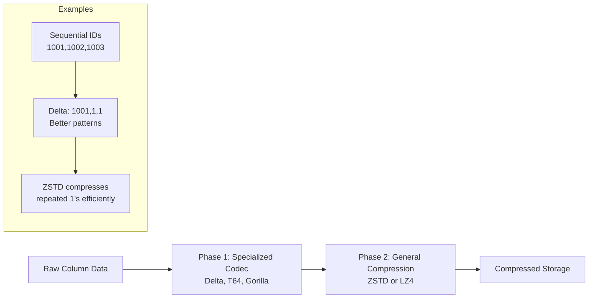
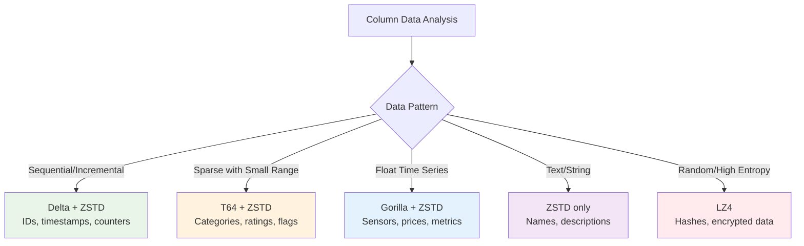

---
tags:
  - compression
  - lz4-vs-zstd
  - delta-codec
  - gorilla-codec
  - performance-optimization
---

## Why Compression Matters So Much

Compression in ClickHouse isn't just about saving disk space - it's the key to performance. This was a major mindset shift for me.

**Traditional thinking**: Compression trades CPU for storage
**ClickHouse reality**: Compression trades CPU for massive I/O speedup

### The Performance Math
```
Example query scanning 1TB of data:

Without compression:
- Read 1TB from disk: ~100 seconds (10GB/s SSD)
- Decompress: 0 seconds  
- Total: 100 seconds

With 10x compression:
- Read 100GB from disk: ~10 seconds
- Decompress: ~2 seconds (50GB/s decompression)
- Total: 12 seconds (8x faster!)
```

**Key insight**: Modern decompression is so fast that the I/O savings almost always win

## Two-Phase Compression Strategy

ClickHouse uses a sophisticated two-phase approach:



### Phase 1: Data Pattern Recognition
**Purpose**: Transform data to create better patterns for general compression

**Specialized codecs**:
- **Delta**: For sequential/incremental data
- **T64**: For sparse data with small value ranges  
- **Gorilla**: For floating-point time series
- **DoubleDelta**: For data with consistent increments

### Phase 2: General Compression  
**Purpose**: Compress the transformed bit patterns efficiently

**Algorithms**:
- **ZSTD**: Better compression ratios, good decompression speed
- **LZ4**: Faster decompression, lower compression ratios

## Compression Algorithm Comparison

### LZ4 vs ZSTD - The Core Decision

| Aspect | LZ4 | ZSTD |
|--------|-----|------|
| **Compression Ratio** | Good (5-10x) | Excellent (8-15x) |
| **Compression Speed** | Very Fast | Moderate |
| **Decompression Speed** | Very Fast (3-5 GB/s) | Fast (2-3 GB/s) |
| **CPU Usage** | Low | Moderate |
| **Memory Usage** | Low | Moderate |

### When I Use Each

**LZ4 - I choose when**:
- CPU is the bottleneck
- Network bandwidth is high
- Query patterns are CPU-intensive (complex aggregations)
- Storage cost is less important

**ZSTD - I choose when**:
- Storage cost matters
- I/O is the bottleneck  
- Network bandwidth is limited
- Data has good compression patterns

**ClickHouse Cloud default**: ZSTD(1) - good balance for most workloads

### Real Performance Numbers

From my benchmarks on e-commerce data:

| Data Type | Raw Size | LZ4 Compressed | ZSTD Compressed | LZ4 Query Time | ZSTD Query Time |
|-----------|----------|----------------|-----------------|----------------|-----------------|
| **Order timestamps** | 1GB | 95MB (10.5x) | 67MB (14.9x) | 1.2s | 0.9s |
| **Customer names** | 2GB | 280MB (7.1x) | 180MB (11.1x) | 2.1s | 1.7s |
| **Product prices** | 500MB | 78MB (6.4x) | 52MB (9.6x) | 0.8s | 0.6s |

**Key insight**: ZSTD usually wins for analytical queries despite slower decompression

## Specialized Codecs Deep Dive

### Delta Codec - For Sequential Data

**Perfect for**:
- Auto-incrementing IDs
- Timestamps  
- Sequential counters
- Monotonic metrics

**How it works**:
```
Original:  [1001, 1002, 1003, 1004, 1005]
Delta:     [1001, 1, 1, 1, 1]  
Benefit:   Small numbers compress much better with ZSTD
```

**Configuration**:
```sql
CREATE TABLE orders (
    order_id UInt32 CODEC(Delta, ZSTD),      -- Sequential IDs
    timestamp DateTime CODEC(Delta, ZSTD),    -- Time series
    customer_id UInt32 CODEC(T64, LZ4)       -- Sparse customer IDs
) ENGINE = MergeTree()
ORDER BY (timestamp, customer_id);
```

### T64 Codec - For Sparse Data

**Perfect for**:
- Sparse integer ranges
- Boolean-like data (0/1 with many zeros)
- Categorical data with few distinct values

**How it works**:
```
Original: [0, 0, 0, 5, 0, 0, 999, 0, 0, 0]
T64:      Encodes small ranges efficiently, much better than raw storage
```

**Real example**:
```sql
-- Product ratings (1-5 stars, many items unrated = 0)
rating UInt8 CODEC(T64, ZSTD)   -- Excellent compression for sparse ratings
```

### Gorilla Codec - For Floating Point Time Series

**Perfect for**:
- Sensor readings (gradual changes)
- Financial prices (small increments)
- Performance metrics
- Any float data with temporal correlation

**How it works**:
```
Uses XOR operations to find minimal differences between consecutive values
Temperature: [20.1, 20.2, 20.1, 20.3] → Stores only the differing bits
```

**Configuration**:
```sql
CREATE TABLE sensor_data (
    timestamp DateTime CODEC(Delta, ZSTD),
    temperature Float32 CODEC(Gorilla, ZSTD),   -- Gradual changes
    humidity Float32 CODEC(Gorilla, ZSTD),      -- Correlated values
    device_id UInt32 CODEC(T64, LZ4)            -- Sparse device IDs
) ENGINE = MergeTree()  
ORDER BY (timestamp, device_id);
```

### DoubleDelta Codec - For Consistent Increments

**Perfect for**:
- Data with consistent time intervals
- Counter metrics with steady increment rates
- Evenly spaced measurements

**Example**:
```
Original:     [100, 110, 120, 130, 140]   (increment by 10)
Delta:        [100, 10, 10, 10, 10]
DoubleDelta:  [100, 10, 0, 0, 0]          (even better!)
```

## Compression Performance Analysis

### Measuring Compression Effectiveness

```sql  
-- Check compression ratios for your tables
SELECT 
    table,
    column,
    type,
    data_compressed_bytes,
    data_uncompressed_bytes,
    round(data_uncompressed_bytes / data_compressed_bytes, 2) as compression_ratio,
    compression_codec
FROM system.parts_columns
WHERE table = 'my_table' AND active = 1
ORDER BY compression_ratio DESC;

-- Look for:
-- - Compression ratios < 3x (may need better codec)  
-- - Very high ratios > 50x (check data quality)
-- - Mismatched codecs for data patterns
```

### Codec Selection Strategy

My decision tree for choosing codecs:



### Optimization Examples

**Time-series table optimization**:
```sql
CREATE TABLE metrics (
    timestamp DateTime CODEC(Delta, ZSTD),          -- 15x compression
    metric_name String CODEC(ZSTD),                 -- 8x compression  
    value Float64 CODEC(Gorilla, ZSTD),            -- 12x compression
    server_id UInt16 CODEC(T64, LZ4),              -- 20x compression
    tags String CODEC(ZSTD)                        -- 6x compression
) ENGINE = MergeTree()
ORDER BY (timestamp, server_id);

-- Expected overall compression: ~10x
-- Query performance improvement: ~8x faster
```

**E-commerce table optimization**:
```sql
CREATE TABLE orders (
    order_id UInt32 CODEC(Delta, ZSTD),            -- Sequential orders
    customer_id UInt32 CODEC(T64, LZ4),            -- Sparse customer space
    order_timestamp DateTime CODEC(Delta, ZSTD),    -- Time series  
    total_cents UInt32 CODEC(T64, ZSTD),           -- Price clustering
    status Enum8(...) CODEC(T64, LZ4),             -- Few distinct values
    shipping_address String CODEC(ZSTD)             -- Text data
) ENGINE = MergeTree()
ORDER BY (order_timestamp, customer_id);
```

## Compression Settings I Use

### Global Compression Configuration
```xml
<!-- In config.xml -->
<compression>
    <case>
        <method>zstd</method>
        <level>1</level>                    <!-- ZSTD compression level -->
    </case>
    <case>
        <method>lz4</method>
        <min_part_size>10485760</min_part_size>     <!-- Use LZ4 for small parts -->
    </case>
</compression>
```

### Per-Query Compression Settings
```sql
-- Force specific compression for testing
SET network_compression_method = 'zstd';    -- Network transfer compression
SET compress_block_size = 262144;           -- 256KB compression blocks  
SET min_compress_chars = 1024;              -- Minimum size to compress
```

### Column-Specific Settings
```sql
-- Apply different strategies per column type
ALTER TABLE my_table MODIFY COLUMN 
    id UInt64 CODEC(Delta, ZSTD),
    timestamp DateTime CODEC(Delta, ZSTD),
    price Decimal(10,2) CODEC(T64, ZSTD),
    category String CODEC(ZSTD(3)),          -- Higher compression level
    description String CODEC(ZSTD(1));       -- Faster compression
```

## Monitoring Compression Performance

### Compression Efficiency Analysis
```sql
-- Identify poorly compressing columns
WITH compression_stats AS (
    SELECT 
        table,
        column,
        compression_codec,
        sum(data_compressed_bytes) as compressed_size,
        sum(data_uncompressed_bytes) as uncompressed_size,
        round(sum(data_uncompressed_bytes) / sum(data_compressed_bytes), 2) as ratio
    FROM system.parts_columns  
    WHERE active = 1
    GROUP BY table, column, compression_codec
)
SELECT *
FROM compression_stats
WHERE ratio < 3.0  -- Poorly compressing columns
ORDER BY (uncompressed_size - compressed_size) DESC;
```

### Query-Level Compression Impact
```sql
-- Monitor decompression overhead
SELECT 
    query_id,
    query_duration_ms,
    ProfileEvents.Values[indexOf(ProfileEvents.Names, 'CompressedReadBufferBytes')] as compressed_read,
    ProfileEvents.Values[indexOf(ProfileEvents.Names, 'UncompressedCacheHits')] as cache_hits,
    ProfileEvents.Values[indexOf(ProfileEvents.Names, 'UncompressedCacheMisses')] as cache_misses
FROM system.query_log
WHERE event_time >= now() - INTERVAL 1 HOUR
  AND type = 'QueryFinish'
  AND compressed_read > 0
ORDER BY query_duration_ms DESC;
```

## Common Compression Mistakes

### 1. Wrong Codec for Data Pattern
```sql
-- Bad: Delta on random data
random_hash String CODEC(Delta, ZSTD)  -- Delta won't help random data

-- Good: Match codec to pattern  
random_hash String CODEC(ZSTD)         -- Just use general compression
```

### 2. Over-Compression
```sql
-- Bad: Excessive compression level
description String CODEC(ZSTD(22))     -- Very slow compression/decompression

-- Good: Balanced approach
description String CODEC(ZSTD(3))      -- Good ratio, reasonable speed
```

### 3. Ignoring Column Characteristics
```sql
-- Analysis before choosing codec:
SELECT 
    column,
    uniq(column) as distinct_values,
    count() as total_rows,
    round(uniq(column) / count() * 100, 2) as cardinality_percent,
    min(column) as min_val,
    max(column) as max_val
FROM my_table
GROUP BY column;

-- High cardinality (>50%): Use ZSTD only
-- Low cardinality (<5%): Use T64 + ZSTD  
-- Sequential pattern: Use Delta + ZSTD
-- Time series floats: Use Gorilla + ZSTD
```

## Best Practices I Follow

1. **Test codec combinations**: Use sample data to test different codec combinations
2. **Monitor compression ratios**: Set up alerts for ratios dropping below 5x
3. **Consider query patterns**: CPU-bound queries might prefer LZ4, I/O-bound prefer ZSTD
4. **Use column analysis**: Analyze data patterns before choosing codecs
5. **Benchmark end-to-end**: Test compression + query performance together
6. **Start conservative**: Begin with ZSTD(1), optimize specific columns later
7. **Document decisions**: Note why specific codecs were chosen for future reference

### Codec Selection Cheat Sheet

| Data Pattern | Optimal Codec | Typical Compression | Use Case |
|--------------|---------------|-------------------|----------|
| **Sequential integers** | Delta + ZSTD | 10-30x | IDs, timestamps |
| **Sparse integers** | T64 + ZSTD | 5-20x | Categories, ratings |  
| **Float time series** | Gorilla + ZSTD | 8-25x | Sensors, metrics |
| **Text/strings** | ZSTD(1-3) | 3-8x | Names, descriptions |
| **High entropy** | LZ4 | 2-4x | Hashes, random data |
| **Boolean/flags** | T64 + LZ4 | 15-50x | Status flags |

**Remember**: Compression is not just about storage - it's your primary query performance optimization tool in ClickHouse.

---

**Next**: [[05-MergeTree Engines Guide]] - Choosing the right engine for your data patterns