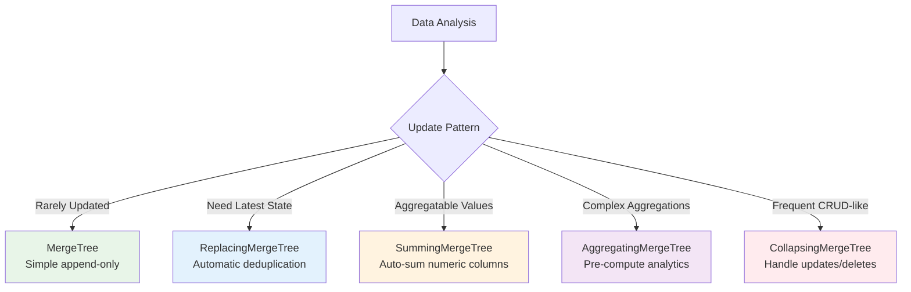
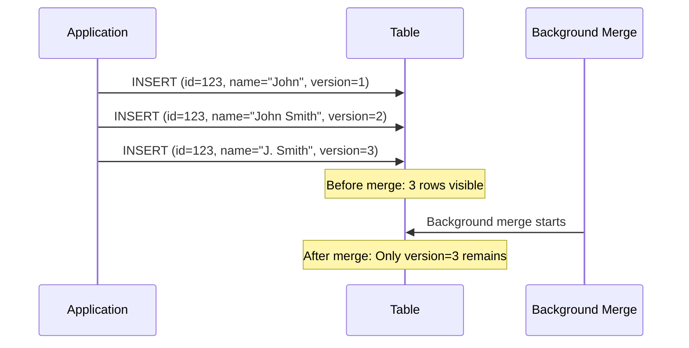
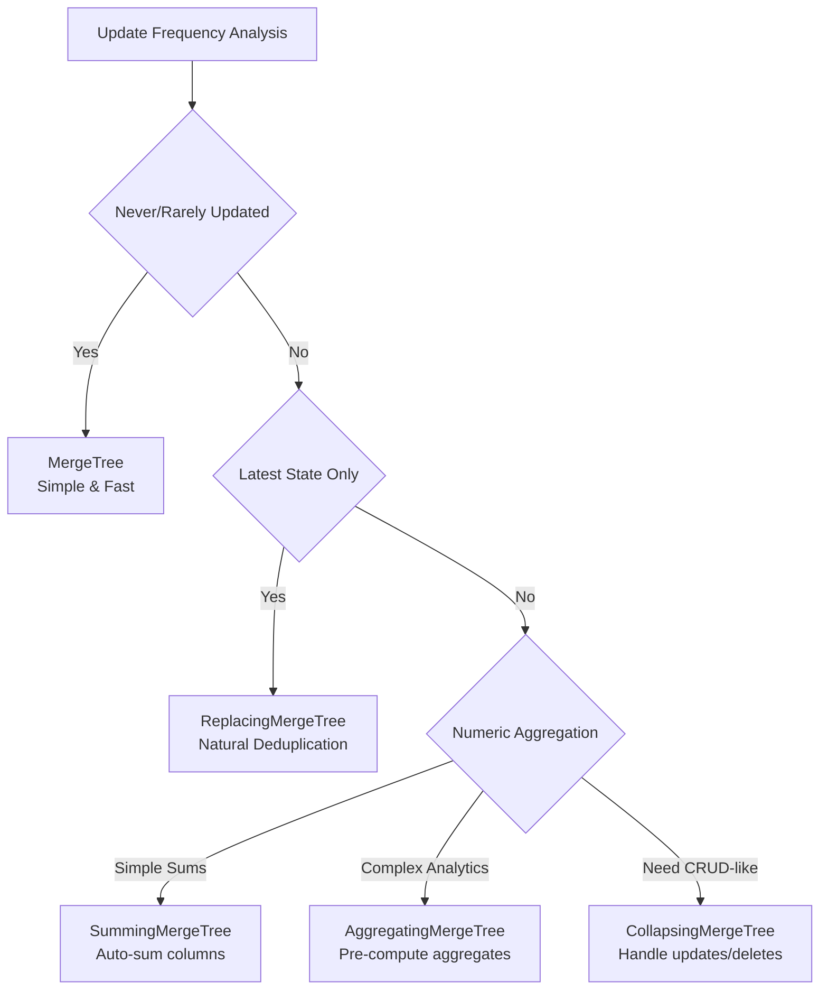

---
tags:
  - mergetree-engines
  - replacing-mergetree
  - summing-mergetree
  - collapsing-mergetree
  - aggregating-mergetree
  - engine-selection
---

## Engine Selection Strategy

Choosing the right MergeTree engine was crucial for my ClickHouse success. Each engine optimizes for different data patterns and update requirements.

## Engine Decision Matrix



## Base MergeTree Engine

**Use when**: Simple append-only analytics, no deduplication needed

### Core Characteristics
- **No deduplication** - allows duplicate primary keys  
- **Background merging** optimizes storage and performance
- **Immutable parts** - data never modified in-place
- **Sparse primary index** for efficient range queries

### Table Definition
```sql
CREATE TABLE events_log (
    event_id UInt32,
    user_id UInt32,
    event_type String,
    timestamp DateTime,
    properties String
) ENGINE = MergeTree()
ORDER BY (timestamp, user_id)        -- Primary key (sparse index)
PARTITION BY toYYYYMM(timestamp)      -- Monthly partitions  
SETTINGS 
    index_granularity = 8192,         -- Default granule size
    merge_with_ttl_timeout = 3600;    -- Merge frequency
```

### Key Behaviors
```sql
-- Multiple inserts with same primary key are allowed
INSERT INTO events_log VALUES (1, 100, 'click', '2024-01-15 10:00:00', '{}');
INSERT INTO events_log VALUES (1, 100, 'click', '2024-01-15 10:00:00', '{}');  -- Duplicate allowed

-- Query returns both rows until background merge
SELECT * FROM events_log WHERE event_id = 1;
-- Returns: 2 rows (before merge), 2 rows (after merge)
```

**Perfect for**: Web analytics, IoT telemetry, application logs, audit trails

## ReplacingMergeTree Engine

**Use when**: Need latest state of records, natural deduplication

### Core Concept


### Table Definition
```sql
CREATE TABLE user_profiles (
    user_id UInt32,
    name String,
    email String,
    last_updated DateTime,
    version UInt32                    -- Version column for replacement logic
) ENGINE = ReplacingMergeTree(version) -- Specify version column
ORDER BY user_id                      -- Deduplication key
SETTINGS 
    clean_deleted_rows = 'Always';    -- Ensure old versions are cleaned
```

### Replacement Logic
```sql
-- Version-based replacement (recommended)
INSERT INTO user_profiles VALUES (123, 'John Doe', 'john@email.com', now(), 1);
INSERT INTO user_profiles VALUES (123, 'John Smith', 'john.smith@email.com', now(), 2);
INSERT INTO user_profiles VALUES (123, 'J. Smith', 'j.smith@email.com', now(), 3);

-- After background merge: only version=3 remains

-- Time-based replacement (if no version column specified)  
CREATE TABLE user_sessions (
    user_id UInt32,
    session_data String,
    updated_at DateTime
) ENGINE = ReplacingMergeTree()       -- Uses insertion time for replacement
ORDER BY user_id;
```

### Important Behaviors
```sql
-- BEFORE merge - query may return multiple versions
SELECT * FROM user_profiles WHERE user_id = 123;
-- May return: 3 rows with different versions

-- To get latest version before merge completes:
SELECT * FROM user_profiles WHERE user_id = 123 ORDER BY version DESC LIMIT 1;

-- Use FINAL to force deduplication (expensive!)
SELECT * FROM user_profiles FINAL WHERE user_id = 123;
-- Always returns: 1 row (latest version)
```

**Perfect for**: User profiles, configuration data, dimension tables, master data

## SummingMergeTree Engine  

**Use when**: Pre-aggregate numeric metrics automatically

### Core Concept
Automatically sums numeric columns during background merges for rows with identical sorting key.

### Table Definition
```sql
CREATE TABLE daily_metrics (
    date Date,
    metric_name String, 
    user_segment String,
    -- These columns will be summed automatically
    page_views UInt64,
    unique_visitors UInt64, 
    revenue Decimal(10,2),
    -- Non-numeric columns: first value kept during merge
    created_at DateTime
) ENGINE = SummingMergeTree()
ORDER BY (date, metric_name, user_segment)    -- Grouping key for summation
PARTITION BY toYYYYMM(date);
```

### Summation Behavior
```sql
-- Insert individual events
INSERT INTO daily_metrics VALUES 
    ('2024-01-15', 'homepage_views', 'premium', 1000, 250, 150.00, now()),
    ('2024-01-15', 'homepage_views', 'premium', 500, 125, 75.00, now()),
    ('2024-01-15', 'homepage_views', 'premium', 300, 80, 45.00, now());

-- Before merge: 3 separate rows
SELECT * FROM daily_metrics 
WHERE date = '2024-01-15' AND metric_name = 'homepage_views';

-- After background merge: 1 aggregated row  
-- Result: ('2024-01-15', 'homepage_views', 'premium', 1800, 455, 270.00, <first_timestamp>)
```

### Advanced Summation Control
```sql
-- Specify which columns to sum (others ignored in summation)
CREATE TABLE custom_metrics (
    date Date,
    category String,
    revenue Decimal(10,2),
    orders UInt32,
    description String          -- Not summed
) ENGINE = SummingMergeTree((revenue, orders))  -- Only sum these columns
ORDER BY (date, category);
```

### Query Patterns
```sql
-- Query aggregated data (may include partial sums before merge)
SELECT 
    date,
    metric_name,
    SUM(page_views) as total_views,      -- Use SUM in case of partial merges
    SUM(revenue) as total_revenue
FROM daily_metrics
WHERE date >= '2024-01-01'
GROUP BY date, metric_name
ORDER BY date;

-- Force final aggregation with FINAL (expensive)
SELECT date, metric_name, page_views, revenue
FROM daily_metrics FINAL
WHERE date = '2024-01-15';
```

**Perfect for**: Metrics aggregation, time-series summaries, financial data, event counters

## AggregatingMergeTree Engine

**Use when**: Need complex pre-aggregated analytics (beyond simple sums)

### Core Concept  
Pre-computes complex aggregation states during merges, supporting COUNT, AVG, quantiles, etc.

### Table Definition
```sql
CREATE TABLE user_analytics (
    date Date,
    user_segment String,
    region String,
    -- Aggregation states (not raw values!)
    total_users AggregateFunction(uniq, UInt32),           -- COUNT DISTINCT
    avg_session_time AggregateFunction(avg, UInt32),       -- AVERAGE  
    revenue_sum AggregateFunction(sum, Decimal(10,2)),     -- SUM
    p95_response_time AggregateFunction(quantile(0.95), Float64)  -- 95th percentile
) ENGINE = AggregatingMergeTree()
ORDER BY (date, user_segment, region);
```

### Data Insertion (using -State functions)
```sql
-- Insert aggregation states, not raw values
INSERT INTO user_analytics  
SELECT 
    date,
    user_segment,
    region,
    uniqState(user_id) as total_users,              -- Create aggregation state
    avgState(session_duration) as avg_session_time,
    sumState(order_total) as revenue_sum,
    quantileState(0.95)(response_time) as p95_response_time
FROM raw_events
WHERE date = '2024-01-15'
GROUP BY date, user_segment, region;
```

### Querying Pre-Aggregated Data (-Merge functions)
```sql
-- Extract final values from aggregation states
SELECT 
    date,
    user_segment,
    uniqMerge(total_users) as unique_users,         -- Extract final count
    avgMerge(avg_session_time) as avg_duration,
    sumMerge(revenue_sum) as total_revenue,
    quantileMerge(0.95)(p95_response_time) as p95_latency
FROM user_analytics
WHERE date >= '2024-01-01'
GROUP BY date, user_segment
ORDER BY date, total_revenue DESC;
```

### Materialized View Pattern
```sql
-- Automatically maintain aggregated table
CREATE MATERIALIZED VIEW user_analytics_mv 
TO user_analytics AS
SELECT 
    toDate(timestamp) as date,
    user_segment,
    region,
    uniqState(user_id) as total_users,
    avgState(session_duration) as avg_session_time,
    sumState(revenue) as revenue_sum,
    quantileState(0.95)(response_time) as p95_response_time
FROM raw_user_events
GROUP BY date, user_segment, region;
```

**Perfect for**: Complex analytics dashboards, pre-computed metrics, data warehouse aggregates

## CollapsingMergeTree Engine

**Use when**: Need to handle updates and deletes in append-only system  

### Core Concept
Uses a "sign" column (-1 for delete, +1 for insert) to cancel out rows during merges.

### Table Definition
```sql
CREATE TABLE user_sessions (
    user_id UInt32,
    session_id String,
    start_time DateTime, 
    end_time DateTime,
    pages_viewed UInt32,
    sign Int8                    -- Special sign column: +1 or -1
) ENGINE = CollapsingMergeTree(sign)  -- Specify sign column
ORDER BY (user_id, session_id, start_time);  -- Collapsing key
```

### Update Pattern (Insert + Cancel + New Record)
```sql
-- Original session record
INSERT INTO user_sessions VALUES 
    (123, 'sess_456', '2024-01-15 10:00:00', '2024-01-15 10:30:00', 5, 1);

-- Update session (user viewed more pages, session extended)
-- Step 1: Cancel original record
INSERT INTO user_sessions VALUES 
    (123, 'sess_456', '2024-01-15 10:00:00', '2024-01-15 10:30:00', 5, -1);

-- Step 2: Insert updated record  
INSERT INTO user_sessions VALUES
    (123, 'sess_456', '2024-01-15 10:00:00', '2024-01-15 11:00:00', 8, 1);

-- After merge: Only the updated record remains (original canceled out)
```

### Querying Collapsing Data
```sql
-- Always filter by sign = 1 to get current state
SELECT 
    user_id,
    session_id, 
    end_time,
    pages_viewed
FROM user_sessions
WHERE sign = 1                    -- Only get non-canceled records
  AND user_id = 123;

-- Aggregate queries handle signs automatically
SELECT 
    user_id,
    SUM(sign * pages_viewed) as total_pages,    -- Canceled records subtract
    COUNT(sign) as active_sessions              -- +1 and -1 cancel out
FROM user_sessions  
GROUP BY user_id;
```

### Deletion Pattern
```sql
-- Delete a session entirely
INSERT INTO user_sessions VALUES
    (123, 'sess_789', '2024-01-15 14:00:00', '2024-01-15 14:30:00', 3, -1);
-- This cancels the session (if matching +1 record exists)
```

**Perfect for**: Session tracking, shopping carts, real-time dashboards with updates

## Engine Selection Guide

### My Decision Framework

**Step 1: Analyze Update Patterns**
```sql
-- Questions I ask:
-- 1. How often does the same logical record get updated?
-- 2. Do I need the latest state or all historical versions?  
-- 3. Are updates aggregatable (sums, counts) or complex (averages, percentiles)?
-- 4. Do I need real-time consistency or eventual consistency?
```

**Step 2: Choose Engine**


### Real-World Examples

**E-commerce Order Pipeline**:
```sql
-- Order events (immutable) - MergeTree
CREATE TABLE order_events (
    order_id UInt32,
    event_type Enum8('created'=1, 'paid'=2, 'shipped'=3, 'delivered'=4),
    timestamp DateTime,
    amount Decimal(10,2)
) ENGINE = MergeTree() ORDER BY (timestamp, order_id);

-- Order status (latest state) - ReplacingMergeTree  
CREATE TABLE order_status (
    order_id UInt32,
    status Enum8('pending'=1, 'shipped'=2, 'delivered'=3),
    updated_at DateTime,
    version UInt32
) ENGINE = ReplacingMergeTree(version) ORDER BY order_id;

-- Daily revenue (aggregated) - SummingMergeTree
CREATE TABLE daily_revenue (
    date Date,
    product_category String,
    total_revenue Decimal(12,2),
    order_count UInt32
) ENGINE = SummingMergeTree() ORDER BY (date, product_category);
```

**User Analytics Pipeline**:
```sql
-- Raw events - MergeTree
CREATE TABLE user_events (
    user_id UInt32, 
    event_type String,
    timestamp DateTime,
    properties String
) ENGINE = MergeTree() ORDER BY (timestamp, user_id);

-- User profiles (latest) - ReplacingMergeTree
CREATE TABLE user_profiles (
    user_id UInt32,
    name String,
    email String,
    signup_date Date,
    version UInt64
) ENGINE = ReplacingMergeTree(version) ORDER BY user_id;

-- Session analytics - CollapsingMergeTree (sessions get updated)
CREATE TABLE user_sessions (
    user_id UInt32,
    session_id String,
    start_time DateTime,
    duration_minutes UInt32,
    pages_viewed UInt32,
    sign Int8
) ENGINE = CollapsingMergeTree(sign) ORDER BY (user_id, session_id);
```

## Common Pitfalls and Solutions

### 1. ReplacingMergeTree - Not Using FINAL
```sql
-- Problem: Getting duplicate records before merge
SELECT * FROM user_profiles WHERE user_id = 123;
-- Returns: Multiple versions before background merge

-- Solution 1: Handle in application logic
SELECT * FROM user_profiles 
WHERE user_id = 123 
ORDER BY version DESC LIMIT 1;

-- Solution 2: Use FINAL (performance cost!)
SELECT * FROM user_profiles FINAL WHERE user_id = 123;
-- Always returns: Latest version only
```

### 2. SummingMergeTree - Forgetting SUM() in Queries  
```sql
-- Wrong: Assumes data is fully merged
SELECT date, metric_name, page_views FROM daily_metrics;

-- Correct: Always use SUM() to handle partial merges
SELECT date, metric_name, SUM(page_views) as total_views 
FROM daily_metrics GROUP BY date, metric_name;
```

### 3. CollapsingMergeTree - Unbalanced Signs
```sql  
-- Monitor for unbalanced signs (memory leak)
SELECT 
    user_id,
    SUM(sign) as sign_balance,
    COUNT(*) as total_records
FROM user_sessions
GROUP BY user_id  
HAVING sign_balance != 0        -- Should be 0 for clean data
ORDER BY total_records DESC;

-- Clean up orphaned records
OPTIMIZE TABLE user_sessions FINAL;
```

## Performance Monitoring

### Engine-Specific Monitoring
```sql
-- Check merge performance by engine type
SELECT 
    table,
    engine,
    count() as parts_count,
    sum(rows) as total_rows,
    sum(bytes_on_disk) as storage_bytes
FROM system.parts 
WHERE active = 1 AND database = 'my_db'
GROUP BY table, engine
ORDER BY parts_count DESC;

-- Monitor ReplacingMergeTree deduplication efficiency
SELECT 
    table,
    sum(rows) as total_rows,
    uniq(PRIMARY_KEY_COLUMNS) as unique_keys,
    round(total_rows / unique_keys, 2) as avg_duplicates_per_key
FROM system.parts p
JOIN system.tables t ON p.table = t.name
WHERE t.engine LIKE '%ReplacingMergeTree%' AND p.active = 1
GROUP BY table;
```

### Query Performance by Engine
```sql
-- Compare query patterns by engine type
SELECT 
    engine_full,
    count() as query_count,
    avg(query_duration_ms) as avg_duration,
    avg(memory_usage) as avg_memory
FROM system.query_log ql
JOIN system.tables t ON (ql.query LIKE '%' || t.name || '%')
WHERE event_time >= now() - INTERVAL 1 DAY
  AND type = 'QueryFinish'
GROUP BY engine_full
ORDER BY avg_duration DESC;
```

## Best Practices Summary

1. **Start with MergeTree**: Use base engine unless you have specific deduplication/aggregation needs
2. **ReplacingMergeTree for master data**: User profiles, configuration tables, dimension data  
3. **SummingMergeTree for simple metrics**: Counters, financial aggregates, basic analytics
4. **AggregatingMergeTree for complex analytics**: Pre-compute expensive aggregations
5. **CollapsingMergeTree sparingly**: Only when you need CRUD-like behavior
6. **Always use appropriate query patterns**: SUM() for SummingMergeTree, FINAL carefully, sign filtering for CollapsingMergeTree
7. **Monitor merge performance**: Watch for part count buildup and merge backlogs
8. **Test with realistic data**: Engine performance varies significantly with data patterns

**Key insight**: The right engine choice can make 10-100x performance difference. Analyze your data patterns first, then choose the engine that matches your update and query requirements.

---

**Next**: [[06-Distributed Architecture]] - Scaling ClickHouse across multiple servers