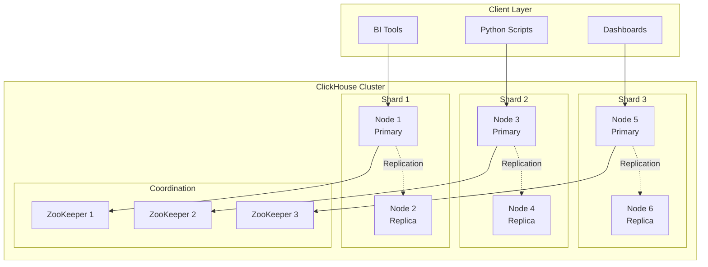
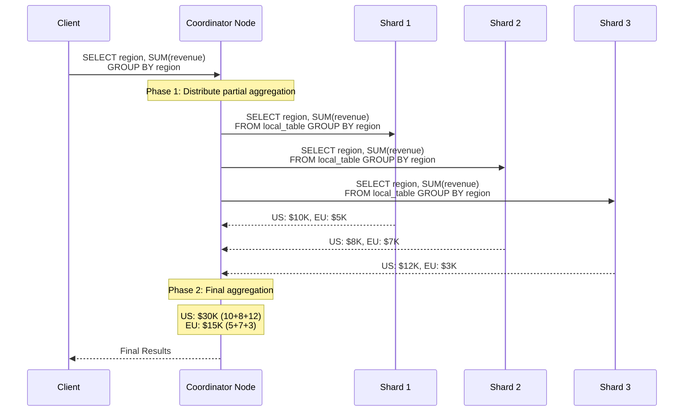
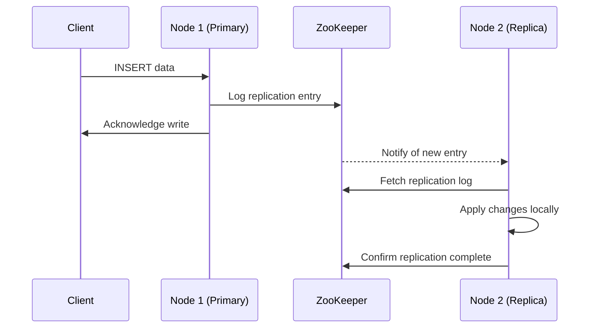

---
tags:
  - distributed-systems
  - sharding
  - replication
  - cluster-management
  - distributed-queries
  - two-phase-aggregation
---

## Why Distribute ClickHouse?

Single-node ClickHouse is incredibly powerful, but I eventually hit limits:
- **Storage**: Single machine can't hold 100TB+ datasets
- **Query performance**: Complex analytics need more CPU cores
- **Availability**: Single point of failure for critical systems
- **Concurrency**: Multiple heavy analytical workloads simultaneously

**Key insight**: ClickHouse distribution is about **scale** and **availability**, not transactional consistency like PostgreSQL clusters.

## Distributed Architecture Overview



**Core concepts I learned**:
- **Shard** = Horizontal partition of data (different data on each shard)
- **Replica** = Copy of same data for availability (same data, different nodes)
- **Coordinator** = Any node can coordinate distributed queries
- **ZooKeeper** = Handles replication consistency and cluster metadata

## Sharding Strategy Deep Dive

The sharding decision completely determines query performance and data distribution.

### Sharding Key Selection

**Key insight**: The sharding key should align with your most common query patterns.

#### Time-Based Sharding (My Preferred Approach)
```sql
-- Shard by time periods
ENGINE = Distributed(cluster, database, table, toYYYYMM(order_date))
```

**Advantages for analytics**:
- **Query pruning**: Most analytics queries are time-bounded
- **Natural lifecycle**: Old partitions can be dropped easily
- **Predictable growth**: New data goes to predictable shards

**Trade-offs**:
- **Hot spotting**: Recent time periods get more traffic
- **Cross-shard queries**: Customer-specific queries hit all shards

#### Hash-Based Sharding
```sql  
-- Even distribution by hash
ENGINE = Distributed(cluster, database, table, cityHash64(customer_id))
```

**Advantages**:
- **Even distribution**: Data spreads evenly across shards
- **No hot spots**: Traffic distributes evenly

**Trade-offs**: 
- **Query fanout**: Time-range queries hit all shards
- **No pruning**: Can't skip shards for common patterns

#### Custom Sharding Logic
```sql
-- Business-logic sharding
ENGINE = Distributed(cluster, database, table, 
    multiIf(
        region = 'US', 1,
        region = 'EU', 2, 
        region = 'ASIA', 3,
        0
    )
)
```

### Sharding Examples from My Experience

**E-commerce Analytics (Time-Based)**:
```sql
-- Orders table sharded by order month
CREATE TABLE orders_distributed (
    order_id UInt32,
    customer_id UInt32,
    order_date Date,
    total_amount Decimal(10,2)
) ENGINE = Distributed('ecommerce_cluster', 'analytics', 'orders_local', toYYYYMM(order_date));

-- Query: "Revenue for last quarter" - hits only recent shards
SELECT SUM(total_amount) FROM orders_distributed 
WHERE order_date >= '2024-01-01' AND order_date < '2024-04-01';
-- ClickHouse automatically routes to relevant shards only
```

**User Analytics (Hash-Based)**:
```sql
-- User events sharded by user hash for even distribution  
CREATE TABLE user_events_distributed (
    user_id UInt32,
    event_type String,
    timestamp DateTime
) ENGINE = Distributed('analytics_cluster', 'events', 'user_events_local', cityHash64(user_id));

-- Query: "All events for user 12345" - hits only one shard
SELECT * FROM user_events_distributed WHERE user_id = 12345;
-- Routes to single shard based on hash(12345)
```

## Distributed Query Execution

This was the most fascinating part for me - understanding how queries work across shards.

### Two-Phase Aggregation Pattern



### Aggregation Functions and Distribution

Understanding which functions work well distributed was crucial:

#### Easy to Distribute (Associative Functions)
```sql
-- These work perfectly across shards
SELECT 
    product_category,
    SUM(revenue) as total_revenue,        -- ✓ sum(a) + sum(b) = sum(a+b)
    COUNT(*) as total_orders,             -- ✓ count(a) + count(b) = count(a+b) 
    MIN(order_date) as first_order,       -- ✓ min(min(a), min(b)) = min(a+b)
    MAX(order_date) as last_order         -- ✓ max(max(a), max(b)) = max(a+b)
FROM orders_distributed 
GROUP BY product_category;
```

#### Challenging to Distribute
```sql
-- These require special handling
SELECT
    product_category,
    AVG(order_amount) as avg_order,       -- Needs SUM/COUNT from each shard
    uniq(customer_id) as unique_customers, -- Uses HyperLogLog approximation
    quantile(0.5)(order_amount) as median  -- Needs data distribution info
FROM orders_distributed
GROUP BY product_category;
```

### How ClickHouse Handles Complex Aggregations

**Average (AVG) - Converted to SUM/COUNT**:
```sql
-- Original query
SELECT AVG(order_amount) FROM orders_distributed;

-- ClickHouse actually executes:
-- Phase 1 on each shard: SELECT SUM(order_amount), COUNT(*) FROM orders_local
-- Phase 2 on coordinator: total_sum / total_count
```

**Distinct Count (uniq) - Probabilistic**:
```sql
-- Uses HyperLogLog for approximate distinct counts
SELECT uniq(customer_id) FROM orders_distributed;
-- Each shard maintains HyperLogLog sketch, coordinator merges sketches
-- Result: ~1% error, but works at any scale
```

**Exact vs Approximate Functions**:
```sql
-- Approximate (fast, scalable)
SELECT uniq(customer_id) FROM orders_distributed;           -- HyperLogLog
SELECT quantile(0.5)(amount) FROM orders_distributed;       -- Reservoir sampling

-- Exact (slower, resource intensive)  
SELECT uniqExact(customer_id) FROM orders_distributed;      -- Exact deduplication
SELECT quantileExact(0.5)(amount) FROM orders_distributed;  -- Full data sort
```

## Cluster Configuration

### My Standard 3-Shard Cluster Setup
```xml
<!-- In config.xml -->
<remote_servers>
    <production_cluster>
        <shard>
            <replica>
                <host>clickhouse-01</host>
                <port>9000</port>
                <user>default</user>
                <password>secure_password</password>
            </replica>
            <replica>
                <host>clickhouse-02</host>
                <port>9000</port>  
            </replica>
        </shard>
        
        <shard>
            <replica>
                <host>clickhouse-03</host>
                <port>9000</port>
            </replica>
            <replica>
                <host>clickhouse-04</host>
                <port>9000</port>
            </replica>
        </shard>
        
        <shard>
            <replica>
                <host>clickhouse-05</host>
                <port>9000</port>
            </replica>
            <replica>
                <host>clickhouse-06</host>
                <port>9000</port>
            </replica>
        </shard>
    </production_cluster>
</remote_servers>
```

### ZooKeeper Configuration
```xml  
<!-- ZooKeeper coordination -->
<zookeeper>
    <node>
        <host>zk-01</host>
        <port>2181</port>
    </node>
    <node>
        <host>zk-02</host>
        <port>2181</port>
    </node>
    <node>
        <host>zk-03</host>
        <port>2181</port>
    </node>
</zookeeper>
```

## Replication Setup

### ReplicatedMergeTree Configuration

**On each node, create local replicated tables**:
```sql
-- Node 1 & 2 (Shard 1)
CREATE TABLE orders_local (
    order_id UInt32,
    customer_id UInt32,
    order_date Date,
    total_amount Decimal(10,2)
) ENGINE = ReplicatedMergeTree(
    '/clickhouse/tables/{shard}/orders',    -- ZooKeeper path (shared per shard)
    '{replica}'                             -- Unique replica identifier  
)
ORDER BY (order_date, customer_id)
PARTITION BY toYYYYMM(order_date);

-- Node 3 & 4 (Shard 2) - same structure, different shard path
-- Node 5 & 6 (Shard 3) - same structure, different shard path
```

**Macros configuration** (in config.xml on each node):
```xml
<!-- Node 1 -->
<macros>
    <shard>01</shard>
    <replica>replica1</replica>
</macros>

<!-- Node 2 -->  
<macros>
    <shard>01</shard>
    <replica>replica2</replica>
</macros>
```

### Replication Process Flow


**Key replication characteristics I learned**:
- **Asynchronous by default**: Write acknowledged before replication complete
- **Eventually consistent**: Replicas catch up within seconds typically
- **Automatic failover**: Any replica can become primary
- **Conflict resolution**: ZooKeeper ensures consistency

## Distributed DDL Operations

### Cluster-Wide Table Management
```sql
-- Execute DDL on all cluster nodes simultaneously
CREATE TABLE orders_local ON CLUSTER production_cluster (
    order_id UInt32,
    customer_id UInt32,
    order_date Date,
    total_amount Decimal(10,2)
) ENGINE = ReplicatedMergeTree('/clickhouse/tables/{shard}/orders', '{replica}')
ORDER BY (order_date, customer_id)
PARTITION BY toYYYYMM(order_date);

-- Create distributed table (only on coordinator nodes)
CREATE TABLE orders_distributed ON CLUSTER production_cluster (
    order_id UInt32,
    customer_id UInt32,
    order_date Date,
    total_amount Decimal(10,2)
) ENGINE = Distributed(production_cluster, default, orders_local, toYYYYMM(order_date));
```

### Schema Changes Across Cluster
```sql
-- Add column to all shards
ALTER TABLE orders_local ON CLUSTER production_cluster 
ADD COLUMN shipping_cost Decimal(6,2) DEFAULT 0.0;

-- Update distributed table definition
ALTER TABLE orders_distributed ON CLUSTER production_cluster
ADD COLUMN shipping_cost Decimal(6,2) DEFAULT 0.0;
```

## Data Loading Strategies

### Direct Shard Loading (Fastest)
```sql
-- Load directly to each shard for maximum performance
-- Shard 1:
INSERT INTO orders_local SELECT * FROM source_data WHERE toYYYYMM(order_date) = 202401;

-- Shard 2:  
INSERT INTO orders_local SELECT * FROM source_data WHERE toYYYYMM(order_date) = 202402;

-- Shard 3:
INSERT INTO orders_local SELECT * FROM source_data WHERE toYYYYMM(order_date) = 202403;
```

### Distributed Table Loading (Simpler)
```sql
-- ClickHouse automatically routes to correct shards
INSERT INTO orders_distributed SELECT * FROM source_data;

-- Monitor distribution
SELECT 
    hostname() as node,
    count() as rows_inserted
FROM orders_local
GROUP BY hostname();
```

### Batch Loading Best Practices
```sql
-- Optimize insert settings for distributed loading
SET max_insert_block_size = 1048576;        -- 1M rows per insert
SET min_insert_block_size_rows = 1000000;   -- Don't create tiny parts
SET max_insert_threads = 16;                -- Parallel insertion
SET insert_distributed_sync = 1;            -- Wait for acknowledgment
```

## Performance Monitoring

### Cluster Health Monitoring
```sql
-- Check cluster node status
SELECT 
    cluster,
    shard_num,
    replica_num, 
    host_name,
    port,
    is_local,
    errors_count
FROM system.clusters
ORDER BY cluster, shard_num, replica_num;

-- Monitor replication lag
SELECT
    database,
    table,
    replica_name,
    is_leader,
    absolute_delay,
    queue_size,
    inserts_in_queue,
    merges_in_queue
FROM system.replicas
WHERE absolute_delay > 60;  -- Alert if >1 minute delay
```

### Distributed Query Performance  
```sql
-- Analyze distributed query execution
SELECT 
    query_id,
    query,
    query_duration_ms,
    read_rows,
    read_bytes,
    memory_usage,
    ProfileEvents.Values[indexOf(ProfileEvents.Names, 'DistributedConnectionFailTry')] as connection_failures
FROM system.query_log
WHERE query LIKE '%_distributed%' 
  AND event_time >= now() - INTERVAL 1 HOUR
  AND type = 'QueryFinish'
ORDER BY query_duration_ms DESC;

-- Check shard query distribution
SELECT 
    hostname() as shard,
    count() as query_count,
    avg(query_duration_ms) as avg_duration
FROM system.query_log  
WHERE event_time >= now() - INTERVAL 1 HOUR
  AND type = 'QueryFinish'
GROUP BY hostname()
ORDER BY query_count DESC;
```

### Network and Coordination Overhead
```sql
-- Monitor ZooKeeper performance
SELECT 
    name,
    value
FROM system.events  
WHERE name LIKE '%ZooKeeper%'
  AND value > 0;

-- Network transfer monitoring
SELECT
    ProfileEvents.Names[indexOf(ProfileEvents.Names, 'NetworkSendBytes')] as bytes_sent,
    ProfileEvents.Names[indexOf(ProfileEvents.Names, 'NetworkReceiveBytes')] as bytes_received
FROM system.query_log
WHERE event_time >= now() - INTERVAL 1 HOUR
  AND type = 'QueryFinish';
```

## Common Distributed Issues & Solutions

### Issue 1: Uneven Data Distribution
```sql
-- Diagnose data skew
SELECT 
    hostName() as shard,
    count() as rows,
    sum(bytes_on_disk) as storage_bytes
FROM orders_local
GROUP BY hostName()
ORDER BY rows DESC;

-- Solutions:
-- 1. Better sharding key selection
-- 2. Resharding existing data  
-- 3. Load balancing for hot partitions
```

### Issue 2: Cross-Shard Query Performance
```sql
-- Bad: Customer query hits all shards
SELECT * FROM orders_distributed WHERE customer_id = 12345;

-- Better: Add time boundary to enable shard pruning  
SELECT * FROM orders_distributed 
WHERE customer_id = 12345 
  AND order_date >= '2024-01-01'    -- Enables shard pruning
  AND order_date < '2024-04-01';

-- Best: Separate table design for customer queries
```

### Issue 3: Replication Lag
```sql
-- Monitor and resolve replication delays
SELECT 
    database,
    table,
    replica_name,
    absolute_delay,
    queue_size
FROM system.replicas
WHERE absolute_delay > 300;  -- >5 minutes is concerning

-- Solutions:
-- 1. Check network connectivity
-- 2. Verify ZooKeeper health
-- 3. Increase replication threads
SET background_schedule_pool_size = 16;
```

### Issue 4: ZooKeeper Coordination Problems  
```sql
-- Check ZooKeeper connectivity
SELECT * FROM system.zookeeper WHERE path = '/';

-- Common solutions:
-- 1. Verify ZooKeeper cluster health
-- 2. Check network connectivity to ZK nodes
-- 3. Review ZK session timeout settings
```

## Best Practices I Follow

### 1. Cluster Design
- **Start with 3 shards minimum** for good distribution
- **Always use replication** (factor 2 minimum) for production
- **Separate ZooKeeper cluster** from ClickHouse nodes
- **Plan for growth** - easier to start with more shards than to reshard

### 2. Sharding Strategy
- **Time-based sharding for analytics** (aligns with query patterns)
- **Hash-based for even distribution** when time-based doesn't fit
- **Monitor data skew regularly** and rebalance if needed
- **Keep shard sizes reasonable** (10-100GB per shard optimal)

### 3. Query Optimization  
- **Design queries for shard pruning** when possible
- **Use approximate functions** (uniq, quantile) for better performance
- **Batch inserts** to reduce coordination overhead
- **Monitor cross-shard query patterns** and optimize hotspots

### 4. Operational Excellence
- **Monitor replication lag continuously** 
- **Test failover procedures regularly**
- **Use distributed DDL** for schema changes
- **Plan for ZooKeeper maintenance windows**

**Key insight**: Distributed ClickHouse success depends on aligning your sharding strategy with your query patterns. The wrong sharding key can make queries 10-100x slower due to unnecessary cross-shard communication.

---

**Next**: [[07-Memory Management]] - How ClickHouse handles large-scale data processing in memory