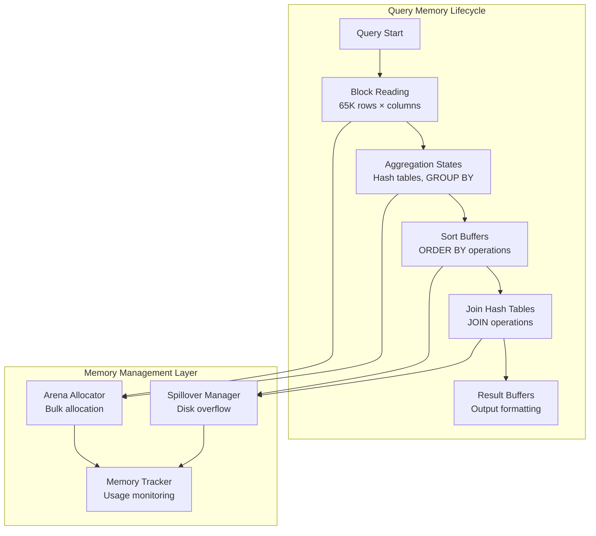
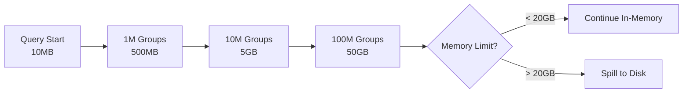
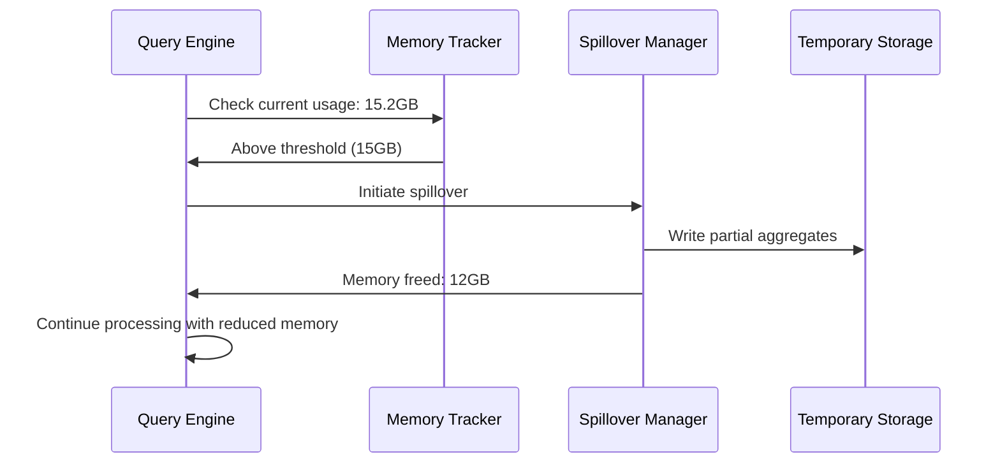
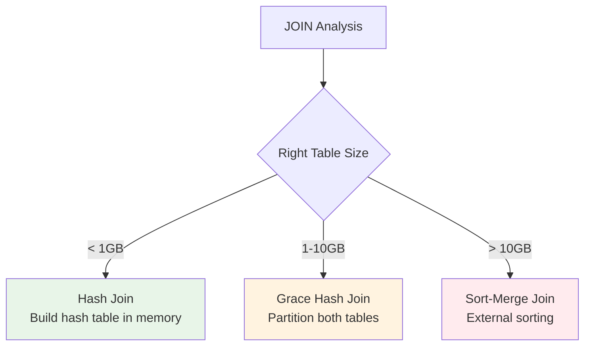
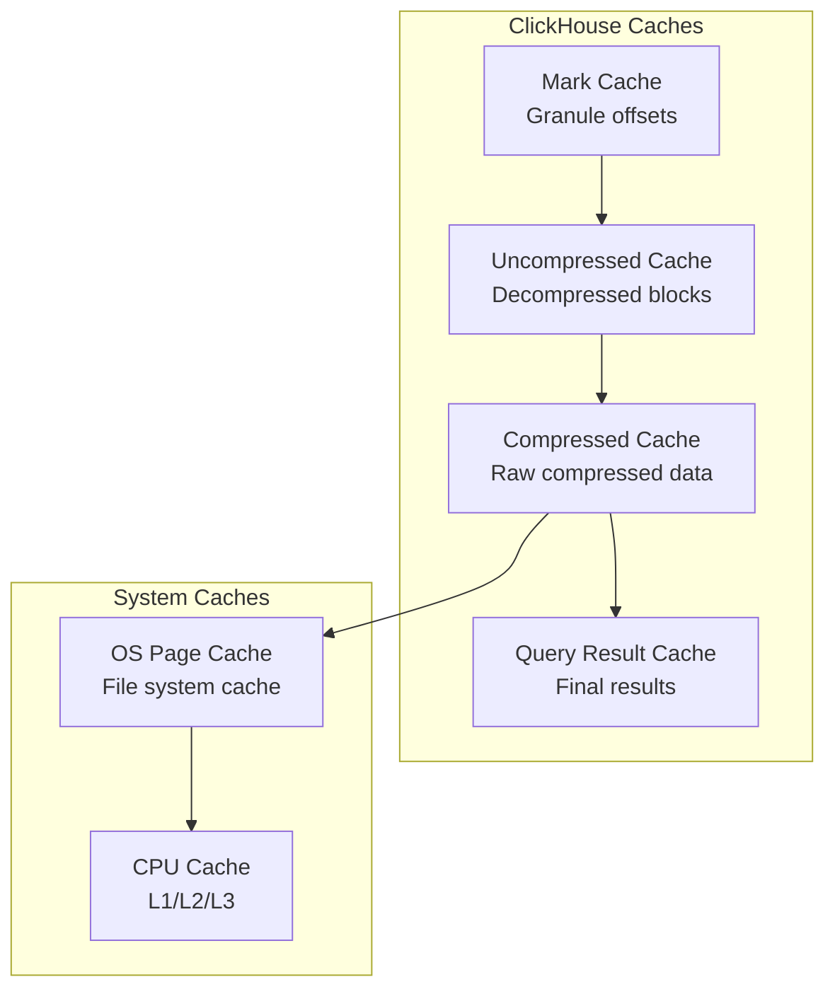

---
tags:
  - memory-management
  - arena-allocation
  - disk-spillover
  - large-aggregations
  - memory-optimization
  - cache-management
---

## Why Memory Management Matters in ClickHouse

Memory management was a crucial learning area for me because ClickHouse processes data very differently from traditional databases:

- **Large working sets**: Processing 65K row blocks requires significant memory
- **Complex aggregations**: GROUP BY operations can create millions of intermediate states
- **Vectorized operations**: SIMD processing needs aligned memory layouts
- **Analytical workloads**: Queries often scan billions of rows

**Key insight**: Poor memory management can make ClickHouse 10-100x slower or cause queries to fail entirely.

## Memory Architecture Overview



## Arena Allocation Pattern

This was a game-changing concept for me - ClickHouse doesn't use traditional malloc/free patterns.

### Traditional Memory Allocation Problems
```cpp
// Traditional approach (problematic for analytics)
for (int i = 0; i < 1000000; i++) {
    GroupState* state = malloc(sizeof(GroupState));    // Million small allocations
    // Process group
    free(state);                                       // Million deallocations  
}
// Result: Memory fragmentation, allocation overhead
```

### ClickHouse Arena Allocation
```cpp
// ClickHouse approach (optimized for analytics)
class Arena {
    vector<char*> chunks;           // Pre-allocated large chunks
    size_t current_pos;
    
public:
    void* alloc(size_t size) {
        // Fast allocation from current chunk
        // No individual free() calls needed
        return allocateFromCurrentChunk(size);
    }
    
    ~Arena() {
        // Bulk deallocation of entire arena
        for (auto chunk : chunks) {
            free(chunk);
        }
    }
};
```

### Arena Benefits I Observed
- **Reduced fragmentation**: Large chunks allocated upfront
- **Faster allocation**: Simple pointer arithmetic vs malloc overhead  
- **Bulk deallocation**: Entire arena freed at query completion
- **Cache friendly**: Related data stored in same memory regions

### Real Performance Impact
```
Traditional allocation for 1M GROUP BY groups:
- Malloc/free overhead: ~200ms
- Memory fragmentation: 30-50% wasted space
- Cache misses: High due to scattered allocation

Arena allocation:
- Allocation overhead: ~5ms  
- Memory fragmentation: <5% overhead
- Cache performance: Better locality
- Net improvement: 5-10x faster for complex queries
```

## Large Aggregation Handling

GROUP BY operations with millions of unique groups were my biggest memory challenge.

### Memory Growth Patterns



### Automatic Spillover Configuration
```sql
-- Memory limits I use for different query types
SET max_memory_usage = 20000000000;                    -- 20GB per query hard limit
SET max_bytes_before_external_group_by = 15000000000;  -- 15GB before GROUP BY spills
SET max_bytes_before_external_sort = 10000000000;      -- 10GB before ORDER BY spills
SET max_bytes_in_join = 8000000000;                    -- 8GB before JOIN spills

-- For memory-constrained environments
SET max_memory_usage = 5000000000;                     -- 5GB total limit
SET max_bytes_before_external_group_by = 3000000000;   -- Spill earlier
```

### Spillover Process Deep Dive

**Phase 1: In-Memory Processing**
```sql
-- Query with large GROUP BY
SELECT customer_segment, product_category, SUM(revenue), COUNT(*)
FROM orders  
WHERE order_date >= '2024-01-01'
GROUP BY customer_segment, product_category;

-- Memory tracking during execution:
-- Block 1: 50MB (hash table grows)
-- Block 2: 120MB 
-- Block 3: 280MB
-- Block N: 15GB (approaching spillover threshold)
```

**Phase 2: Spillover Decision**


**Phase 3: Final Merge**
```sql
-- ClickHouse automatically:
-- 1. Reads partial results from disk
-- 2. Merges with remaining in-memory data  
-- 3. Produces final aggregated results
-- User sees no difference in query results
```

### Monitoring Large Aggregations
```sql
-- Check for spillover operations
SELECT 
    query_id,
    query,
    ProfileEvents.Values[indexOf(ProfileEvents.Names, 'ExternalAggregationWritePart')] as parts_written,
    ProfileEvents.Values[indexOf(ProfileEvents.Names, 'ExternalAggregationCompressedBytes')] as bytes_spilled,
    memory_usage,
    peak_memory_usage
FROM system.query_log
WHERE event_time >= now() - INTERVAL 1 HOUR
  AND parts_written > 0    -- Queries that used spillover
ORDER BY bytes_spilled DESC;
```

## Two-Level Aggregation Strategy

ClickHouse automatically switches aggregation algorithms based on cardinality - this was crucial for my large-scale queries.

### Single-Level vs Two-Level Aggregation

**Single-Level (Small Groups)**:
```
Hash Table: customer_segment → {sum, count}
- "premium" → {$150K, 1200}
- "standard" → {$89K, 800} 
- "basic" → {$45K, 500}
```

**Two-Level (Many Groups)**:
```
Level 1: Partition by hash bucket
Bucket 0: customers 1-1000 → partial aggregates
Bucket 1: customers 1001-2000 → partial aggregates  
...
Level 2: Final aggregation within each bucket
```

### Configuration
```sql
-- Control two-level aggregation thresholds
SET group_by_two_level_threshold = 100000;              -- Switch at 100K groups
SET group_by_two_level_threshold_bytes = 50000000000;    -- Or at 50GB memory usage
SET max_bytes_before_external_group_by = 20000000000;   -- Spill at 20GB

-- For high-cardinality queries (millions of groups)
SET group_by_two_level_threshold = 50000;               -- Switch earlier
SET group_by_two_level_threshold_bytes = 10000000000;   -- Be more aggressive
```

### Performance Impact
```
Query: GROUP BY customer_id (1M unique customers)

Single-level aggregation:
- Memory usage: 15GB
- Query time: 45 seconds  
- Potential spillover: High risk

Two-level aggregation:  
- Memory usage: 8GB
- Query time: 28 seconds
- Spillover risk: Much lower
```

## Join Memory Management

Large JOIN operations were another major memory challenge I encountered.

### Join Algorithm Selection


### Hash Join Memory Management
```sql
-- Configuration for hash joins
SET join_algorithm = 'hash';                    -- Default algorithm
SET max_bytes_in_join = 8000000000;            -- 8GB hash table limit
SET join_use_nulls = 0;                        -- Memory optimization

-- Query with large join
SELECT o.order_id, c.customer_name, o.total_amount
FROM orders o 
JOIN customers c ON o.customer_id = c.customer_id  -- Hash join
WHERE o.order_date >= '2024-01-01';

-- Memory allocation:
-- 1. Build hash table for customers (smaller table)
-- 2. Probe with orders (larger table)  
-- 3. If hash table > 8GB, automatically spill to disk
```

### Join Spillover Process
```sql
-- Monitor join spillover
SELECT 
    query_id,
    ProfileEvents.Values[indexOf(ProfileEvents.Names, 'ExternalJoinWritePart')] as join_spill_parts,
    ProfileEvents.Values[indexOf(ProfileEvents.Names, 'ExternalJoinReadBytes')] as spill_read_bytes,
    peak_memory_usage
FROM system.query_log  
WHERE join_spill_parts > 0
  AND event_time >= now() - INTERVAL 1 DAY
ORDER BY peak_memory_usage DESC;
```

## Cache Management System

ClickHouse has multiple cache layers that I learned to tune for optimal performance.

### Cache Hierarchy


### Cache Configuration I Use
```xml
<!-- In config.xml -->
<mark_cache_size>5368709120</mark_cache_size>         <!-- 5GB mark cache -->
<uncompressed_cache_size>8589934592</uncompressed_cache_size>  <!-- 8GB uncompressed -->

<!-- Per-query cache settings -->
<use_uncompressed_cache>1</use_uncompressed_cache>
<compress_block_size>262144</compress_block_size>     <!-- 256KB compression blocks -->
```

```sql
-- Query-level cache control
SET use_uncompressed_cache = 1;              -- Enable decompressed block caching
SET use_query_cache = 1;                     -- Enable result caching (22.8+)
SET query_cache_size = 1073741824;           -- 1GB result cache
```

### Cache Hit Rate Analysis
```sql
-- Monitor cache effectiveness
SELECT 
    name,
    value,
    description
FROM system.events
WHERE name IN (
    'MarkCacheHits',
    'MarkCacheMisses', 
    'UncompressedCacheHits',
    'UncompressedCacheMisses',
    'CompressedReadBufferBytes',
    'UncompressedReadBufferBytes'
);

-- Calculate cache hit ratios
WITH cache_stats AS (
    SELECT 
        value AS hits
    FROM system.events 
    WHERE name = 'UncompressedCacheHits'
    UNION ALL
    SELECT value FROM system.events WHERE name = 'UncompressedCacheMisses'
)
SELECT 
    sum(hits) as total_requests,
    hits / sum(hits) * 100 as hit_rate_percent
FROM cache_stats;
```

### Cache Optimization Strategies
```sql
-- Warm up caches for frequently accessed data  
SELECT count() FROM important_table;         -- Loads marks into cache
SELECT sum(revenue) FROM important_table;    -- Loads uncompressed blocks

-- Preload specific partitions
SELECT count() FROM orders 
WHERE order_date >= '2024-01-01' 
  AND order_date < '2024-02-01';
```

## Memory Settings for Different Workloads

### High-Concurrency Analytics (Many Small Queries)
```sql
-- Conservative memory limits to support many concurrent queries
SET max_memory_usage = 2000000000;                     -- 2GB per query
SET max_bytes_before_external_group_by = 1000000000;   -- Spill early
SET max_bytes_before_external_sort = 800000000;        -- Conservative sort limit
SET max_threads = 4;                                   -- Limit CPU usage per query
```

### Large Batch Processing (Few Big Queries) 
```sql
-- Aggressive memory usage for maximum performance
SET max_memory_usage = 50000000000;                    -- 50GB per query
SET max_bytes_before_external_group_by = 30000000000;  -- High GROUP BY limit
SET max_bytes_before_external_sort = 25000000000;      -- High sort limit  
SET max_threads = 32;                                  -- Use all available CPU
```

### Real-Time Dashboard Queries
```sql
-- Fast execution with reasonable memory usage
SET max_memory_usage = 5000000000;                     -- 5GB limit
SET max_bytes_before_external_group_by = 3000000000;   -- Spill at 3GB
SET use_uncompressed_cache = 1;                        -- Heavy cache usage
SET max_execution_time = 30;                           -- 30 second timeout
```

## Memory Monitoring and Troubleshooting

### Real-Time Memory Monitoring
```sql
-- Monitor current memory usage across system
SELECT 
    query_id,
    user,
    memory_usage,
    peak_memory_usage,
    read_rows,
    read_bytes,
    query
FROM system.processes
WHERE memory_usage > 1000000000  -- Queries using >1GB
ORDER BY memory_usage DESC;

-- Check system memory pressure
SELECT 
    (total_memory - available_memory) / total_memory * 100 as memory_used_percent,
    available_memory / 1024 / 1024 / 1024 as available_gb
FROM system.asynchronous_metrics 
WHERE metric LIKE '%Memory%';
```

### Historical Memory Analysis
```sql
-- Identify memory-intensive query patterns
SELECT 
    extractAllGroups(query, '(SELECT .+? FROM ([a-zA-Z0-9_]+))')[1][2] as table_name,
    count() as query_count,
    avg(memory_usage / 1024 / 1024 / 1024) as avg_memory_gb,
    max(memory_usage / 1024 / 1024 / 1024) as max_memory_gb,
    avg(query_duration_ms) as avg_duration_ms
FROM system.query_log
WHERE event_time >= now() - INTERVAL 1 DAY
  AND type = 'QueryFinish'
  AND memory_usage > 0
GROUP BY table_name
ORDER BY max_memory_gb DESC;
```

### Memory Leak Detection
```sql
-- Check for potential memory leaks (long-running queries)
SELECT 
    query_id,
    user,
    elapsed,
    memory_usage / 1024 / 1024 as memory_mb,
    query
FROM system.processes  
WHERE elapsed > 3600     -- Running >1 hour
  AND memory_usage > 100000000  -- Using >100MB
ORDER BY elapsed DESC;

-- Monitor memory growth patterns
SELECT 
    toStartOfMinute(event_time) as minute,
    avg(memory_usage / 1024 / 1024 / 1024) as avg_memory_gb,
    max(memory_usage / 1024 / 1024 / 1024) as max_memory_gb,
    count() as query_count
FROM system.query_log
WHERE event_time >= now() - INTERVAL 2 HOUR
  AND type = 'QueryStart'
GROUP BY minute
ORDER BY minute DESC;
```

## Memory Optimization Best Practices

### 1. Query Design for Memory Efficiency
```sql
-- Bad: Memory-intensive pattern
SELECT 
    customer_id,
    groupArray(order_date) as all_order_dates,      -- Stores all values in memory
    groupArray(product_name) as all_products        -- Memory grows linearly
FROM orders
GROUP BY customer_id;

-- Good: Memory-efficient pattern  
SELECT 
    customer_id,
    count() as total_orders,                        -- Constant memory
    min(order_date) as first_order,
    max(order_date) as last_order,
    uniq(product_name) as unique_products           -- HyperLogLog - constant memory
FROM orders  
GROUP BY customer_id;
```

### 2. Aggregation Optimization
```sql
-- Memory-hungry: Complex grouping
SELECT 
    customer_id,
    product_category, 
    product_subcategory,
    brand,
    color,
    size,
    SUM(revenue)
FROM orders
GROUP BY customer_id, product_category, product_subcategory, brand, color, size;
-- Potential groups: millions

-- Memory-friendly: Hierarchical aggregation
SELECT 
    customer_id,
    product_category,
    SUM(revenue)
FROM orders
GROUP BY customer_id, product_category;
-- Then drill down in separate queries if needed
```

### 3. Temporary Table Strategy
```sql
-- Instead of complex single query, break into stages
CREATE TEMPORARY TABLE customer_summary AS
SELECT 
    customer_id,
    sum(revenue) as total_revenue,
    count() as order_count
FROM orders
GROUP BY customer_id;

-- Then join with dimension data
SELECT 
    cs.customer_id,
    c.customer_name,
    cs.total_revenue,
    cs.order_count
FROM customer_summary cs
JOIN customers c ON cs.customer_id = c.customer_id
ORDER BY total_revenue DESC;
```

### 4. Memory Limit Tuning
```sql
-- Start conservative and increase based on monitoring
SET max_memory_usage = 5000000000;    -- 5GB starting point

-- Monitor actual usage vs limits
SELECT 
    avg(memory_usage / 1024 / 1024 / 1024) as avg_memory_gb,
    max(memory_usage / 1024 / 1024 / 1024) as max_memory_gb,
    avg(5000000000 / memory_usage) as headroom_ratio
FROM system.query_log
WHERE event_time >= now() - INTERVAL 1 DAY;

-- Adjust limits based on headroom analysis
```

## Common Memory Issues & Solutions

### Issue 1: Query Killed by Memory Limit
```
Error: Memory limit exceeded (total): would use X bytes (attempt to allocate chunk of Y bytes)

Root causes:
1. GROUP BY with too many unique groups
2. Large JOIN operations  
3. ORDER BY on large result sets
4. Inefficient query patterns

Solutions:
1. Increase memory limits if hardware allows
2. Optimize query (reduce groups, add filters)  
3. Use sampling for exploratory analysis
4. Break query into smaller parts
```

### Issue 2: Memory Fragmentation
```sql
-- Symptoms: Available memory but allocation failures
-- Solution: Restart ClickHouse periodically for long-running systems
-- Or use jemalloc for better memory management

-- Monitor fragmentation indicators
SELECT 
    name,
    value
FROM system.asynchronous_metrics  
WHERE name IN ('MemoryResident', 'MemoryVirtual', 'MemoryCode')
ORDER BY name;
```

### Issue 3: Cache Thrashing
```sql
-- Symptoms: High cache miss rates
SELECT 
    UncompressedCacheHits / (UncompressedCacheHits + UncompressedCacheMisses) * 100 as hit_rate
FROM (
    SELECT value as UncompressedCacheHits FROM system.events WHERE name = 'UncompressedCacheHits'
), (
    SELECT value as UncompressedCacheMisses FROM system.events WHERE name = 'UncompressedCacheMisses'  
);

-- Solutions:
-- 1. Increase cache sizes
-- 2. Optimize query patterns for cache reuse
-- 3. Pre-warm caches for important data
```

## Memory Management Checklist

**Query Design**:
- ✅ Use constant-memory aggregations when possible
- ✅ Limit GROUP BY cardinality  
- ✅ Apply filters early to reduce working set
- ✅ Consider sampling for exploration

**Configuration**:  
- ✅ Set appropriate memory limits per workload
- ✅ Configure spillover thresholds  
- ✅ Tune cache sizes for your data access patterns
- ✅ Enable two-level aggregation for high-cardinality queries

**Monitoring**:
- ✅ Track memory usage trends
- ✅ Monitor spillover frequency
- ✅ Check cache hit rates
- ✅ Alert on memory pressure

**Key insight**: ClickHouse memory management is about understanding your data patterns and query characteristics, then configuring the system to handle peak loads efficiently while maintaining good performance for typical workloads.

---

**Next**: [[08-ClickHouse SQL Reference]] - ClickHouse SQL dialect differences and advanced analytical functions