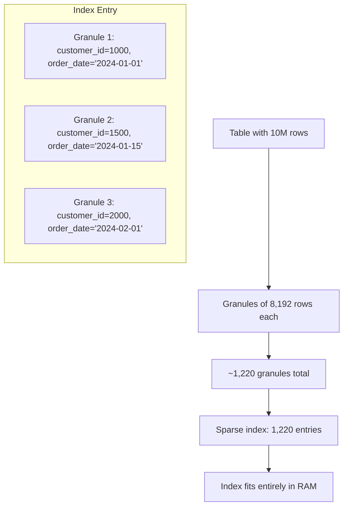

---
tags:
  - schema-design
  - table-design
  - indexing-strategies
  - partitioning
  - materialized-views
  - denormalization
---

## Schema Design Philosophy

Coming from PostgreSQL, I had to completely rethink schema design for ClickHouse. The fundamental shift:

**PostgreSQL mindset**: Normalize data, minimize redundancy, optimize for transactions
**ClickHouse mindset**: Denormalize for queries, optimize for analytical access patterns, embrace redundancy for performance

**Key insight**: In ClickHouse, **query performance trumps storage efficiency**. Design your schema for how you'll read data, not how you'll store it.

## Primary Key Design Strategy

The primary key (ORDER BY clause) is the most critical schema design decision in ClickHouse.

### Understanding Sparse Primary Index



**Critical concept**: Primary key helps eliminate entire granules from scan, not individual rows.

### Primary Key Selection Framework

**1. Query Pattern Analysis**
```sql
-- Before designing schema, analyze your query patterns:

-- Pattern 1: Time-series analysis (80% of queries)
-- "Revenue by day/week/month"
-- "Customer behavior over time"  
-- "Product performance trends"
ORDER BY (order_date, customer_id)  -- Time first

-- Pattern 2: Customer-centric analysis (15% of queries)  
-- "All orders for specific customer"
-- "Customer lifetime analysis"
ORDER BY (customer_id, order_date)  -- Customer first

-- Pattern 3: Product analysis (5% of queries)
-- "Product performance analysis"  
-- "Category trends"
ORDER BY (product_id, order_date)   -- Product first
```

**2. Selectivity Principle**
```sql
-- Put most selective columns first for better pruning
-- Good: High cardinality first
ORDER BY (customer_id, order_date, product_id)  -- 1M customers, good pruning

-- Bad: Low cardinality first  
ORDER BY (order_status, order_date, customer_id)  -- Only 5 statuses, poor pruning
```

### Real-World Primary Key Examples

**E-commerce Orders Table**:
```sql
CREATE TABLE orders (
    order_id UInt32,
    customer_id UInt32,
    order_date Date,
    order_timestamp DateTime,
    product_id UInt32,
    quantity UInt16,
    unit_price Decimal(10,2),
    total_amount Decimal(10,2),
    order_status Enum8('pending'=1, 'paid'=2, 'shipped'=3, 'delivered'=4)
) ENGINE = MergeTree()
ORDER BY (order_date, customer_id, order_id)    -- Time-series primary key
PARTITION BY toYYYYMM(order_date);               -- Monthly partitions
```

**Rationale**:
- `order_date` first: Most queries filter by time range
- `customer_id` second: Enables customer-specific analysis within time ranges
- `order_id` third: Ensures uniqueness and supports exact order lookups

**IoT Sensor Data**:
```sql
CREATE TABLE sensor_readings (
    sensor_id UInt32,
    timestamp DateTime,
    location_id UInt16,
    temperature Float32,
    humidity Float32,
    battery_level UInt8,
    firmware_version String
) ENGINE = MergeTree()
ORDER BY (sensor_id, timestamp)                 -- Sensor-first approach
PARTITION BY toYYYYMMDD(timestamp);              -- Daily partitions (high volume)
```

**Rationale**:
- `sensor_id` first: Queries often focus on specific sensors
- `timestamp` second: Enables time-series analysis per sensor
- Daily partitions: High-volume IoT data needs fine-grained partitioning

**User Analytics Events**:
```sql
CREATE TABLE user_events (
    user_id UInt32,
    session_id String,
    event_timestamp DateTime,
    event_type LowCardinality(String),
    page_url String,
    referrer_url String,
    user_agent String,
    properties String                            -- JSON as String
) ENGINE = MergeTree()  
ORDER BY (user_id, event_timestamp, session_id) -- User-centric design
PARTITION BY toYYYYMM(event_timestamp);
```

## Partitioning Strategies

Partitioning determines physical data organization and directly impacts query performance and maintenance.

### Time-Based Partitioning (Most Common)

```sql
-- Monthly partitioning (my default for most analytical workloads)
PARTITION BY toYYYYMM(timestamp)                 -- 202401, 202402, ...

-- Daily partitioning (for high-volume data)
PARTITION BY toYYYYMMDD(timestamp)              -- 20240115, 20240116, ...

-- Custom time buckets  
PARTITION BY (toYear(timestamp), toQuarter(timestamp))  -- Year-Quarter pairs
PARTITION BY (toYYYYMM(timestamp), region)      -- Time + categorical
```

**Partition size guidelines I follow**:
- **Target**: 10MB - 10GB per partition
- **Monthly**: Works well for most business analytics (moderate volume)  
- **Daily**: Use for high-volume IoT, logs, events (>1GB per day)
- **Weekly**: Rarely optimal, prefer monthly or daily

### Multi-Dimensional Partitioning

```sql
-- Geographic + temporal partitioning
CREATE TABLE regional_sales (
    order_date Date,
    region LowCardinality(String),
    country LowCardinality(String), 
    sales_amount Decimal(10,2)
) ENGINE = MergeTree()
ORDER BY (order_date, region, country)
PARTITION BY (region, toYYYYMM(order_date));     -- Region-month partitions

-- Business logic partitioning
CREATE TABLE customer_orders (
    customer_tier Enum8('free'=1, 'premium'=2, 'enterprise'=3),
    order_date Date,
    customer_id UInt32,
    order_amount Decimal(10,2)
) ENGINE = MergeTree()
ORDER BY (customer_tier, order_date, customer_id)  
PARTITION BY (customer_tier, toYYYYMM(order_date));
```

### Partitioning Best Practices

```sql
-- Monitor partition sizes
SELECT 
    partition,
    count() as parts,
    sum(rows) as total_rows,
    formatReadableSize(sum(bytes_on_disk)) as disk_size,
    min(min_date) as earliest_date,
    max(max_date) as latest_date
FROM system.parts
WHERE table = 'orders' AND active = 1
GROUP BY partition
ORDER BY partition;

-- Partition pruning verification
EXPLAIN SELECT count() FROM orders WHERE order_date >= '2024-01-15';
-- Should show: "Partition filter: order_date >= '2024-01-15'"
```

## Data Type Selection for Performance

### Numeric Type Optimization

```sql
CREATE TABLE optimized_metrics (
    -- Use smallest integer type that fits your range
    device_id UInt16,                    -- 0-65K devices (2 bytes vs 4 for UInt32)
    user_id UInt32,                      -- 0-4.3B users (4 bytes vs 8 for UInt64)
    
    -- Store money as integers (cents) for exact arithmetic + compression
    revenue_cents UInt32,                -- $0.00 - $42,949.67 (4 bytes)
    price_cents UInt16,                  -- $0.00 - $655.35 (2 bytes)
    
    -- Use appropriate decimal precision
    exchange_rate Decimal(8,4),          -- 1234.5678 (exact arithmetic)
    
    -- Float for approximate calculations (better compression)
    latitude Float32,                    -- GPS coordinates (6-7 decimal places)
    temperature Float32,                 -- Sensor readings
    
    -- Dates without unnecessary precision
    event_date Date,                     -- 2 bytes vs 4 for DateTime
    event_hour UInt8                     -- 0-23 hours (1 byte)
) ENGINE = MergeTree() ORDER BY (event_date, device_id);
```

### String Type Optimization

```sql
CREATE TABLE string_optimized (
    -- Fixed strings for predictable lengths
    country_code FixedString(2),         -- 'US', 'UK' (always 2 chars)
    currency_code FixedString(3),        -- 'USD', 'EUR' (always 3 chars)
    
    -- Low cardinality for categorical data (amazing compression)
    product_category LowCardinality(String),      -- ~100 categories
    user_segment LowCardinality(String),          -- 'premium', 'standard', 'basic'
    device_type LowCardinality(String),           -- 'mobile', 'desktop', 'tablet'
    
    -- Enums for small, fixed sets
    order_status Enum8(
        'pending' = 1, 
        'processing' = 2, 
        'shipped' = 3, 
        'delivered' = 4, 
        'cancelled' = 5
    ),
    
    -- Regular strings for unpredictable content
    product_description String,
    user_comments String,
    
    -- Nullable strings (use sparingly - hurts compression)
    optional_notes Nullable(String)
) ENGINE = MergeTree() ORDER BY (product_category, user_segment);
```

### Array and Complex Types

```sql  
CREATE TABLE complex_data (
    user_id UInt32,
    
    -- Arrays for multi-value attributes
    viewed_product_ids Array(UInt32),            -- Product IDs viewed in session
    purchase_amounts Array(Decimal(8,2)),        -- All purchase amounts
    event_timestamps Array(DateTime),            -- Event sequence timestamps
    
    -- Nested structures for related data
    user_sessions Nested(
        session_id String,
        start_timestamp DateTime,
        end_timestamp DateTime,
        page_views UInt16,
        conversions UInt8
    ),
    
    -- Maps for flexible key-value data
    custom_properties Map(String, String),       -- User-defined attributes
    feature_flags Map(String, UInt8),            -- Boolean feature flags
    
    -- JSON for semi-structured data (ClickHouse 22.8+)
    event_metadata JSON
    
) ENGINE = MergeTree() ORDER BY user_id;

-- Query complex types
SELECT 
    user_id,
    length(viewed_product_ids) as products_viewed,
    arrayElement(viewed_product_ids, 1) as first_product,
    user_sessions.session_id as all_session_ids,
    custom_properties['acquisition_channel'] as acquisition_source
FROM complex_data
WHERE has(viewed_product_ids, 12345);           -- Array membership check
```

## Secondary Indexes and Skip Indexes

ClickHouse sparse primary index doesn't help with non-primary-key columns. Skip indexes fill this gap.

### Skip Index Types and Use Cases

```sql
CREATE TABLE products_with_indexes (
    product_id UInt32,
    created_date Date,
    product_name String,
    category LowCardinality(String),
    price Decimal(8,2),
    description String,
    tags Array(String)
    
) ENGINE = MergeTree()
ORDER BY (created_date, product_id)             -- Primary key

-- Skip indexes for non-primary key filtering
INDEX category_idx category TYPE set(100) GRANULARITY 1,        -- Categorical filtering
INDEX price_range_idx price TYPE minmax GRANULARITY 4,         -- Range filtering  
INDEX description_search_idx description TYPE tokenbf_v1(32768, 3, 0) GRANULARITY 1,  -- Text search
INDEX tags_bloom_idx tags TYPE bloom_filter GRANULARITY 1;      -- Array membership
```

### Skip Index Performance Analysis

```sql
-- Monitor skip index effectiveness
SELECT 
    table,
    name,
    type,
    granularity,
    data_compressed_bytes,
    data_uncompressed_bytes
FROM system.data_skipping_indices
WHERE table = 'products_with_indexes';

-- Test index usage with EXPLAIN
EXPLAIN indexes = 1
SELECT * FROM products_with_indexes 
WHERE category = 'Electronics' AND price BETWEEN 100 AND 500;

-- Should show:
-- "Condition: (category in ['Electronics']) and (price >= 100) and (price <= 500)"
-- "Parts: 15/100 (15.0%)"  -- Skip index eliminated 85% of parts
```

### When to Use Skip Indexes

**Good candidates**:
```sql
-- Categorical columns frequently filtered
INDEX status_idx order_status TYPE set(10) GRANULARITY 1;

-- Numeric ranges  
INDEX amount_idx order_amount TYPE minmax GRANULARITY 4;

-- Text search columns
INDEX description_idx product_description TYPE tokenbf_v1(32768, 3, 0) GRANULARITY 1;
```

**Avoid skip indexes when**:
- Column is already in primary key (redundant)
- Column has very high cardinality (bloom filters become ineffective)
- Column is rarely filtered in queries
- Granularity is too small (index overhead exceeds benefits)

## Denormalization Patterns

### Star Schema vs Denormalized Design

**Traditional normalized approach** (avoid in ClickHouse):
```sql
-- Don't do this - requires JOINs for every analytical query
CREATE TABLE orders (order_id UInt32, customer_id UInt32, product_id UInt32, ...);
CREATE TABLE customers (customer_id UInt32, customer_name String, ...);  
CREATE TABLE products (product_id UInt32, product_name String, ...);

-- Every query requires JOINs
SELECT c.customer_name, p.product_name, SUM(o.amount)
FROM orders o
JOIN customers c ON o.customer_id = c.customer_id    -- JOIN kills performance
JOIN products p ON o.product_id = p.product_id       -- on large datasets
GROUP BY c.customer_name, p.product_name;
```

**ClickHouse denormalized approach** (preferred):
```sql
CREATE TABLE orders_denormalized (
    -- Order facts
    order_id UInt32,
    order_date Date,
    order_timestamp DateTime,
    
    -- Customer dimensions (denormalized)
    customer_id UInt32,
    customer_name String,
    customer_email String,
    customer_segment LowCardinality(String),
    customer_country LowCardinality(String),
    
    -- Product dimensions (denormalized)  
    product_id UInt32,
    product_name String,
    product_category LowCardinality(String),
    product_brand LowCardinality(String),
    
    -- Metrics
    quantity UInt16,
    unit_price Decimal(8,2),
    total_amount Decimal(10,2)
    
) ENGINE = MergeTree()
ORDER BY (order_date, customer_id, product_id)
PARTITION BY toYYYYMM(order_date);

-- Analytical queries become simple and fast
SELECT customer_segment, product_category, SUM(total_amount)
FROM orders_denormalized
WHERE order_date >= '2024-01-01'
GROUP BY customer_segment, product_category;
```

### Handling Dimension Updates

**Challenge**: What happens when customer name changes in denormalized table?

**Solution 1: Materialized Views with Refresh**
```sql
-- Source normalized tables (for dimension management)
CREATE TABLE customers (
    customer_id UInt32,
    customer_name String,
    customer_segment LowCardinality(String),
    updated_at DateTime
) ENGINE = ReplacingMergeTree(updated_at) ORDER BY customer_id;

-- Denormalized analytical table
CREATE TABLE customer_orders AS customers_normalized
ENGINE = MergeTree() ORDER BY (order_date, customer_id);

-- Refresh strategy (daily/weekly)
INSERT INTO customer_orders 
SELECT 
    o.order_date,
    o.customer_id,
    c.customer_name,          -- Fresh dimension data
    c.customer_segment,       -- Fresh dimension data
    o.product_id,
    o.total_amount
FROM orders_raw o
JOIN customers c ON o.customer_id = c.customer_id
WHERE o.order_date >= yesterday();
```

**Solution 2: Versioned Dimensions**
```sql
CREATE TABLE customer_orders_versioned (
    order_date Date,
    customer_id UInt32,
    
    -- Capture dimension state at time of transaction
    customer_name_at_order String,
    customer_segment_at_order LowCardinality(String),
    
    product_id UInt32,
    total_amount Decimal(10,2),
    
    -- Dimension validity
    dimension_version UInt32,
    dimension_updated_at DateTime
    
) ENGINE = MergeTree() ORDER BY (order_date, customer_id);
```

## Materialized Views for Pre-aggregation

Materialized views are essential for ClickHouse performance - they enable real-time pre-computed analytics.

### Basic Materialized View Pattern

```sql
-- Source table (detailed events)
CREATE TABLE page_views (
    user_id UInt32,
    page_url String,
    timestamp DateTime,
    session_id String,
    referrer_url String
) ENGINE = MergeTree() ORDER BY (timestamp, user_id);

-- Pre-aggregated materialized view
CREATE MATERIALIZED VIEW daily_page_views_mv
ENGINE = SummingMergeTree()
ORDER BY (date, page_url)
AS SELECT 
    toDate(timestamp) as date,
    page_url,
    count() as page_views,
    uniq(user_id) as unique_visitors,
    uniq(session_id) as unique_sessions
FROM page_views
GROUP BY date, page_url;

-- Query the materialized view (fast!)  
SELECT page_url, sum(page_views), sum(unique_visitors)
FROM daily_page_views_mv
WHERE date >= '2024-01-01'
GROUP BY page_url
ORDER BY sum(page_views) DESC;
```

### Advanced Materialized View Patterns

**Multi-level Aggregation**:
```sql
-- Level 1: Hourly aggregation
CREATE MATERIALIZED VIEW hourly_metrics_mv
ENGINE = SummingMergeTree() ORDER BY (date, hour, metric_name)
AS SELECT 
    toDate(timestamp) as date,
    toHour(timestamp) as hour,
    metric_name,
    sum(value) as hourly_sum,
    count() as hourly_count
FROM raw_metrics
GROUP BY date, hour, metric_name;

-- Level 2: Daily rollup from hourly
CREATE MATERIALIZED VIEW daily_metrics_mv  
ENGINE = SummingMergeTree() ORDER BY (date, metric_name)
AS SELECT
    date,
    metric_name,
    sum(hourly_sum) as daily_sum,
    sum(hourly_count) as daily_count
FROM hourly_metrics_mv
GROUP BY date, metric_name;
```

**Real-time Dashboard Materialized View**:
```sql
CREATE MATERIALIZED VIEW real_time_dashboard_mv
ENGINE = ReplacingMergeTree(updated_at)
ORDER BY metric_type
AS SELECT
    'revenue_today' as metric_type,
    sum(total_amount) as metric_value,
    now() as updated_at
FROM orders
WHERE order_date = today()
UNION ALL
SELECT
    'orders_today' as metric_type,
    count() as metric_value,
    now() as updated_at  
FROM orders
WHERE order_date = today()
UNION ALL
SELECT
    'avg_order_value' as metric_type,
    avg(total_amount) as metric_value,
    now() as updated_at
FROM orders
WHERE order_date = today();

-- Dashboard queries become instant
SELECT metric_type, metric_value FROM real_time_dashboard_mv FINAL;
```

### Materialized View Best Practices

```sql
-- Monitor materialized view performance
SELECT 
    database,
    table,
    engine,
    total_rows,
    total_bytes
FROM system.tables
WHERE engine LIKE '%MaterializedView%';

-- Check materialized view freshness
SELECT 
    database,
    table,
    max_date,
    dateDiff('minute', max_date, now()) as minutes_behind
FROM (
    SELECT 
        database,
        table, 
        max(date_column) as max_date
    FROM materialized_view_table
    GROUP BY database, table
);
```

## Schema Evolution and Migration

### Adding Columns Safely

```sql
-- Safe column additions (no data rewrite)
ALTER TABLE orders 
ADD COLUMN shipping_cost Decimal(6,2) DEFAULT 0.0,
ADD COLUMN tracking_number String DEFAULT '';

-- Adding columns with complex defaults (triggers rewrite)
ALTER TABLE orders 
ADD COLUMN total_with_tax Decimal(10,2) DEFAULT total_amount * 1.1;  -- Rewrite!

-- Better: Add column first, then populate
ALTER TABLE orders ADD COLUMN total_with_tax Decimal(10,2) DEFAULT 0.0;
ALTER TABLE orders UPDATE total_with_tax = total_amount * 1.1 WHERE total_with_tax = 0.0;
```

### Schema Versioning Strategy

```sql
-- Version 1: Initial schema
CREATE TABLE user_events_v1 (
    user_id UInt32,
    event_type String,
    timestamp DateTime
) ENGINE = MergeTree() ORDER BY (timestamp, user_id);

-- Version 2: Enhanced schema  
CREATE TABLE user_events_v2 (
    user_id UInt32,
    event_type LowCardinality(String),      -- Optimization
    timestamp DateTime,
    session_id String,                      -- New field
    properties String                       -- New field
) ENGINE = MergeTree() ORDER BY (timestamp, user_id);

-- Migration strategy: Parallel loading
INSERT INTO user_events_v2 
SELECT 
    user_id,
    event_type,
    timestamp,
    '' as session_id,                       -- Default for missing data
    '{}' as properties                      -- Default empty JSON
FROM user_events_v1;

-- Switch applications to v2, then drop v1
DROP TABLE user_events_v1;
RENAME TABLE user_events_v2 TO user_events;
```

## Schema Design Checklist

### Design Phase
- ✅ **Analyze query patterns** before designing schema  
- ✅ **Choose primary key** based on most common filters
- ✅ **Design for denormalization** - avoid JOINs in analytical queries
- ✅ **Select appropriate data types** for compression and performance
- ✅ **Plan partitioning strategy** based on data volume and access patterns

### Implementation Phase  
- ✅ **Add skip indexes** for frequently filtered non-primary key columns
- ✅ **Create materialized views** for expensive recurring calculations
- ✅ **Monitor compression ratios** and adjust codecs if needed
- ✅ **Test query performance** against realistic data volumes
- ✅ **Plan schema evolution** strategy for future changes

### Operational Phase
- ✅ **Monitor partition sizes** and split if growing too large
- ✅ **Track skip index effectiveness** and remove unused indexes
- ✅ **Refresh materialized views** appropriately for data freshness needs
- ✅ **Analyze query patterns** and optimize schema based on actual usage

**Key insight**: ClickHouse schema design is about understanding your analytical questions first, then designing data structures to answer them as efficiently as possible. The schema should reflect your analytical mental model, not your operational data model.

---

**Next**: [[10-ETL and Integration]] - Data ingestion patterns and integration approaches for analytical workloads