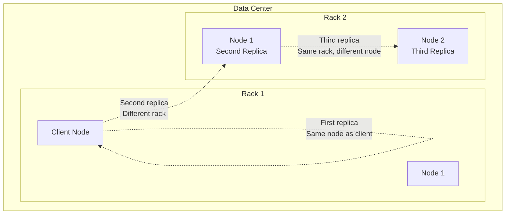

---
tags:
  - distributed-systems
  - data-chunking
  - file-systems
  - hdfs
  - storage
  - performance
  - data-locality
---

## The Core Problem

When you need to store a file larger than any single machine can hold, you must split it into smaller pieces. This process is called **chunking** or **block splitting**.

## Why Chunking Works

### Basic Example
```
Original File: big_data.txt (1TB)
Machine Capacity: 100GB each

Solution:
Chunk 1: bytes 0 to 107,374,182,399 → Machine A
Chunk 2: bytes 107,374,182,400 to 214,748,364,799 → Machine B
Chunk 3: bytes 214,748,364,800 to 322,122,547,199 → Machine C
... and so on
```

### Key Information Needed
For each chunk, the system must track:
- **File ID**: Which original file this chunk belongs to
- **Chunk Number**: Position in the original file (1st chunk, 2nd chunk, etc.)
- **Size**: How many bytes in this chunk
- **Location**: Which machine(s) store this chunk
- **Checksum**: Verify data integrity

## Chunk Size Considerations

### Too Small Chunks (e.g., 1KB)
**Problems:**
- Massive metadata overhead (millions of entries to track)
- Poor network efficiency (too many small transfers)
- Increased likelihood of losing pieces

### Too Large Chunks (e.g., 10GB)
**Problems:**
- Poor parallelization (fewer machines can work simultaneously)
- Expensive to transfer when machines fail
- Harder to balance storage across machines

### Sweet Spot (128MB in HDFS)
**Benefits:**
- Reasonable metadata size
- Good parallelization
- Efficient network transfers
- Fast enough failure recovery

## Distribution Strategies

### 1. Random Distribution
```python
def distribute_chunk(chunk_id):
    return random.choice(available_machines)
```
- **Pros**: Simple, tends to balance load
- **Cons**: No control over data locality

### 2. Round-Robin Distribution
```python
def distribute_chunk(chunk_id, machine_list):
    return machine_list[chunk_id % len(machine_list)]
```
- **Pros**: Perfect load balancing
- **Cons**: Predictable patterns, no locality consideration

### 3. Load-Aware Distribution
```python
def distribute_chunk(chunk_id):
    return min(available_machines, key=lambda m: m.current_load)
```
- **Pros**: Considers machine capacity and current usage
- **Cons**: More complex, requires real-time load monitoring

## Data Locality Optimization

### Rack-Aware Placement
Modern data centers organize machines into racks. Network bandwidth is:
- **Highest**: Within same machine
- **High**: Within same rack
- **Lower**: Between racks
- **Lowest**: Between data centers

### HDFS Placement Strategy


This balances:
- **Reliability**: Survives single node and single rack failures
- **Performance**: Two replicas on same rack for fast local reads
- **Network usage**: Avoids cross-rack writes when possible

## Reading Distributed Files

### Sequential Read Process
1. Client requests file
2. [[Metadata Management|NameNode]] returns list of chunks and their locations
3. Client contacts each machine in sequence
4. Client assembles chunks back into original file

### Parallel Read Optimization
Instead of reading chunks sequentially, client can:
- Request multiple chunks simultaneously
- Choose closest replica for each chunk
- Pipeline chunk assembly

### Example Read Operation
```
File: big_data.txt
Client needs: All chunks

NameNode response:
Chunk 1: [Machine-A, Machine-D, Machine-G]
Chunk 2: [Machine-B, Machine-E, Machine-H]  
Chunk 3: [Machine-C, Machine-F, Machine-I]

Client strategy:
- Read Chunk 1 from Machine-A (closest)
- Read Chunk 2 from Machine-B (closest)
- Read Chunk 3 from Machine-C (closest)
```

## Challenges with Distribution

### 1. Chunk Tracking Complexity
- Must maintain mapping of millions of chunks
- Updates needed when machines fail or chunks move
- Consistency challenges with multiple metadata replicas

### 2. Hotspots
- Popular files create load imbalances
- Some machines become overwhelmed while others idle
- Need dynamic load balancing strategies

### 3. Recovery Complexity
- When machine fails, must identify all chunks it held
- Need to re-replicate those chunks to maintain fault tolerance
- Must update all metadata references

## Connection to Other Concepts

- [[Fault Tolerance and Replication]] - How multiple copies are managed
- [[Metadata Management]] - How chunk locations are tracked
- [[HDFS Architecture]] - How Hadoop implements these concepts
- [[Performance vs Reliability Tradeoffs]] - Design decisions in chunk distribution

---

*Previous: [[Introduction to Distributed File Systems]] | Next: [[Fault Tolerance and Replication]]*