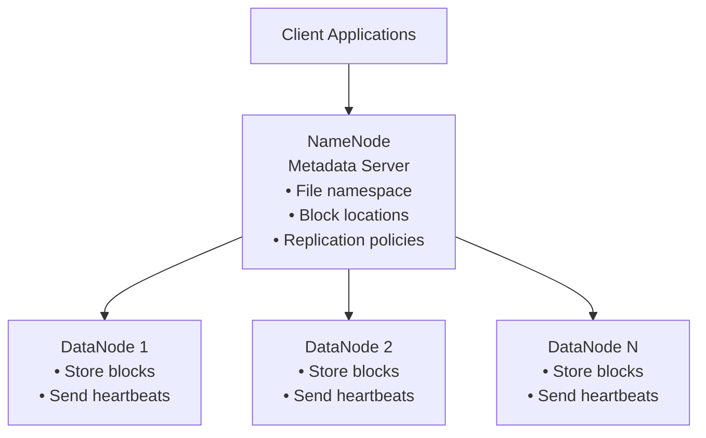
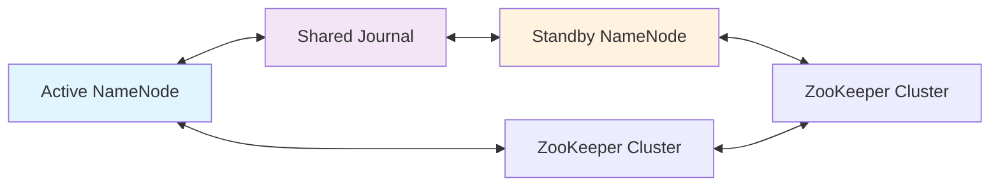

---
tags:
  - distributed-systems
  - hdfs
  - hadoop
  - complete-guide
  - file-systems
  - big-data
---

## Table of Contents
1. [[Introduction to Distributed File Systems]]
2. [[#Core Problems in Distributed Systems]]
3. [[#Data Distribution Strategies]]
4. [[Fault Tolerance and Replication]]
5. [[Metadata Management]]
6. [[Heartbeat and Failure Detection]]
7. [[HDFS Architecture]]
8. [[Performance vs Reliability Tradeoffs]]
9. [[Key Concepts Summary]]

---

## Introduction to Distributed File Systems

### What is a Distributed File System?
A distributed file system stores data across multiple machines while presenting a unified interface to users. Instead of storing files on a single machine, the system spreads data across many nodes in a network.

### Why Do We Need Distributed File Systems?
- **Scale**: Single machines can't store petabytes of data
- **Performance**: Multiple machines can serve data simultaneously
- **Reliability**: No single point of failure
- **Cost**: Commodity hardware is cheaper than specialized storage systems

### Real-World Example
Imagine storing a 1TB file when you only have machines with 100GB storage each. You must split the file across multiple machines to store it at all.

### The Fundamental Challenge
**Core Problem**: You have a 1TB file but only machines with 100GB storage each. How do you store it?

**Obvious Solution**: Split the file into chunks that fit on individual machines.

**But this creates new problems**:
- How do you keep track of which chunks belong to which files?
- How do you handle machine failures?
- How do clients find their data?
- How do you maintain performance?

---

## Core Problems in Distributed Systems 

### 1. Data Distribution Problem
**Challenge**: How do you split large files across multiple machines?

**Solution**: Chunking
- Split files into fixed-size blocks (e.g., 128MB in HDFS)
- Store each chunk on different machines
- Keep track of which chunks belong to which files

**Example**:
```
File: big_data.txt (1TB)
Chunk 1: Machines A, B, C (0-128MB)
Chunk 2: Machines D, E, F (128-256MB)
Chunk 3: Machines G, H, I (256-384MB)
...
```

### 2. Data Location Problem
**Challenge**: How do clients find which machines have their data?

**Solution**: Metadata Registry
- Central catalog that maps chunks to machine locations
- Stores only metadata, not actual data
- Enables fast lookups without scanning all machines

### 3. Failure Handling Problem
**Challenge**: Machines fail regularly - how do you prevent data loss?

**Solution**: Replication
- Store multiple copies of each chunk
- When one machine fails, data is still available from replicas

---

## Data Distribution Strategies

### Chunking Strategy
**Why chunk files?**
- Large files won't fit on single machines
- Enables parallel processing
- Simplifies replication and recovery

**Chunk Size Considerations**:
- **Too small**: Excessive metadata overhead
- **Too large**: Poor parallelization, large chunks to transfer on failure
- **HDFS default**: 128MB (sweet spot for most workloads)

### Distribution Patterns
1. **Random Distribution**: Spread chunks randomly across cluster
2. **Round-Robin**: Distribute chunks in sequence across machines
3. **Load-Aware**: Consider machine capacity and current load

### Data Locality Optimization
Modern data centers organize machines into racks. Network bandwidth is:
- **Highest**: Within same machine
- **High**: Within same rack
- **Lower**: Between racks
- **Lowest**: Between data centers

---

## Fault Tolerance & Replication

### Types of Failures (Most to Least Common)
1. **Machine Failure**: Single node dies (disk, memory, CPU failure)
2. **Rack Failure**: Power/network issues affect entire rack
3. **Data Center Failure**: Catastrophic events (rare but total)

### Replication Strategies

#### Strategy 1: Cross-Data Center Replication
```
Chunk 1: Copy A (Data Center 1), Copy B (Data Center 2), Copy C (Data Center 3)
```
**Pros**: Survives data center failures
**Cons**: High network latency, expensive

#### Strategy 2: Cross-Rack Replication (HDFS Approach)
```
Chunk 1: Machine A (Rack 1), Machine B (Rack 2), Machine C (Rack 2)
```
**Pros**: Good balance of fault tolerance and performance
**Cons**: Cannot survive multiple specific rack failures

#### Why HDFS Chooses Cross-Rack Strategy
- **Performance**: Only one cross-rack write instead of multiple
- **Reliability**: Survives single rack failure (most common type)
- **Cost**: Lower network overhead than cross-data center

### Replication Factor Decisions
- **Factor 1**: No fault tolerance, any failure = data loss
- **Factor 2**: Survives single failure, but risky
- **Factor 3**: HDFS default - survives 2 simultaneous failures
- **Factor 5+**: Very high reliability but expensive storage

### Calculating Reliability
For 3 replicas with 1% annual node failure rate:
```
Probability of losing all 3 replicas = 0.01^3 = 0.000001 = 1 in 1,000,000
```

---

## Metadata Management

### The Central Challenge
In a distributed file system with millions of chunks across thousands of machines, how do you efficiently answer: "Where is chunk #47 of file big_data.txt?"

### What is Metadata?
**Metadata** = "data about data"

In distributed file systems, metadata includes:
- **File information**: name, size, permissions, creation time
- **Block mapping**: which chunks belong to which files
- **Location mapping**: which machines store each chunk
- **Replication info**: how many copies exist and where

### Example Metadata Entry
```json
{
  "file": "/user/data/big_data.txt",
  "size": 1099511627776,
  "blocks": [
    {
      "block_id": "blk_1001",
      "size": 134217728,
      "replicas": [
        {"node": "machine-45", "rack": "rack-7"},
        {"node": "machine-78", "rack": "rack-12"},
        {"node": "machine-91", "rack": "rack-12"}
      ]
    }
  ]
}
```

### Why Separate Metadata from Data?
**Performance Benefits**:
- Small size: Metadata is tiny compared to actual data
- Memory storage: All metadata can fit in RAM for fast access
- Centralized: Single point for quick lookups

**Scale Comparison**:
```
1PB of data at 128MB blocks = 8 million blocks
Metadata per block ≈ 150 bytes
Total metadata ≈ 1.2GB (fits easily in memory)
```

### HDFS NameNode Architecture
HDFS uses centralized metadata with optimizations:

```python
class NameNode:
    def __init__(self):
        self.namespace = {}  # file/directory tree
        self.block_map = {}  # block_id -> [replica locations]
        self.node_map = {}   # node_id -> [blocks stored]
    
    def get_block_locations(self, filename):
        blocks = self.namespace[filename].blocks
        locations = []
        for block_id in blocks:
            replicas = self.block_map[block_id]
            locations.append(replicas)
        return locations
```

### Handling NameNode Failures
**The Problem**: If NameNode fails, entire cluster becomes inaccessible

**Solution**: High Availability (Active/Standby)
```
[Active NameNode] ↔ [Shared Journal] ↔ [Standby NameNode]
       |                                        |
   [ZooKeeper] ←--- coordination ---→ [ZooKeeper]
```

---

## Heartbeat & Failure Detection

### The Fundamental Problem
In distributed systems, you cannot perfectly distinguish between:
- Machine failure
- Network delay  
- Network partition
- Extreme slowness

### Heartbeat Mechanism
```python
def datanode_heartbeat():
    while True:
        heartbeat = {
            'datanode_id': self.node_id,
            'timestamp': current_time(),
            'capacity': self.total_space,
            'used': self.used_space,
            'remaining': self.free_space,
            'blocks': self.get_block_list()
        }
        namenode.send_heartbeat(heartbeat)
        sleep(3_seconds)
```

### Why Machines Ping Registry (Not Vice Versa)
**Option A: Registry Pings Machines**
- Problems: Registry becomes bottleneck, single point of monitoring failure

**Option B: Machines Ping Registry** (HDFS Choice)
- Advantages: Distributed load, registry focuses on serving clients

### HDFS Failure Detection Parameters
```python
HEARTBEAT_INTERVAL = 3_seconds        # How often DataNodes send heartbeats
HEARTBEAT_TIMEOUT = 10 * 60_seconds   # 10 minutes without heartbeat = dead
```

**Why 10 minutes?**
- Allows for temporary network issues and GC pauses
- Balances quick detection vs. false positives
- Reduces unnecessary re-replication work

### Recovery Process
```python
def handle_node_failure(failed_node):
    # 1. Get list of chunks on failed node
    lost_chunks = get_chunks_on_node(failed_node)
    
    # 2. For each chunk, check remaining replicas
    for chunk in lost_chunks:
        if count_replicas(chunk) < desired_replicas:
            # 3. Choose source and destination for re-replication
            source_node = choose_replica_source(chunk)
            dest_node = choose_replica_destination(chunk)
            # 4. Initiate copy operation
            initiate_copy(chunk, source_node, dest_node)
```

---

## HDFS Architecture

### Complete System Overview


### Core Components

#### NameNode (Master)
**Responsibilities**:
- Maintains file system namespace
- Tracks block locations across all DataNodes
- Makes replication decisions
- Handles client metadata requests

#### DataNode (Workers)  
**Responsibilities**:
- Store file blocks on local disks
- Serve read/write requests from clients
- Send periodic heartbeats to NameNode
- Execute commands from NameNode

### File Operations Flow

#### Writing a File
```python
def write_file_to_hdfs(filename, data):
    # 1. Client contacts NameNode
    response = namenode.create_file(filename, replication_factor=3)
    
    # 2. NameNode allocates blocks and chooses DataNode locations
    block_assignments = [
        {'block_id': 'blk_1001', 'locations': ['dn1', 'dn2', 'dn3']}
    ]
    
    # 3. Client writes to DataNodes in pipeline
    for assignment in block_assignments:
        pipeline = create_pipeline(assignment.locations)
        write_block_pipeline(data_chunk, pipeline)
    
    # 4. Client notifies NameNode of completion
    namenode.complete_file(filename)
```

#### Reading a File
```python
def read_file_from_hdfs(filename):
    # 1. Get block locations from NameNode
    block_locations = namenode.get_block_locations(filename)
    
    # 2. Read each block from closest DataNode
    file_data = []
    for block_info in block_locations:
        best_datanode = choose_best_replica(block_info.locations)
        block_data = datanode_client.read_block(best_datanode, block_info.block_id)
        file_data.append(block_data)
    
    # 3. Assemble complete file
    return b''.join(file_data)
```

### High Availability Architecture


**How it works**:
1. Active and Standby NameNodes share transaction log
2. Standby continuously applies changes from shared log
3. ZooKeeper handles failover coordination
4. Automatic switchover in seconds

---

## Performance vs Reliability Tradeoffs

### The Fundamental Tension
In distributed systems, you constantly face choices between making the system faster or more reliable. Almost every design decision involves weighing these competing goals.

### Key Tradeoff Areas

#### 1. Replication Factor
| Factor | Storage Cost | Read Performance | Write Performance | Reliability |
|--------|--------------|------------------|-------------------|-------------|
| 1 | 1x | Good | Excellent | Very Poor |
| 3 | 3x | Good | Moderate | Excellent |
| 5+ | 5x+ | Excellent | Poor | Exceptional |

**HDFS Choice**: Replication factor of 3
- **Why**: Sweet spot balancing storage cost, write performance, and reliability

#### 2. Block Size
| Size | Metadata Overhead | Parallelization | Network Efficiency |
|------|-------------------|-----------------|-------------------|
| Small (1-16MB) | High | Excellent | Poor |
| Medium (128MB) | Moderate | Good | Good |
| Large (512MB+) | Low | Poor | Excellent |

**HDFS Choice**: 128MB blocks
- **Why**: Balance between metadata overhead and parallelization

#### 3. Failure Detection Timing
| Detection Speed | False Positives | Recovery Time | System Stability |
|----------------|-----------------|---------------|------------------|
| Fast (1-2 min) | High | Fast | Less Stable |
| Moderate (10 min) | Low | Moderate | Stable |
| Slow (30+ min) | Very Low | Slow | Very Stable |

**HDFS Choice**: 10-minute timeout
- **Why**: Prefers stability over speed in failure detection

### Real-World Design Decisions

#### HDFS Rack Placement Strategy
**Option A**: All replicas same rack
- Pros: Fastest writes, lowest network overhead
- Cons: Single rack failure = data loss

**Option B**: All replicas different racks  
- Pros: Maximum fault tolerance
- Cons: Every write crosses rack boundaries

**HDFS Choice**: Mixed strategy (2 replicas same rack, 1 different)
- Result: Only 1 cross-rack write, survives single rack failure

### Engineering Decision Framework
When making tradeoffs, ask:
1. **Failure Analysis**: What failures are most common? What's the cost?
2. **Workload Characteristics**: Read-heavy or write-heavy? Latency vs throughput?
3. **Resource Constraints**: Storage budget? Network bandwidth? Operational complexity?
4. **Growth Projections**: How will data volume and user base grow?

---

## Key Concepts Summary

### Core Problems & Solutions
1. **Storage Problem**: Files larger than single machines → **Chunking**
2. **Location Problem**: Finding data across thousands of machines → **Metadata Registry**
3. **Failure Problem**: Inevitable machine failures → **Replication**
4. **Detection Problem**: Identifying failed machines → **Heartbeat Mechanism**

### HDFS Key Design Decisions
| Decision | HDFS Choice | Tradeoff Rationale |
|----------|-------------|-------------------|
| **Replication Factor** | 3 copies | 3x storage cost for strong reliability |
| **Block Size** | 128MB | Balance metadata overhead vs. parallelization |
| **Metadata Architecture** | Centralized | Simplicity vs. scalability |
| **Failure Detection** | 10-minute timeout | Stability vs. quick recovery |
| **Replica Placement** | 2 same rack, 1 different | Write performance vs. fault tolerance |

### Mental Models

#### The File Cabinet Analogy
- **Files** are split into **pages** (blocks)
- **Pages** are stored in **filing cabinets** (DataNodes)
- The **librarian** (NameNode) keeps a **catalog** (metadata)
- **Multiple copies** of important pages are kept in different cabinets
- **Regular check-ins** (heartbeats) ensure all cabinets are working

#### The Reliability Math
```
Single machine failure rate: 1% per year
With replication factor 3:
Probability of losing all copies = 0.01³ = 0.000001 (1 in 1 million)
```

### Self-Assessment Questions
To test your understanding:

**Conceptual Understanding**:
- Why can't you just use a traditional database for big data storage?
- What would happen if HDFS used 1MB blocks instead of 128MB?
- Why does HDFS need a separate NameNode?

**Design Reasoning**:
- Why does HDFS use 3 replicas instead of 2 or 4?
- Why do DataNodes send heartbeats to NameNode rather than vice versa?
- Why put 2 replicas on same rack instead of spreading across racks?

**Practical Application**:
- How would you modify HDFS for write-heavy workloads?
- What would you change for very small files?
- How would you adapt for intercontinental replication?

### Beyond HDFS: Related Systems
| System | Primary Tradeoff | Use Case |
|--------|------------------|----------|
| **HDFS** | Simplicity over performance | Batch processing |
| **Cassandra** | Availability over consistency | Web applications |
| **MongoDB** | Ease of use over scalability | Document storage |
| **Ceph** | Flexibility over simplicity | Cloud storage |

### Key Takeaways
1. **No Perfect Solutions**: Every design choice has costs
2. **Context Matters**: Optimal tradeoffs depend on specific requirements  
3. **Simple Designs Scale**: HDFS proves simple approaches can work at massive scale
4. **Understanding Workloads is Crucial**: Good tradeoffs require knowing your use case
5. **Evolution is Possible**: But fundamental choices constrain future options

---

*This completes your comprehensive study guide to distributed file systems and HDFS. Use the self-assessment questions to test your understanding and explore the related concepts for deeper learning.*