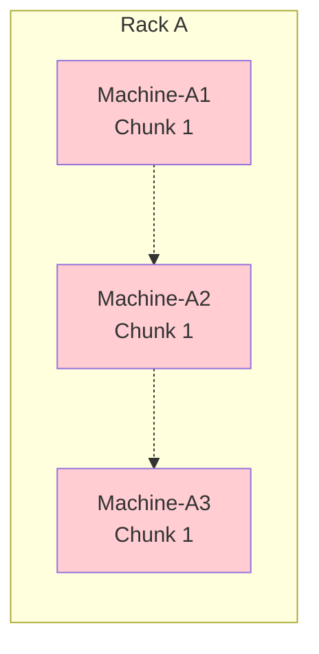
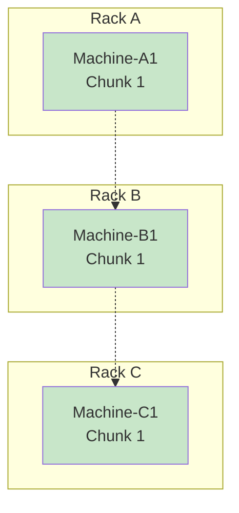
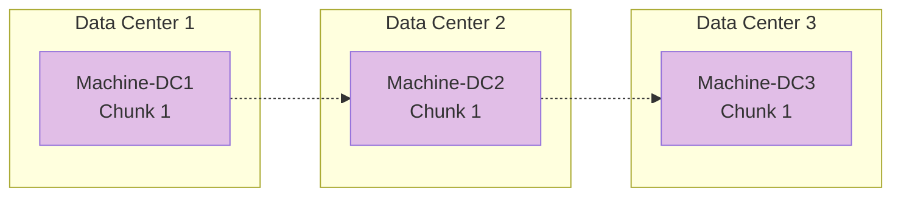
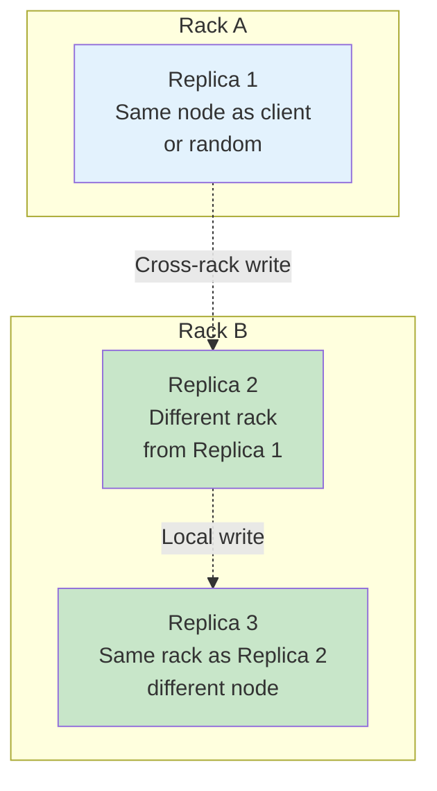

---
tags:
  - distributed-systems
  - fault-tolerance
  - replication
  - reliability
  - availability
  - hdfs
  - failure-handling
---

## The Fundamental Problem

In distributed systems, machine failures are not exceptional events—they're inevitable and regular occurrences. Without proper handling, any single machine failure would make part of your data permanently inaccessible.

## Types of Failures (Most to Least Common)

### 1. Single Machine Failures
**Frequency**: Daily in large clusters
**Causes**:
- Disk drive failures
- Memory corruption
- CPU overheating
- Power supply issues
- Software crashes

### 2. Rack-Level Failures  
**Frequency**: Weekly/Monthly in large data centers
**Causes**:
- Power distribution unit (PDU) failure
- Top-of-rack switch failure
- Cooling system problems
- Network cable issues

### 3. Data Center Failures
**Frequency**: Yearly/Rarely
**Causes**:
- Natural disasters (earthquakes, floods)
- Power grid failures
- Network provider outages
- Human errors (wrong cable unplugged)

## Replication Strategies

### Strategy 1: Local Replication

**Pros**: Fast access, low network overhead
**Cons**: Single rack failure loses all copies

### Strategy 2: Cross-Rack Replication  

**Pros**: Survives rack failures
**Cons**: Higher network overhead for writes

### Strategy 3: Cross-Data Center Replication

**Pros**: Survives data center failures
**Cons**: Very high latency, expensive network costs

## HDFS Default Strategy (Cross-Rack with Performance Optimization)

### The Balanced Approach


### Why This Works
**Reliability**: 
- Survives any single node failure
- Survives any single rack failure  
- Probability of losing all 3 replicas is extremely low

**Performance**:
- 2 replicas in same rack enable fast local reads
- Only 1 replica needs cross-rack network transfer during writes
- Read operations can choose closest available replica

**Network Efficiency**:
- Write operation crosses rack boundary only once
- Subsequent reads often served locally

## Failure Detection and Recovery

### The Problem
When a machine fails:
1. System must detect the failure quickly
2. Identify all chunks that were stored on failed machine  
3. Create new replicas to maintain replication factor
4. Update metadata to reflect new locations

### Detection Methods

#### Heartbeat Mechanism
```python
# Each DataNode sends heartbeat every 3 seconds
heartbeat = {
    'node_id': 'machine-47',
    'timestamp': current_time(),
    'available_space': 850_000_000_000,  # 850GB free
    'chunks_stored': ['chunk_1_2', 'chunk_5_7', ...]
}

# NameNode marks node as dead if no heartbeat for 10 minutes
if (current_time() - last_heartbeat) > 600_seconds:
    mark_node_as_failed(node_id)
```

#### Why Machines Ping the Registry (Not Vice Versa)
**Scalability**: 10,000 machines × 1 registry is better than 1 registry × 10,000 machines
**Load Distribution**: Spreads the heartbeat load across time
**Registry Focus**: Allows metadata server to focus on serving clients

### Recovery Process
```python
def handle_node_failure(failed_node_id):
    # 1. Get list of chunks that were on failed node
    lost_chunks = get_chunks_on_node(failed_node_id)
    
    # 2. For each chunk, check remaining replicas
    for chunk in lost_chunks:
        remaining_replicas = count_replicas(chunk)
        if remaining_replicas < desired_replicas:
            # 3. Choose source and destination for re-replication
            source_node = choose_replica_source(chunk)
            dest_node = choose_replica_destination(chunk)
            
            # 4. Initiate copy operation
            initiate_copy(chunk, source_node, dest_node)
```

## Replication Factor Decisions

### Common Configurations

#### Replication Factor = 1
- **Use case**: Temporary data, easily regeneratable data
- **Risk**: Any single failure loses data permanently
- **Storage cost**: 1x

#### Replication Factor = 2  
- **Use case**: Important but replaceable data
- **Risk**: Two failures on same chunk cause data loss
- **Storage cost**: 2x

#### Replication Factor = 3 (HDFS Default)
- **Use case**: Critical data requiring high availability
- **Risk**: Three failures on same chunk (extremely rare)
- **Storage cost**: 3x

### Calculating Risk
For 3 replicas with 1% annual node failure rate:
```
Probability of losing all 3 replicas = 0.01^3 = 0.000001 = 1 in 1,000,000
```

## Consistency During Failures

### Write Consistency Challenge
What happens when writing to 3 replicas and 1 machine fails mid-write?

```
Write operation in progress:
Replica 1: ✓ Write successful
Replica 2: ✗ Machine failed  
Replica 3: ✓ Write successful

Result: Only 2 out of 3 replicas have new data
```

### HDFS Approach
1. **Minimum Replicas**: Require acknowledgment from at least 2 replicas
2. **Pipeline Recovery**: If replica fails during write, continue with remaining replicas
3. **Background Repair**: Detect under-replicated blocks and create new copies

## Performance Implications

### Read Performance
- **Best case**: Read from local replica (same machine/rack)
- **Typical case**: Choose replica based on network distance and load
- **Load balancing**: Distribute reads across replicas

### Write Performance  
- **Sequential writes**: Must write to all replicas before confirming success
- **Network bottleneck**: Cross-rack writes are slowest component
- **Pipeline optimization**: Start writing replica 2 before replica 1 completes

### Storage Overhead
```
Raw data: 100TB
Replication factor: 3
Total storage needed: 300TB
Storage efficiency: 33%
```

## Connection to Other Concepts

- [[Data Chunking and Distribution]] - What gets replicated
- [[Metadata Management]] - How replica locations are tracked
- [[Heartbeat and Failure Detection]] - How failures are detected
- [[Performance vs Reliability Tradeoffs]] - Design decisions in replication

---

*Previous: [[Data Chunking and Distribution]] | Next: [[Metadata Management]]*