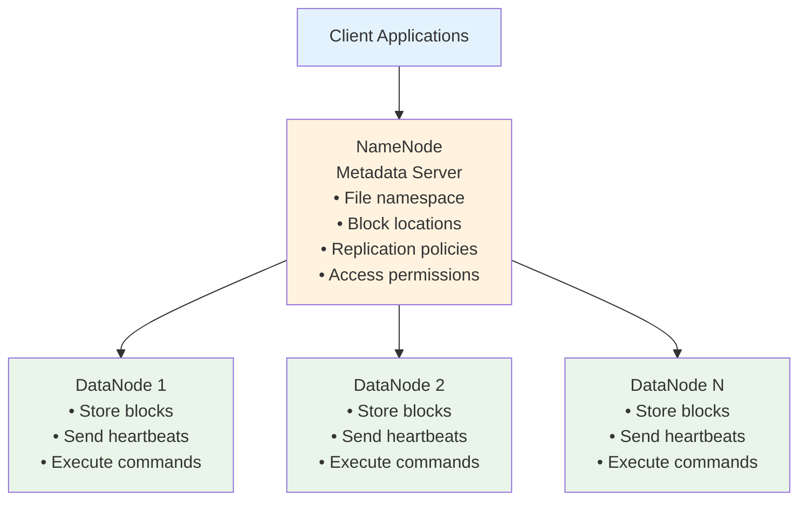
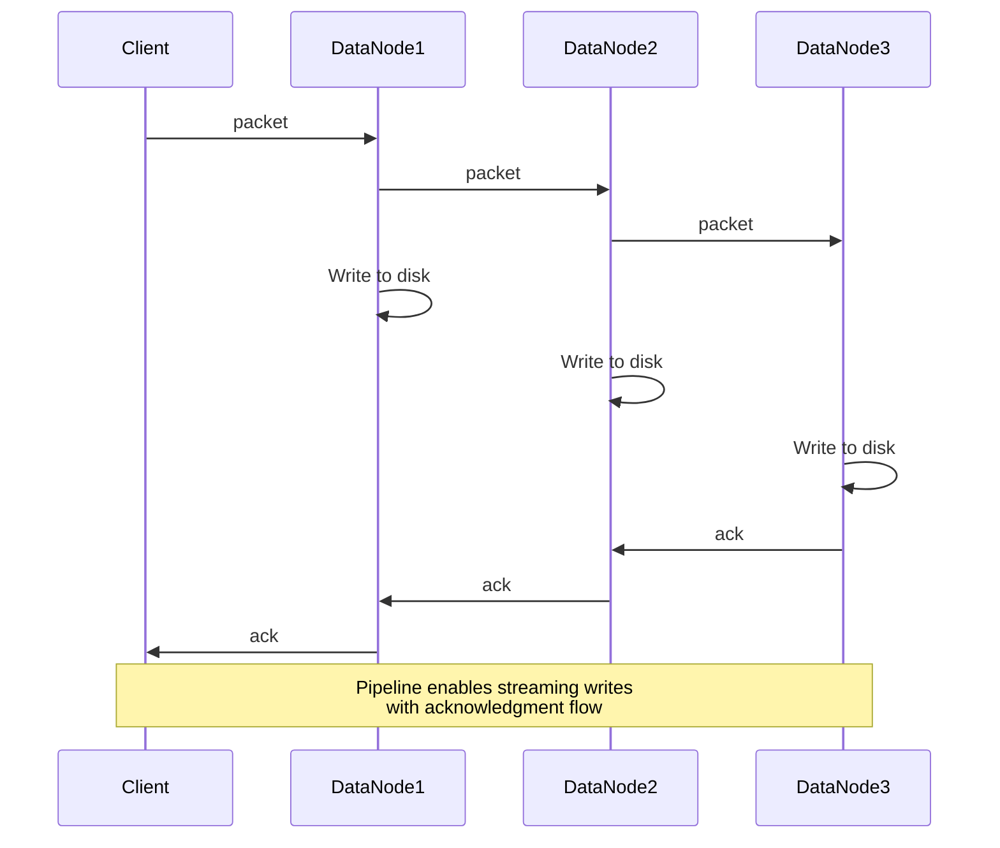
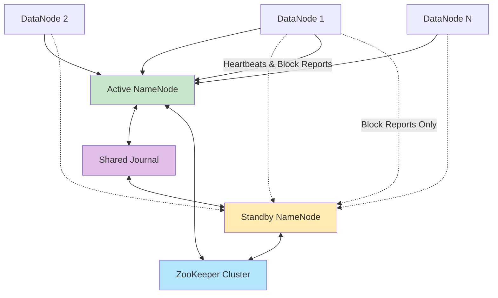

# HDFS Architecture

#hdfs #hadoop #distributed-systems #architecture #namenode #datanode #file-systems #big-data

## Complete System Overview

HDFS (Hadoop Distributed File System) implements all the distributed systems concepts we've discussed in a production-ready system. Here's how all the pieces fit together:



## Core Components

### NameNode (Master)
**Role**: Central metadata server and cluster coordinator

**Responsibilities**:
- Maintains file system namespace (directories, files, permissions)
- Tracks block locations across all DataNodes
- Makes replication decisions
- Handles client metadata requests
- Coordinates cluster operations

**Memory Structure**:
```java
class NameNode {
    // File system namespace
    FSDirectory namespace;           // Directory tree
    
    // Block management  
    BlockManager blockManager;       // Block → DataNode mapping
    Map<Long, BlockInfo> blocks;     // All blocks in system
    
    // DataNode management
    DatanodeManager datanodeManager; // DataNode health & capacity
    HeartbeatManager heartbeats;     // Failure detection
    
    // Client request handling
    NameNodeRpcServer rpcServer;     // Handles client requests
}
```

### DataNode (Workers)
**Role**: Storage nodes that hold actual file data

**Responsibilities**:
- Store file blocks on local disks
- Serve read/write requests from clients
- Send periodic heartbeats to NameNode
- Execute commands from NameNode (replicate, delete blocks)
- Report block corruption

**Local Structure**:
```
DataNode Local Storage:
/hadoop/datanode/
├── current/
│   ├── BP-randomid-namenode-createtime/
│   │   ├── current/
│   │   │   ├── blk_1001        ← Actual block data
│   │   │   ├── blk_1001.meta   ← Block checksum
│   │   │   ├── blk_1002        
│   │   │   └── blk_1002.meta
│   │   └── tmp/                ← Temporary files during writes
│   └── VERSION                 ← DataNode version info
```

## File Operations Flow

### Writing a File
```python
def write_file_to_hdfs(filename, data):
    # 1. Client contacts NameNode
    response = namenode.create_file(filename, replication_factor=3)
    
    # 2. NameNode allocates blocks and chooses DataNode locations
    block_assignments = [
        {'block_id': 'blk_1001', 'locations': ['dn1', 'dn2', 'dn3']},
        {'block_id': 'blk_1002', 'locations': ['dn4', 'dn5', 'dn6']}
    ]
    
    # 3. Client writes each block to DataNodes in pipeline
    for i, block_assignment in enumerate(block_assignments):
        block_data = data[i*128MB:(i+1)*128MB]
        
        # Create pipeline: Client → DN1 → DN2 → DN3
        pipeline = create_pipeline(block_assignment.locations)
        write_block_pipeline(block_data, pipeline)
    
    # 4. Client notifies NameNode of successful completion
    namenode.complete_file(filename)
```

### Pipeline Write Process


### Reading a File
```python
def read_file_from_hdfs(filename):
    # 1. Client asks NameNode for block locations
    block_locations = namenode.get_block_locations(filename)
    
    # Response format:
    # [
    #   {'block_id': 'blk_1001', 'locations': ['dn1', 'dn2', 'dn3'], 'offset': 0},
    #   {'block_id': 'blk_1002', 'locations': ['dn4', 'dn5', 'dn6'], 'offset': 128MB}
    # ]
    
    # 2. Client reads each block from closest DataNode
    file_data = []
    for block_info in block_locations:
        # Choose best DataNode (closest, least loaded)
        best_datanode = choose_best_replica(block_info.locations)
        
        # Read block data directly from DataNode
        block_data = datanode_client.read_block(best_datanode, block_info.block_id)
        file_data.append(block_data)
    
    # 3. Assemble complete file
    return b''.join(file_data)
```

## Block Management Deep Dive

### Block Allocation Strategy
```python
def allocate_new_block(filename, replication_factor):
    # 1. Choose DataNodes for replicas
    replicas = []
    
    # First replica: prefer local DataNode (if client is on cluster)
    first_replica = choose_local_datanode() or choose_random_datanode()
    replicas.append(first_replica)
    
    # Second replica: different rack from first
    second_replica = choose_datanode_different_rack(first_replica.rack)
    replicas.append(second_replica)
    
    # Third replica: same rack as second, different node
    third_replica = choose_datanode_same_rack(second_replica.rack, exclude=second_replica)
    replicas.append(third_replica)
    
    # 2. Generate unique block ID
    block_id = generate_unique_block_id()
    
    # 3. Create block metadata
    block_info = BlockInfo(
        block_id=block_id,
        replicas=replicas,
        size=0,  # Will be updated as data is written
        generation_stamp=current_time()  # For consistency
    )
    
    # 4. Add to NameNode's block map
    self.blocks[block_id] = block_info
    
    return block_info
```

### Block Integrity Verification
```python
def verify_block_integrity():
    """Regular process to check block corruption"""
    
    for block_id, block_info in self.all_blocks.items():
        for replica_location in block_info.replicas:
            # Request checksum from DataNode
            stored_checksum = datanode.get_block_checksum(replica_location, block_id)
            
            # Compare with expected checksum
            expected_checksum = block_info.expected_checksum
            
            if stored_checksum != expected_checksum:
                # Mark replica as corrupt
                self.mark_replica_corrupt(block_id, replica_location)
                
                # Schedule re-replication from good replica
                good_replica = self.find_good_replica(block_id)
                new_location = self.choose_replication_target(block_id)
                self.schedule_replication(block_id, good_replica, new_location)
```

## High Availability Architecture

### Single Point of Failure Problem
Traditional HDFS has a critical weakness: if the NameNode fails, the entire cluster becomes inaccessible even though all data is safely stored on DataNodes.

### Solution: NameNode High Availability (HA)


### Shared Journal Implementation
```python
class JournalNode:
    """Stores NameNode transaction logs for HA"""
    
    def __init__(self):
        self.edit_log = []  # Sequence of all NameNode operations
        self.last_transaction_id = 0
    
    def log_operation(self, operation):
        """Called by Active NameNode for every operation"""
        operation.transaction_id = self.last_transaction_id + 1
        self.edit_log.append(operation)
        self.last_transaction_id += 1
        
        # Sync to disk immediately (durability)
        self.sync_to_disk()
    
    def get_operations_since(self, transaction_id):
        """Called by Standby NameNode to stay in sync"""
        return [op for op in self.edit_log if op.transaction_id > transaction_id]
```

### Failover Process
```python
def handle_active_namenode_failure():
    # 1. ZooKeeper detects Active NameNode failure
    zookeeper.detect_session_timeout('active-namenode')
    
    # 2. Standby NameNode becomes Active
    standby_namenode.transition_to_active()
    
    # 3. Fence the old Active (prevent split-brain)
    fence_old_active_namenode()
    
    # 4. Update ZooKeeper leadership
    zookeeper.update_active_namenode('standby-namenode')
    
    # 5. DataNodes start sending heartbeats to new Active
    notify_datanodes_of_failover()
```

## Performance Optimizations

### Block Caching
```python
class BlockCache:
    """Cache frequently accessed blocks in DataNode memory"""
    
    def __init__(self, max_cache_size):
        self.cached_blocks = {}  # block_id → block_data
        self.access_count = {}   # block_id → access_frequency
        self.max_size = max_cache_size
    
    def cache_block(self, block_id, block_data):
        if len(self.cached_blocks) >= self.max_size:
            # Evict least frequently used block
            lfu_block = min(self.access_count.items(), key=lambda x: x[1])
            del self.cached_blocks[lfu_block[0]]
            del self.access_count[lfu_block[0]]
        
        self.cached_blocks[block_id] = block_data
        self.access_count[block_id] = 1
```

### Client-Side Read Optimization
```python
def optimized_file_read(filename):
    block_locations = namenode.get_block_locations(filename)
    
    # Parallel block reading
    with ThreadPoolExecutor(max_workers=min(len(block_locations), 10)) as executor:
        futures = []
        
        for block_info in block_locations:
            future = executor.submit(read_single_block, block_info)
            futures.append(future)
        
        # Collect results in order
        block_data = []
        for future in futures:
            block_data.append(future.result())
    
    return b''.join(block_data)
```

## Capacity Management

### DataNode Storage Management
```python
def manage_datanode_storage():
    for volume in self.storage_volumes:
        used_ratio = volume.used_space / volume.total_space
        
        if used_ratio > 0.90:  # 90% full
            # Stop accepting new blocks on this volume
            volume.mark_read_only()
            
            # Notify NameNode of reduced capacity
            self.send_capacity_update_to_namenode()
        
        elif used_ratio > 0.85:  # 85% full
            # Start moving blocks to other volumes (if available)
            self.initiate_intra_node_balancing()
```

### Cluster-Wide Balancing
```python
def balance_cluster_capacity():
    """Redistribute blocks to maintain even storage usage"""
    
    # Calculate target utilization
    total_capacity = sum(dn.capacity for dn in self.datanodes)
    total_used = sum(dn.used_space for dn in self.datanodes)
    target_utilization = total_used / total_capacity
    
    # Identify over-utilized and under-utilized nodes
    overutilized = [dn for dn in self.datanodes if dn.utilization > target_utilization + 0.1]
    underutilized = [dn for dn in self.datanodes if dn.utilization < target_utilization - 0.1]
    
    # Move blocks from over-utilized to under-utilized
    for source_node in overutilized:
        for target_node in underutilized:
            blocks_to_move = self.choose_blocks_to_move(source_node, target_node)
            for block in blocks_to_move:
                self.schedule_block_movement(block, source_node, target_node)
```

## Connection to Other Concepts

This architecture brings together all the concepts we've discussed:
- [[Data Chunking and Distribution]] - How HDFS splits files into blocks
- [[Fault Tolerance and Replication]] - How HDFS handles machine failures  
- [[Metadata Management]] - How the NameNode tracks everything
- [[Heartbeat and Failure Detection]] - How HDFS monitors cluster health
- [[Performance vs Reliability Tradeoffs]] - Design decisions in HDFS

---

*Previous: [[Heartbeat and Failure Detection]] | Next: [[Performance vs Reliability Tradeoffs]]*