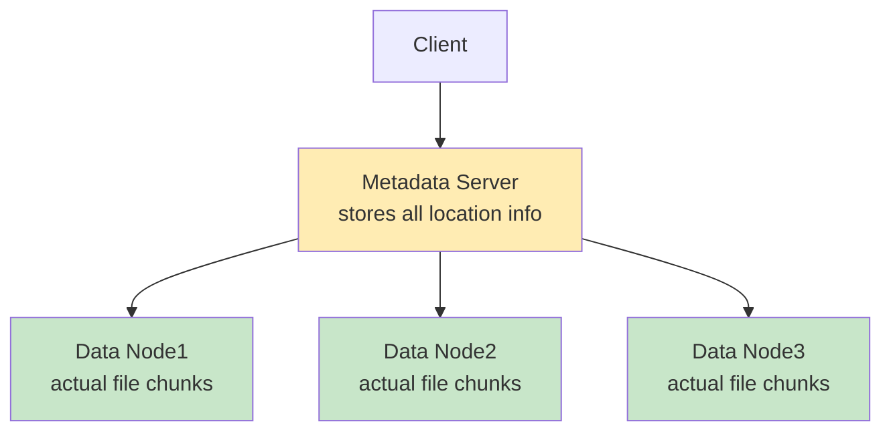
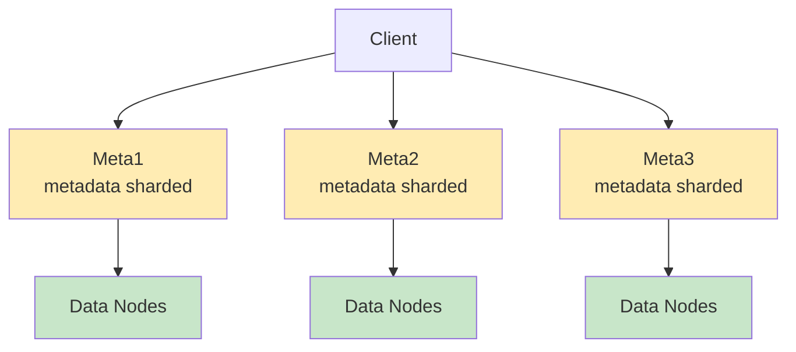

---
tags:
  - distributed-systems
  - metadata
  - namenode
  - consistency
  - performance
  - hdfs
  - data-chunking
  - scalability
---

## The Central Challenge

In a distributed file system with millions of chunks across thousands of machines, how do you efficiently answer the question: "Where is chunk #47 of file big_data.txt?"

## What is Metadata?

**Metadata** = "data about data"

In distributed file systems, metadata includes:
- **File information**: name, size, permissions, creation time
- **Block mapping**: which chunks belong to which files  
- **Location mapping**: which machines store each chunk
- **Replication info**: how many copies exist and where
- **Health status**: which chunks are under-replicated

### Example Metadata Entry
```json
{
  "file": "/user/data/big_data.txt",
  "size": 1099511627776,  // 1TB in bytes
  "blocks": [
    {
      "block_id": "blk_1001",
      "size": 134217728,    // 128MB
      "replicas": [
        {"node": "machine-45", "rack": "rack-7"},
        {"node": "machine-78", "rack": "rack-12"},  
        {"node": "machine-91", "rack": "rack-12"}
      ]
    },
    {
      "block_id": "blk_1002", 
      "size": 134217728,
      "replicas": [
        {"node": "machine-23", "rack": "rack-3"},
        {"node": "machine-67", "rack": "rack-8"},
        {"node": "machine-89", "rack": "rack-8"}
      ]
    }
  ]
}
```

## Why Separate Metadata from Data?

### Performance Benefits
- **Small size**: Metadata is tiny compared to actual data
- **Memory storage**: All metadata can fit in RAM for fast access
- **Centralized**: Single point for quick lookups

### Example Scale Comparison
```
1PB of data at 128MB blocks = 8 million blocks
Metadata per block ≈ 150 bytes
Total metadata ≈ 1.2GB (fits easily in memory)

Storing 1.2GB metadata vs. searching 1PB data
Speed difference: ~1,000,000x faster
```

## Metadata Architecture Patterns

### Pattern 1: Centralized Metadata Server


**Advantages**: 
- Simple consistency model
- Fast lookups
- Easy to implement

**Disadvantages**:
- Single point of failure
- Performance bottleneck
- Scalability limits

### Pattern 2: Distributed Metadata


**Advantages**:
- No single point of failure  
- Better scalability
- Distributed load

**Disadvantages**:
- Complex consistency
- Harder to implement
- Cross-shard operations expensive

## HDFS Approach: NameNode Architecture

### Single NameNode Design
HDFS uses Pattern 1 (centralized) with optimizations:

```python
class NameNode:
    def __init__(self):
        self.namespace = {}  # file/directory tree
        self.block_map = {}  # block_id -> [replica locations]
        self.node_map = {}   # node_id -> [blocks stored]
        
    def get_block_locations(self, filename):
        """Client calls this to find where file chunks are"""
        blocks = self.namespace[filename].blocks
        locations = []
        for block_id in blocks:
            replicas = self.block_map[block_id]
            locations.append(replicas)
        return locations
```

### Why Single NameNode Works
1. **Metadata is small**: Even petabytes of data = gigabytes of metadata
2. **Memory storage**: All metadata kept in RAM for speed
3. **Optimized data structures**: Efficient hash maps and trees
4. **Batch operations**: Multiple operations per client request

## Handling NameNode Failures

### The Problem
If the NameNode fails, the entire cluster becomes inaccessible even though all data is safely stored on DataNodes.

### Solution 1: Secondary NameNode (Backup)
```python
# Secondary NameNode periodically saves NameNode state
def backup_metadata():
    namespace_snapshot = primary_namenode.export_namespace()
    block_mapping_snapshot = primary_namenode.export_blocks()
    save_to_disk(namespace_snapshot, block_mapping_snapshot)
```

**Recovery process**:
1. Detect NameNode failure
2. Start new NameNode instance  
3. Load latest snapshot from Secondary NameNode
4. Replay recent transaction logs
5. Rebuild block locations by querying all DataNodes

### Solution 2: High Availability (Active/Standby)
```
[Active NameNode] ↔ [Shared Journal] ↔ [Standby NameNode]
       |                                        |
   [ZooKeeper] ←--- coordination ---→ [ZooKeeper]
```

**How it works**:
1. Active and Standby NameNodes share transaction log
2. Standby continuously applies changes from shared log
3. ZooKeeper handles failover coordination
4. Automatic switchover in seconds (not minutes)

## Consistency Challenges

### The Metadata Update Problem
When a DataNode fails, metadata must be updated. But what if multiple NameNode replicas exist?

```
Scenario: DataNode-5 fails

Option A: Update all replicas immediately
- Risk: What if one replica is temporarily unreachable?
- Problem: Inconsistent state across replicas

Option B: Update replicas periodically  
- Risk: Stale metadata directs clients to failed nodes
- Problem: Poor user experience, wasted network calls
```

### HDFS Solution: Ordered Updates
```python
def handle_datanode_failure(failed_node):
    # 1. Write change to persistent journal FIRST
    journal.write(f"NODE_FAILED:{failed_node}:{timestamp}")
    
    # 2. Update in-memory structures
    self.remove_node_blocks(failed_node)
    
    # 3. Standby replicas apply journal changes
    # This ensures consistent ordering of all updates
```

## Performance Optimization

### Caching Strategies
```python
class NameNode:
    def __init__(self):
        self.location_cache = {}  # Recently requested locations
        self.hot_files = {}       # Frequently accessed files
        
    def get_locations(self, filename):
        if filename in self.location_cache:
            return self.location_cache[filename]
        
        # Expensive lookup
        locations = self.compute_locations(filename)
        self.location_cache[filename] = locations
        return locations
```

### Batch Operations
Instead of:
```
Client: "Where is block 1 of file X?"
Client: "Where is block 2 of file X?"  
Client: "Where is block 3 of file X?"
```

Better:
```
Client: "Where are ALL blocks of file X?"
NameNode: [locations for all blocks]
```

### Load Balancing Metadata Reads
```python
def choose_replica_for_read(replicas):
    """Choose best replica based on client location and node load"""
    
    # Prefer local replicas
    local_replicas = [r for r in replicas if r.rack == client_rack]
    if local_replicas:
        return min(local_replicas, key=lambda r: r.current_load)
    
    # Fall back to least loaded replica
    return min(replicas, key=lambda r: r.network_distance + r.current_load)
```

## Metadata Storage Details

### In-Memory Structures
```java
// Simplified HDFS NameNode memory layout
class NameNode {
    Map<String, INodeFile> namespace;      // /path/to/file -> file info
    Map<Long, BlockInfo> blocks;           // block_id -> block metadata  
    Map<String, DatanodeInfo> datanodes;   // node_id -> node info
    
    // Memory usage: ~150 bytes per block
    // 1 million blocks ≈ 150MB RAM
}
```

### Persistent Storage
```
NameNode disk storage:
/hadoop/namenode/
├── fsimage         ← Complete namespace snapshot
├── edits           ← Transaction log (recent changes)
├── fsimage.md5     ← Checksum verification
└── edits.md5       ← Transaction log checksum
```

### Startup Process
```python
def namenode_startup():
    # 1. Load latest complete snapshot
    namespace = load_fsimage()
    
    # 2. Replay all changes since snapshot
    changes = load_edits_log()
    for change in changes:
        namespace.apply(change)
    
    # 3. Enter safe mode (read-only)
    enter_safe_mode()
    
    # 4. Wait for DataNodes to report their blocks
    wait_for_block_reports()
    
    # 5. Verify sufficient replicas exist
    if sufficient_replicas():
        exit_safe_mode()
```

## Connection to Other Concepts

- [[Data Chunking and Distribution]] - What metadata describes
- [[Fault Tolerance and Replication]] - How metadata tracks replicas  
- [[Heartbeat and Failure Detection]] - How metadata gets updated
- [[HDFS Architecture]] - How Hadoop implements metadata management

---

*Previous: [[Fault Tolerance and Replication]] | Next: [[Heartbeat and Failure Detection]]*