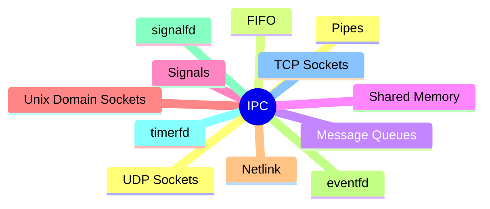
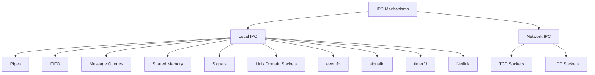
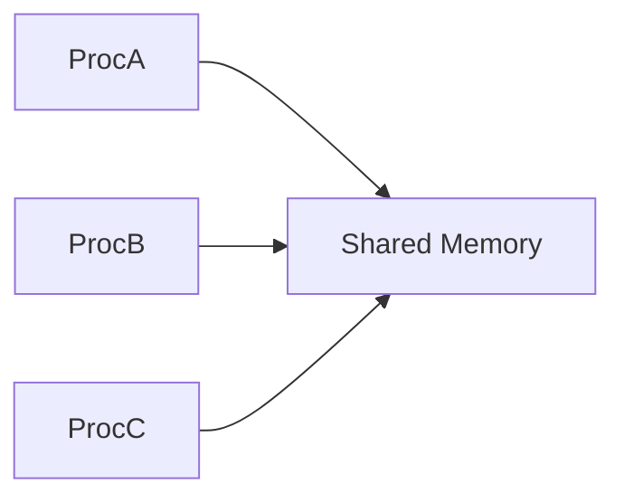
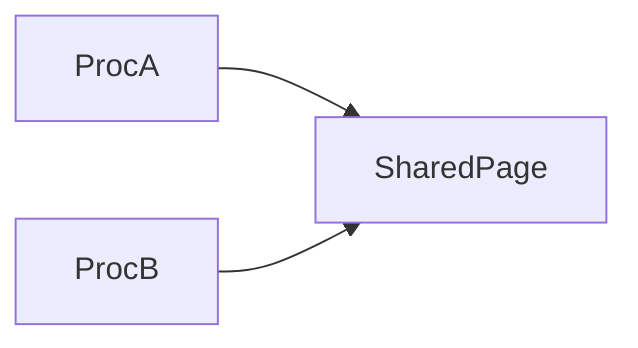
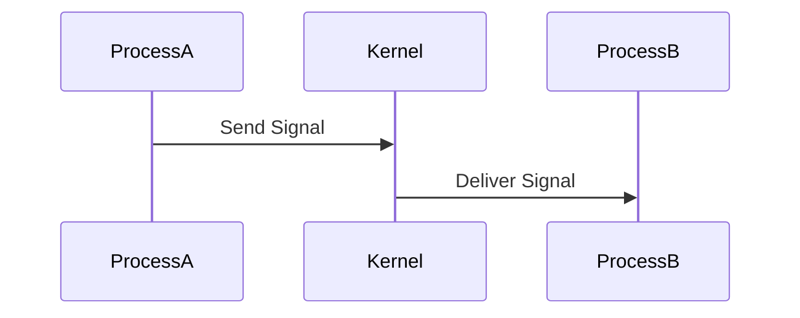
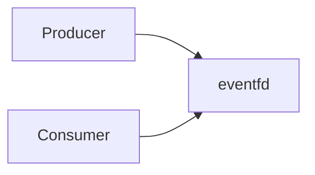
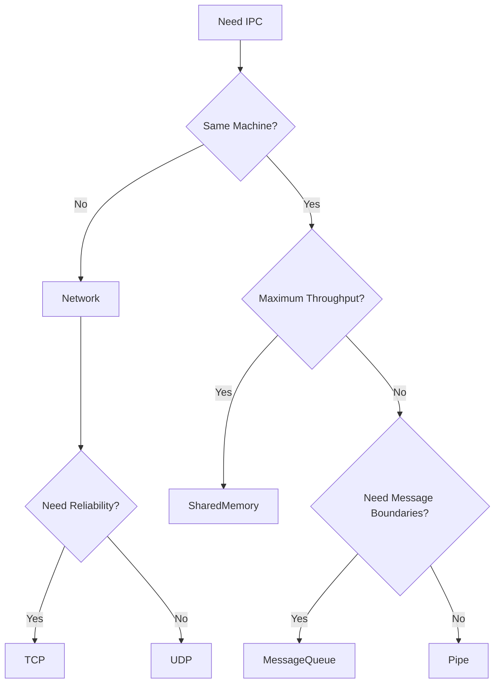

---
tags:
  - basics
  - architecture
  - design-decisions
---
# IPC Mechanisms

## Definition

Inter-Process Communication (IPC) mechanisms allow independent processes to exchange information.

A true IPC mechanism transfers data, notifications, or messages from one process to another.

---

# IPC Mechanisms Overview



---

# IPC Classification



---

# Pipes

## Purpose

A unidirectional byte stream between related processes.

Typically used between parent and child processes.

---

## Architecture


---

## Characteristics

|Property|Value|
|---|---|
|Message Boundaries|No|
|Direction|One-way|
|Related Processes|Usually Yes|
|Kernel Buffered|Yes|

---

## Common Usage

```bash
cat file.txt | grep error
```

---

# FIFO (Named Pipes)

## Purpose

A pipe represented by a filesystem object.

Allows unrelated processes to communicate.

---

## Architecture


---

## Characteristics

|Property|Value|
|---|---|
|Message Boundaries|No|
|Direction|One-way|
|Related Processes Required|No|
|Filesystem Path|Yes|

---

# Message Queues

## Purpose

Kernel-managed queues containing discrete messages.

---

## Architecture


---

## Characteristics

|Property|Value|
|---|---|
|Message Boundaries|Yes|
|Ordering|Preserved|
|Priority Support|Yes|
|Kernel Buffered|Yes|

---

## Advantages

- Asynchronous communication
- Natural producer-consumer model
- Message prioritization

---

# Shared Memory

## Purpose

Multiple processes map the same memory region.

Processes communicate by reading and writing shared memory.

---

## Architecture



---

## Characteristics

|Property|Value|
|---|---|
|Message Boundaries|No|
|Copy Required|No|
|Throughput|Very High|
|Synchronization Required|Yes|

---

## Why It Is Fast



No kernel-mediated copying after setup.

---

# Signals

## Purpose

Deliver asynchronous notifications to another process.

---

## Architecture



---

## Characteristics

|Property|Value|
|---|---|
|Data Transfer|Minimal|
|Asynchronous|Yes|
|Reliable Queueing|Limited|
|Notification Only|Mostly|

---

## Common Signals

|Signal|Purpose|
|---|---|
|SIGINT|Interrupt|
|SIGTERM|Graceful termination|
|SIGKILL|Immediate termination|
|SIGUSR1|User-defined|
|SIGUSR2|User-defined|

---

# Unix Domain Sockets

## Purpose

Bidirectional communication between processes on the same machine.

---

## Architecture


---

## Characteristics

|Property|Value|
|---|---|
|Bidirectional|Yes|
|Message Boundaries|Optional|
|Local Only|Yes|
|High Performance|Yes|

---

## Typical Users

- Docker
- Wayland
- System services
- Local daemons

---

# Netlink

## Purpose

Communication channel between user-space and the Linux kernel.

---

## Architecture


---

## Typical Uses

- Routing table updates
- Network configuration
- Firewall management
- Interface events

---

# eventfd

## Purpose

Kernel event counter used for notifications.

---

## Architecture



---

## Characteristics

|Property|Value|
|---|---|
|Payload|64-bit Counter|
|Pollable|Yes|
|Lightweight|Yes|

---

## Typical Uses

- Event loops
- Wakeup notifications
- epoll integration

---

# signalfd

## Purpose

Receive signals through a file descriptor.

Converts signals into readable events.

---

## Architecture


---

## Benefits

Traditional signal handlers become unnecessary.

Works naturally with:

- poll
- select
- epoll

---

# timerfd

## Purpose

Receive timer expirations through a file descriptor.

---

## Architecture


---

## Benefits

Timers become readable events.

Integrates cleanly with event loops.

---

# TCP Sockets

## Purpose

Reliable communication between processes across machines.

---

## Architecture


---

## Characteristics

|Property|Value|
|---|---|
|Reliable|Yes|
|Ordered Delivery|Yes|
|Streaming|Yes|
|Networked|Yes|

---

## Common Users

- Databases
- REST APIs
- gRPC
- SSH

---

# UDP Sockets

## Purpose

Connectionless communication between processes.

---

## Architecture


---

## Characteristics

|Property|Value|
|---|---|
|Reliable|No|
|Ordered|No|
|Fast|Yes|
|Networked|Yes|

---

## Common Users

- DNS
- VoIP
- Video Streaming
- Multiplayer Games

---

# Choosing an IPC Mechanism



---

# Relative Performance

Approximate throughput ranking:

```text
Shared Memory
    ↓
Unix Domain Sockets
    ↓
Pipes
    ↓
Message Queues
    ↓
TCP Sockets
    ↓
UDP Sockets
    ↓
Signals
```

Actual performance depends on workload and kernel implementation.

---

# Key Takeaways

1. Pipes and FIFOs provide byte streams.
2. Message queues provide discrete messages.
3. Shared memory provides the highest throughput.
4. Signals provide notifications rather than bulk data transfer.
5. Unix domain sockets are the preferred local service IPC mechanism.
6. Netlink is the standard userspace ↔ kernel communication channel.
7. eventfd, signalfd, and timerfd integrate IPC with Linux event loops.
8. TCP and UDP extend IPC beyond a single machine.
9. these are just mechanisms to pass data around, you can still face concurrency problems which could be solved using [[Synchronization Mechanisms]] 