---
tags:
  - basics
  - architecture
---
## Definition

Synchronization mechanisms coordinate execution between threads or processes.

Their purpose is to:

- Prevent race conditions
- Protect shared resources
- Coordinate execution order
- Implement waiting and notification semantics

Unlike IPC mechanisms, synchronization primitives generally do **not transfer application data**.

---

# Synchronization Mechanisms Overview

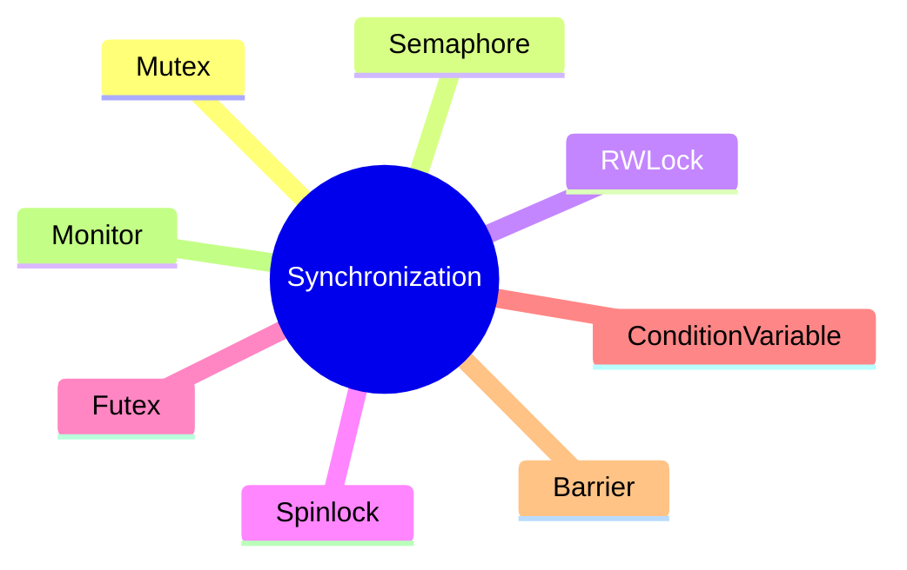

---

# Classification

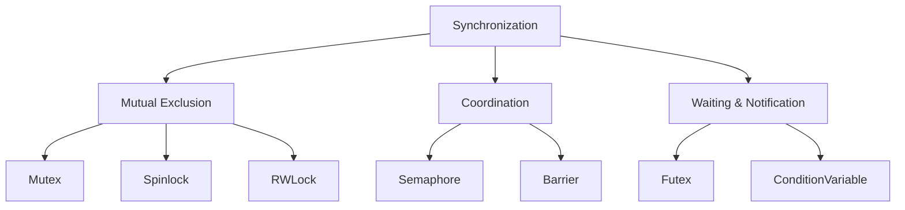

---

# The Race Condition Problem

Synchronization exists to prevent races.

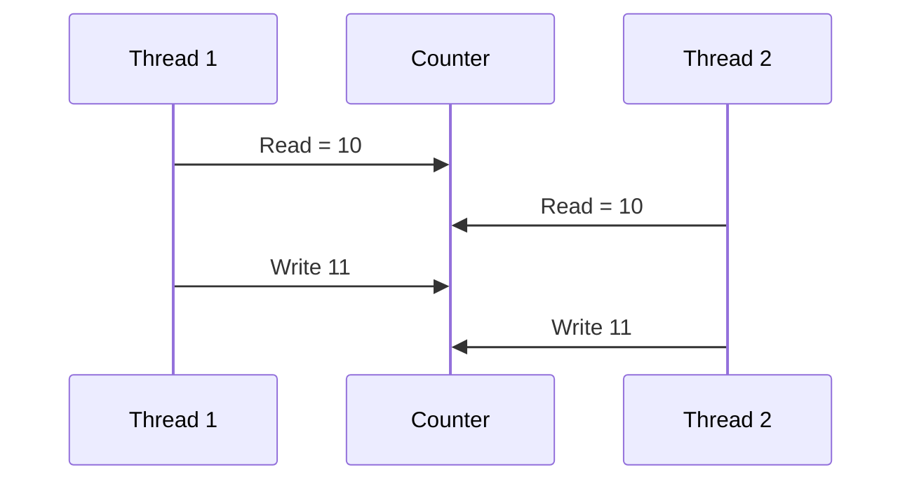

Expected:

```text
12
```

Actual:

```text
11
```

One increment is lost.

---

# Mutex

## Definition

A mutex (Mutual Exclusion Lock) allows only one thread to enter a critical section at a time.

---

## Architecture

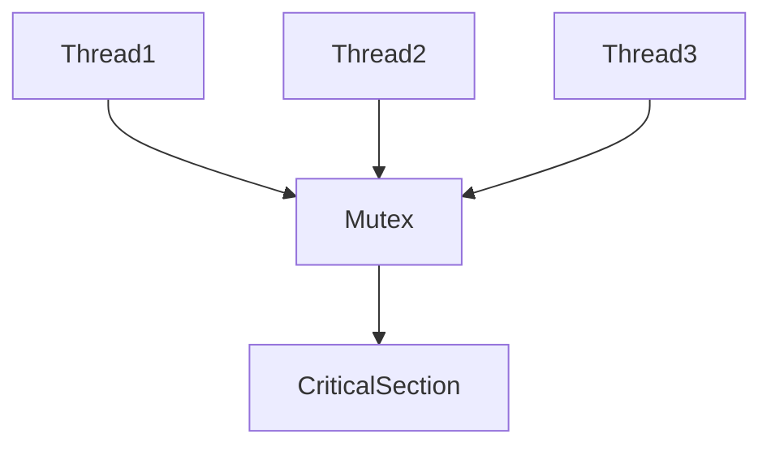

---

## Critical Section


---

## Characteristics

|Property|Value|
|---|---|
|Ownership|Yes|
|Blocking|Yes|
|Fairness|Implementation Dependent|
|Reentrant|Usually No|

---

## Use Cases

- Protecting shared data structures
- Database connection pools
- Caches
- Reference counters

---

# Spinlock

## Definition

A lock where waiting threads continuously retry instead of sleeping.

---

## Architecture

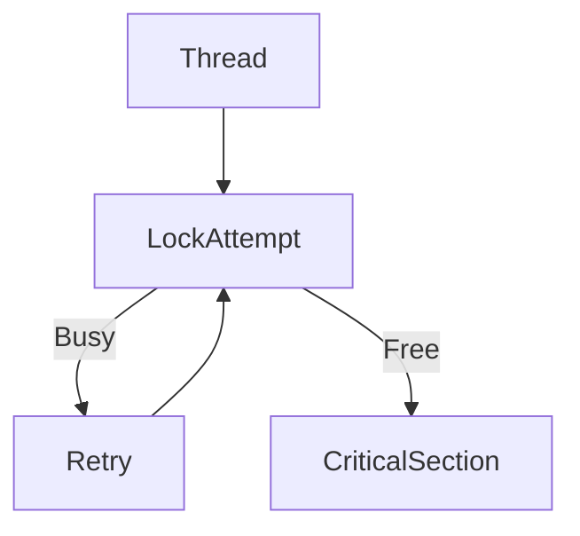

---

## Characteristics

|Property|Value|
|---|---|
|Sleeps|No|
|CPU Usage|High|
|Latency|Very Low|
|Kernel Usage|Minimal|

---

## Best For

Short critical sections.

---

## Bad For

Long waits.

---

# Read-Write Lock (RWLock)

## Definition

Allows:

- Multiple readers simultaneously
- One writer exclusively

---

## Architecture

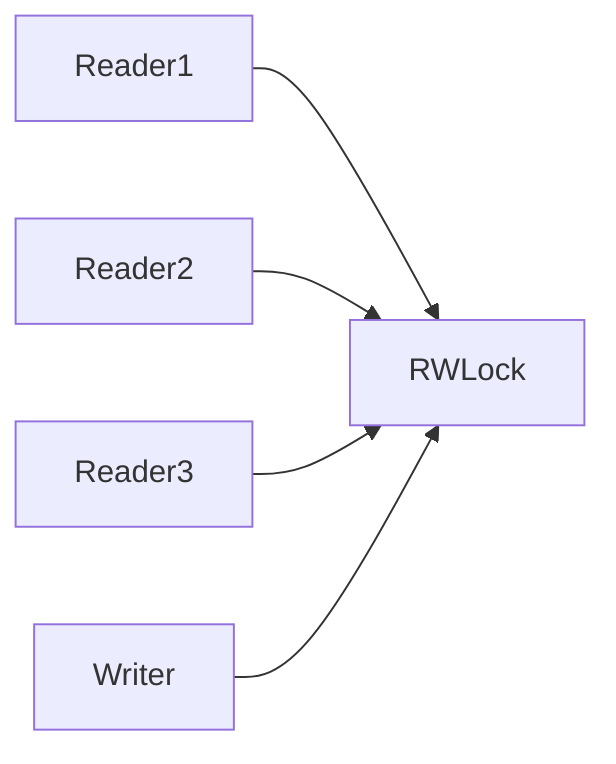

---

## Access Rules

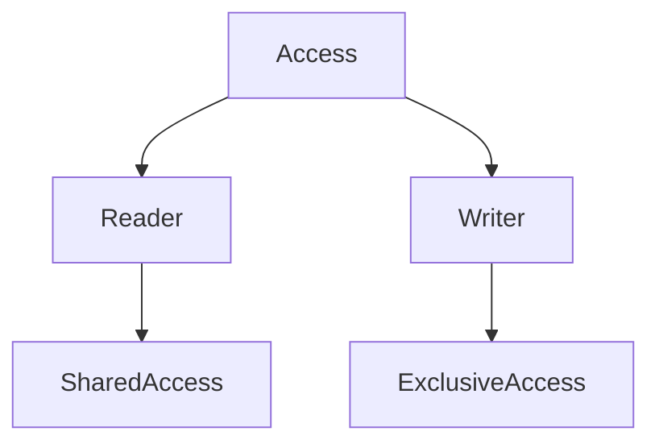

---

## Best For

Read-heavy workloads.

Examples:

- Configuration stores
    
- In-memory databases
    
- Caches
    

---

# Semaphore

## Definition

A counter-based synchronization primitive.

Controls access to a limited number of resources.

---

## Architecture

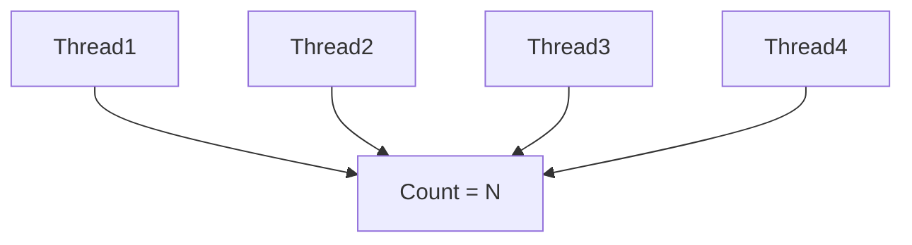

---

## Types

### Binary Semaphore

```text
0 or 1
```

Similar to a mutex.

---

### Counting Semaphore

```text
0 ... N
```

Controls access to multiple resources.

---

## Example

Database pool:

```text
10 connections available
```

Semaphore count:

```text
10
```

---

# Condition Variable

## Definition

Allows threads to sleep until a condition becomes true.

---

## Architecture

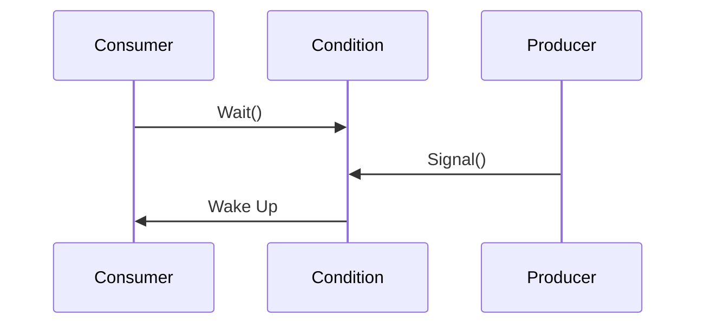

---

## Typical Pattern

```text
while (!condition)
    wait()

proceed()
```

---

## Use Cases

- Producer-consumer systems
    
- Task queues
    
- Job schedulers
    

---

# Futex

## Definition

Fast Userspace Mutex.

Linux synchronization primitive that only enters the kernel when contention occurs.

---

## Architecture

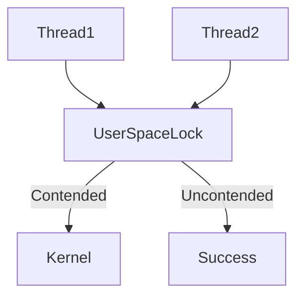

---

## Why Futex Is Fast

Most lock operations occur entirely in userspace.

Kernel involvement happens only when blocking becomes necessary.

---

## Used By

- pthread mutexes
    
- Rust synchronization primitives
    
- Java synchronization
    
- Go runtime
    

---

# Barrier

## Definition

Forces a group of threads to wait until all participants arrive.

---

## Architecture

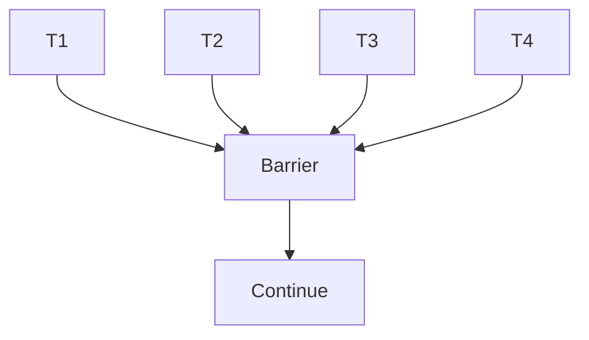

---

## Example

```text
4 threads required

Thread 1 arrives
Thread 2 arrives
Thread 3 arrives

Wait...

Thread 4 arrives

Release all 4
```

---

## Use Cases

- Scientific computing
    
- Parallel algorithms
    
- Simulation systems
    

---

# Monitor

## Definition

A monitor combines:

- Shared data
    
- Mutex
    
- Condition variables
    

into a single abstraction.

---

## Architecture

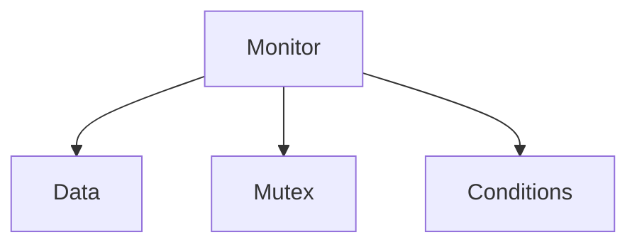

---

## Languages Using Monitors

- Java
    
- C#
    
- Kotlin
    

---

# Synchronization Primitive Comparison

|Primitive|Ownership|Multiple Holders|Sleep|Best For|
|---|---|---|---|---|
|Mutex|Yes|No|Yes|General locking|
|Spinlock|Yes|No|No|Very short sections|
|RWLock|Yes|Readers Only|Yes|Read-heavy workloads|
|Semaphore|No|Yes|Yes|Resource limits|
|Condition Variable|No|N/A|Yes|Waiting for events|
|Futex|Depends|No|Yes|High-performance locking|
|Barrier|No|Many|Yes|Parallel phases|

---

# Relationships

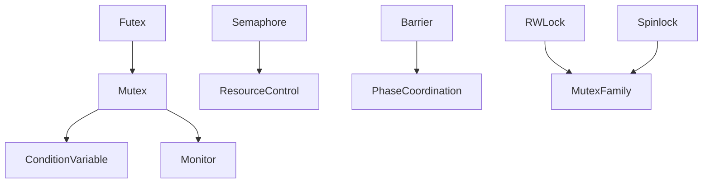

---

# How Modern Languages Use Them

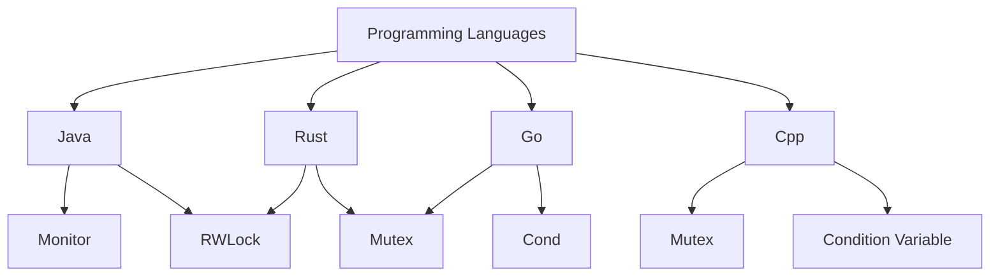

---

# Key Takeaways

1. Synchronization primitives coordinate execution rather than transfer data.
    
2. Mutexes are the most common locking primitive.
    
3. Spinlocks trade CPU usage for lower latency.
    
4. RWLocks improve performance in read-heavy workloads.
    
5. Semaphores control access to limited resources.
    
6. Condition variables implement wait/notify patterns.
    
7. Futexes are the foundation of many modern locking implementations on Linux.
    
8. Barriers synchronize phases of parallel execution.
    
9. Monitors combine data protection and coordination into a single abstraction.