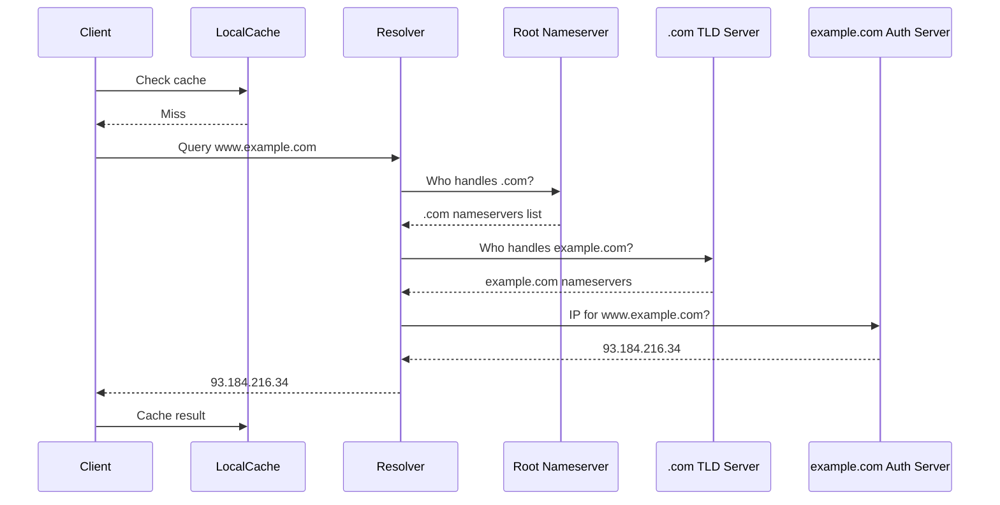
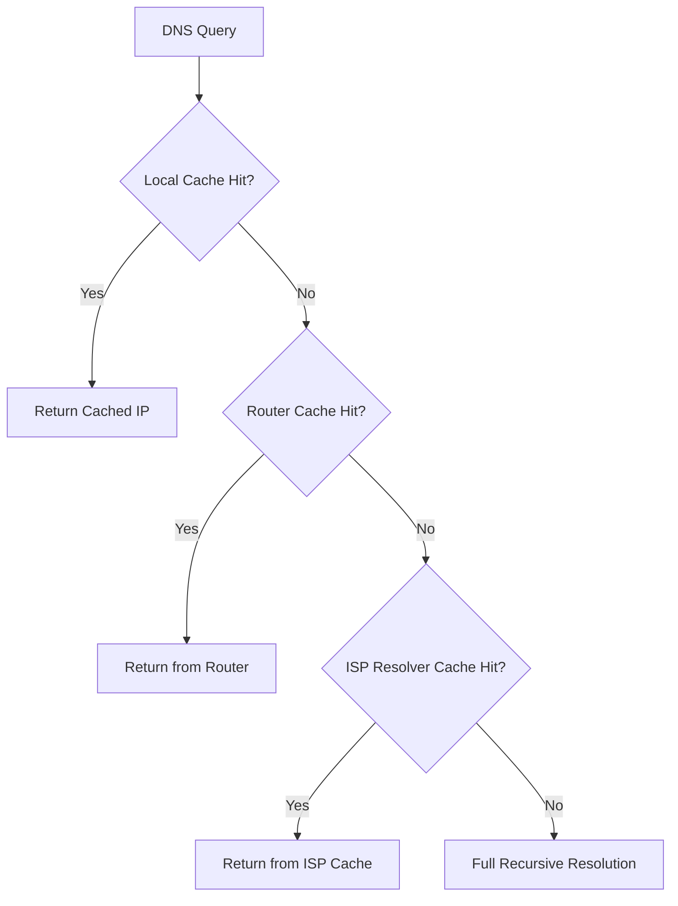
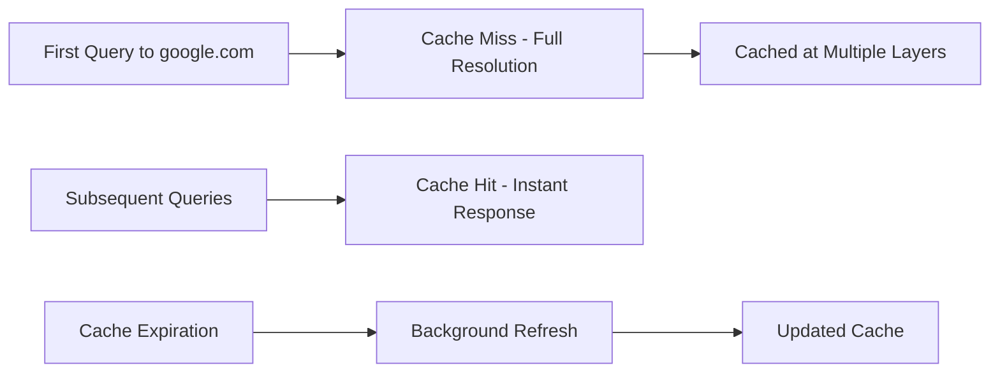

---
tags:
  - dns
  - query-resolution
  - recursive-resolution
  - authoritative-servers
---

## Full Resolution Path (Cache Miss Scenario)

When resolving www.example.com with no cached data:

## Cache-Optimized Resolution (Common Case)

Most queries skip the full hierarchy due to caching:

## Resolution Types

### Recursive Resolution
- Client sends single query to resolver
- Resolver handles entire resolution process
- Client receives final answer
- **Used by**: End-user devices

### Iterative Resolution
- Client handles resolution step-by-step
- Server provides referrals to next nameserver
- Client follows referral chain manually
- **Used by**: DNS servers communicating with each other

## Caching Layers

### Layer 1: Application Cache
- **Location**: Browser, OS resolver
- **TTL**: Respects DNS record TTL
- **Scope**: Single device
- **Performance**: Sub-millisecond response

### Layer 2: Local Network Cache
- **Location**: Router/gateway device
- **Scope**: All devices on local network
- **Benefit**: Shared cache across household/office

### Layer 3: ISP Resolver Cache
- **Location**: ISP's DNS infrastructure
- **Scope**: All ISP customers
- **Benefit**: Massive shared cache for popular domains

### Layer 4: Authoritative Server Cache
- **Location**: DNS servers themselves
- **Purpose**: Cache data about other domains they've queried

## Popular Domain Acceleration

**Effect**: Popular domains become faster to resolve due to widespread caching

## TTL Impact on Resolution

Different record types, different caching strategies:
- **A records**: Often 300-3600 seconds TTL
- **NS records**: Often 24-48 hours TTL  
- **Root hints**: Rarely change, cached for days

**Trade-off**: Longer TTL = better performance, slower propagation of changes

---
**Related**: [[DNS Caching Architecture]] | [[DNS Message Structure]] | [[Authoritative vs Recursive Servers]]