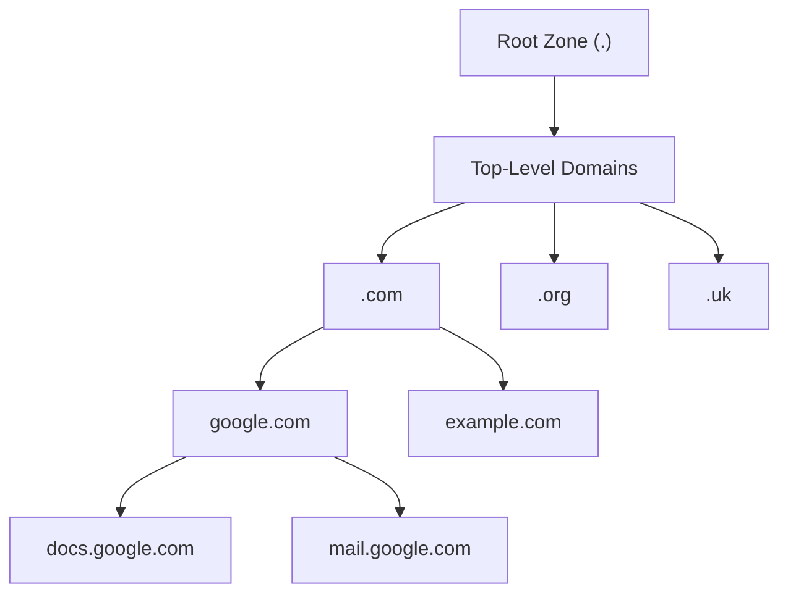

---
tags:
  - dns
  - networking
  - name-resolution
  - internet-infrastructure
---
## Core Function
Domain Name System translates human-readable domain names to IP addresses that computers use for communication.

**Problem solved**: Humans remember "google.com" better than 142.250.191.14

## Hierarchical Structure

**Key insight**: Distributed system where no single server needs complete internet knowledge

## DNS Resolution Process
[[DNS Query Resolution Process]]

## Related Components
- [[DNS Message Structure]] 
- [[DNS Record Types]] 
- [[DNS Caching Architecture]] 
- [[DNS Transport Protocols]]
- [[DNS Security (DNSSEC)]] 

## Integration with Network Stack
- **Above**: Application layer protocols (HTTP, SMTP)
- **Below**: UDP/TCP transport layer
- **Infrastructure**: Global anycast networks
- **Dependencies**: Internet routing (BGP), NAT translation

## Performance Characteristics
- **Query time**: Typically 10-100ms globally
- **Cache hit rates**: 80-95% for popular domains
- **Throughput**: Major resolvers handle millions of queries/second
- **Availability**: 99.9%+ uptime through redundancy

---
**See also**: [[Network Protocol Stack]]