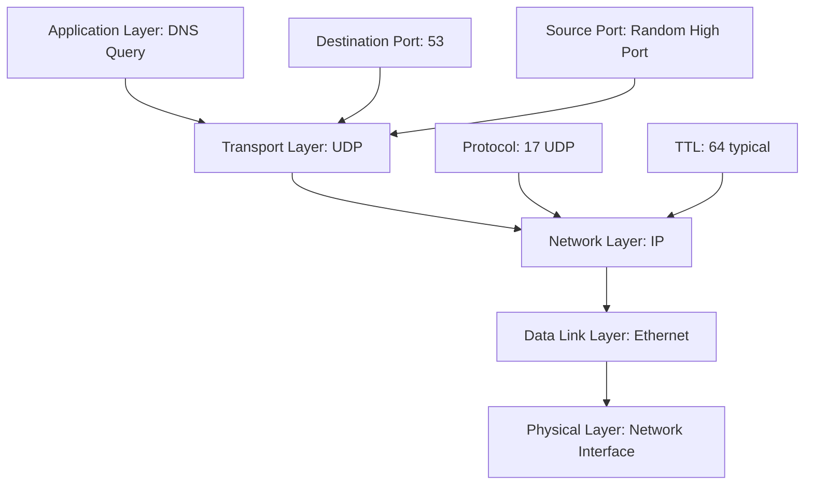

---
tags:
  - dns
  - udp
  - tcp
  - transport-layer
  - protocol-selection
---

## Primary Transport: UDP

### Why UDP for DNS?

**Connection overhead elimination**:
- No 3-way handshake required
- No connection teardown
- Single request-response exchange
- **Benefit**: Minimal latency for simple queries

**Failure handling simplicity**:
- Packet loss = timeout and retry entire query
- No need to track partial state
- **Contrast with TCP**: Complex retransmission of specific segments

**Performance characteristics**:
- Query size: Typically 50-100 bytes
- Response size: Usually 200-500 bytes  
- **Total**: Perfect fit for single UDP datagram

### UDP Size Limitations

**Traditional limit**: 512 bytes
**EDNS0 extension**: Allows larger responses (typically 1232-4096 bytes)
**Fragmentation concerns**: Larger UDP packets may fragment, reducing reliability

## TCP Fallback Scenarios

### When DNS Uses TCP

**Large responses triggering TCP**:
- DNSSEC responses with cryptographic signatures
- Zone transfers (AXFR/IXFR)
- Responses with many resource records
- TXT records with extensive data

**Truncation mechanism**:
1. Server sets TC (truncated) bit in UDP response
2. Client receives truncated response
3. Client automatically retries identical query over TCP
4. Server sends complete response

### TCP-Specific Features

**Zone transfers**:
- Primary to secondary server synchronization
- Always uses TCP due to large data volumes
- Uses multiple DNS messages in sequence

**Connection persistence**:
- Single TCP connection can carry multiple DNS queries
- Reduces connection overhead for bulk operations
- **Used by**: DNS servers, not typical client queries

## Network Stack Integration

### UDP DNS Query Path

### Checksum and Error Detection

**UDP checksum**:
- Covers UDP header, payload, and IP pseudo-header
- Detects corruption in transit
- **Failure handling**: Packet discarded, client timeout triggers retry

**IP checksum**:
- Covers IP header only
- Ensures routing information integrity
- Recalculated at each router hop

## Port Number Usage

### Well-Known Port 53
- **Server listening port**: Always 53
- **Client source port**: Random ephemeral port (32768-65535)
- **Response routing**: Server sends response to client's source port

### NAT Implications
Client may use port 34567, but router's NAT translates to different external port for uniqueness

## Performance Optimization

### Query pipelining
- Multiple outstanding queries simultaneously
- Different Query IDs distinguish responses
- **Limitation**: UDP provides no ordering guarantees

### Happy Eyeballs for DNS
- Parallel queries to multiple DNS servers
- Use first successful response
- **Fallback strategy**: IPv4 and IPv6 queries simultaneously

## Security Considerations

### Vulnerability: Lack of Authentication
- UDP responses can be spoofed
- Cache poisoning attacks possible
- **Mitigation**: DNSSEC, query ID randomization, source port randomization

### DoT and DoH Evolution
- **DNS over TLS (DoT)**: TCP port 853
- **DNS over HTTPS (DoH)**: HTTPS port 443
- **Trade-off**: Security vs performance overhead

---
**Related**: [[NAT Translation Mechanics]] | [[Internet Routing with BGP]] | [[DNS Security Extensions]]