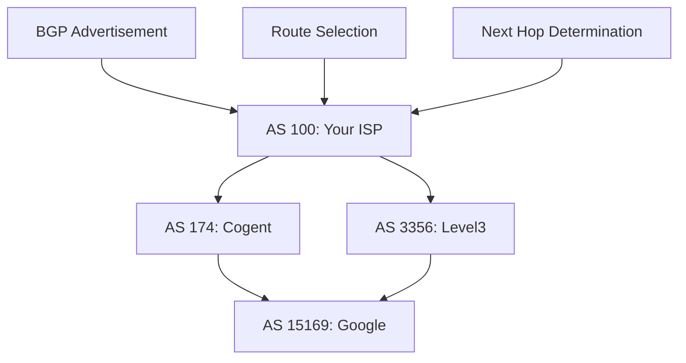
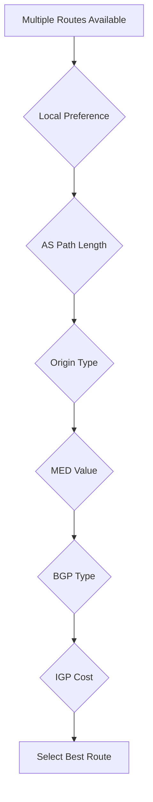
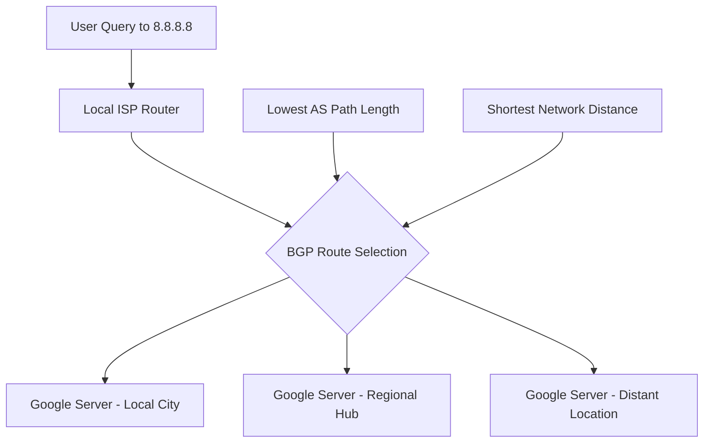

---
tags:
  - bgp
  - internet-routing
  - routing-tables
  - network-prefixes
  - autonomous-systems
---
## Routing Scale Problem

**Challenge**: Internet has billions of IP addresses across millions of networks
**Solution**: Route aggregation using network prefixes instead of individual IPs

### Network Prefix Concept
Instead of storing routes to individual IPs, routers store routes to ranges:
- Route to 8.8.8.8 specifically
- Route to 8.8.8.0/24 (covers 8.8.8.0-8.8.8.255) 

## Border Gateway Protocol (BGP)

### Purpose
Protocol that allows routers to share routing information about network reachability across the global internet.

### Autonomous Systems (AS)
- **Definition**: Collection of networks under single administrative control
- **Examples**: ISPs, large corporations, cloud providers
- **AS Numbers**: Unique identifiers (e.g., AS15169 = Google)



## Routing Table Structure

### Example Routing Table Entry
```
Network: 8.8.8.0/24
Next Hop: 203.0.113.1
AS Path: 100 174 15169
Metric: 150
Local Preference: 100
```

### Longest Prefix Matching
Router chooses most specific route that matches destination:

**Example for 8.8.8.8**:
- Route 1: 0.0.0.0/0 (default route)
- Route 2: 8.0.0.0/8 (Google's broader range)
- Route 3: 8.8.8.0/24 (specific Google DNS range)
- **Selection**: Route 3 (longest prefix /24)

## BGP Route Selection Process

### Multi-step decision algorithm:
1. **Highest Local Preference**: Administrative policy
2. **Shortest AS Path**: Fewest autonomous systems
3. **Lowest Origin**: IGP < EGP < Incomplete
4. **Lowest MED**: Multi-Exit Discriminator from neighbor AS
5. **eBGP over iBGP**: External over internal routes
6. **Lowest IGP Cost**: Internal routing protocol cost
7. **Lowest Router ID**: Tie-breaker



## Route Propagation

### BGP UPDATE Messages
Routers share routing information through UPDATE messages:
- **NLRI**: Network Layer Reachability Information (prefixes)
- **Path Attributes**: AS_PATH, NEXT_HOP, LOCAL_PREF, etc.
- **Withdrawal**: Remove previously advertised routes

### Convergence Process
When network topology changes:
1. Change detected by directly connected router
2. BGP UPDATE sent to all neighbors
3. Each router updates routing table
4. Propagation continues across internet
5. **Convergence time**: Seconds to minutes globally

## Latency Optimization in Routing

### Path Selection Factors

**AS Path Length**:
- Shorter AS paths generally mean fewer router hops
- **Assumption**: Fewer hops = lower latency
- **Reality**: Not always true due to physical distance

**IGP Metrics**:
- Interior Gateway Protocol costs within AS
- Can incorporate measured latency, bandwidth, utilization
- **Examples**: OSPF cost, ISIS metric

### Real-world Latency Calculation

Router making forwarding decision knows:
- **Direct latency** to each neighbor (measured via keepalives)
- **Advertised path costs** from BGP neighbors
- **Calculated total**: Direct + advertised = end-to-end estimate

**Example calculation from our discussion**:
- Path via Router B: 5ms (direct) + 20ms (advertised) = 25ms total
- Path via Router C: 2ms (direct) + 30ms (advertised) = 32ms total
- **Selection**: Router B path (lower total latency)

## Anycast Routing

### Global Service Implementation
Services like Google DNS (8.8.8.8) use anycast:
- **Same IP announced** from multiple geographic locations
- **BGP selects** topologically closest instance
- **Result**: Automatic latency optimization



## Route Flapping and Stability

### BGP Dampening
- **Problem**: Unstable routes cause constant updates
- **Solution**: Exponential backoff for flapping routes
- **Effect**: Temporary route suppression until stability

### Convergence Issues
- **Split-brain scenarios**: Different routers have different views
- **Black holes**: Routes exist but destination unreachable
- **Loops**: Temporary during convergence periods

## Performance Impact on DNS

### Route optimization benefits:
- **Automatic**: BGP selects efficient paths without manual configuration
- **Dynamic**: Adapts to network failures and congestion
- **Global scale**: Works across entire internet infrastructure

### Limitations:
- **Convergence delays**: Route changes take time to propagate
- **Policy vs performance**: Business relationships may override optimal paths
- **Information lag**: Route advertisements based on slightly stale information

---
**Related**: [[DNS Caching Architecture]] | [[Network Stack Layering]] | [[Anycast Implementation]]