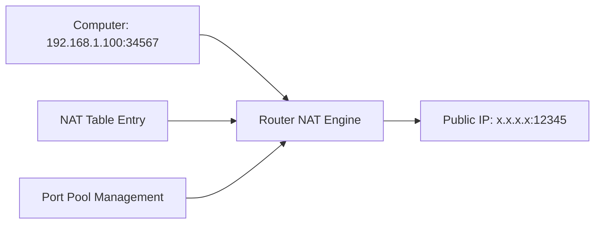
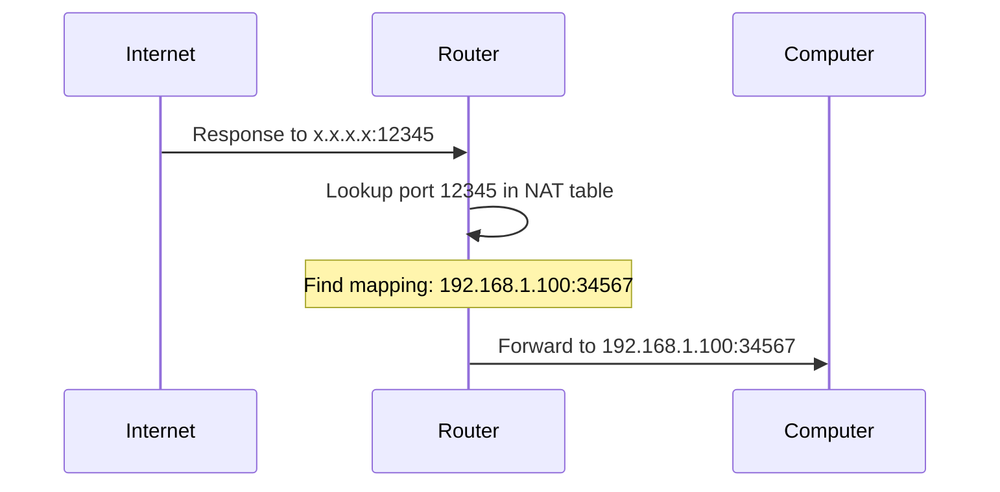
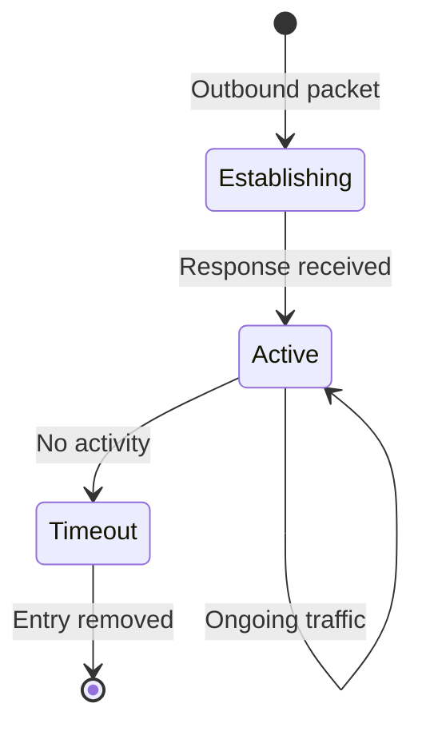

---
tags:
  - nat
  - network-address-translation
  - routing
  - port-mapping
---
## Core Problem
Private IP addresses (192.168.x.x, 10.x.x.x) not routable on internet. Multiple devices behind single public IP need unique identification.

## NAT Translation Process

### Outbound Translation


**Header modifications**:
- Source IP: 192.168.1.100 → Router's public IP
- Source port: 34567 → Unique external port (12345)
- Destination unchanged: 8.8.8.8:53

### NAT Table Structure

| External Port | Internal IP | Internal Port | Protocol | Destination |
|---------------|-------------|---------------|----------|-------------|
| 12345 | 192.168.1.100 | 34567 | UDP | 8.8.8.8:53 |
| 12346 | 192.168.1.101 | 34567 | UDP | 8.8.8.8:53 |
| 12347 | 192.168.1.100 | 45678 | TCP | 93.184.216.34:80 |

**Key insight**: External port becomes unique identifier for internal connection

### Inbound Translation



**Header modifications on return**:
- Destination IP: Router's public IP → 192.168.1.100
- Destination port: 12345 → 34567
- Source unchanged: 8.8.8.8:53

## Port Pool Management

### Ephemeral Port Allocation
- **Range**: Typically 1024-65535 available for NAT
- **Strategy**: Sequential or random allocation
- **Collision handling**: Router ensures uniqueness per destination

### Connection Tracking


**Timeout values**:
- UDP connections: 30-300 seconds typically
- TCP connections: Track connection state
- **Cleanup**: Prevents NAT table exhaustion

## Collision Avoidance

### Scenario: Multiple devices, same source port
- Device A (192.168.1.100) uses port 34567 → DNS query
- Device B (192.168.1.101) uses port 34567 → DNS query  
- Both targeting 8.8.8.8:53

**NAT solution**:
- Device A mapped to external port 12345
- Device B mapped to external port 12346
- **Result**: No collision, unique external identification

## NAT Types and Behaviors

### Full Cone NAT
- External mapping applies to any external host
- **Security**: Lower (allows unsolicited inbound)
- **Compatibility**: Highest for P2P applications

### Restricted Cone NAT  
- External mapping restricted to destinations contacted
- **Behavior**: Can receive from 8.8.8.8 only after sending to 8.8.8.8

### Port-Restricted Cone NAT
- Mapping restricted to specific destination IP:port combinations
- **Most common**: Home router default behavior

### Symmetric NAT
- Different mapping for each destination
- **Security**: Highest
- **Compatibility**: Causes issues with some applications

## Impact on DNS Performance

### Connection reuse limitations
- Each DNS query may get different external port
- **Effect**: Cannot reuse connections across queries
- **Workaround**: DNS over persistent TCP connections

### Load balancer complications
- Multiple external ports for same internal client
- **Issue**: Server-side connection tracking becomes complex

## Troubleshooting NAT Issues

### Common symptoms
- Intermittent connectivity
- Applications working internally but failing externally
- Port conflicts under high load

### Diagnostic commands
```bash
# View NAT table (Linux)
cat /proc/net/nf_conntrack

# Check port exhaustion
netstat -an | grep :53 | wc -l
```

---
**Related**: [[Internet Routing with BGP]] | [[ARP Protocol]] | [[Network Stack Layering]]