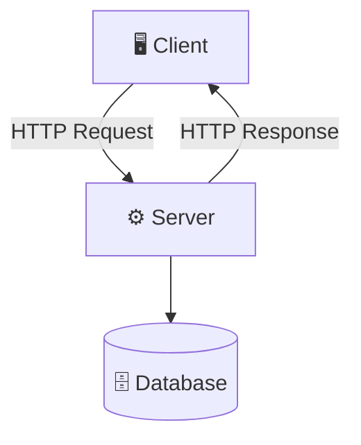

---
tags:
  - basics
  - system-design
  - architecture
---
* the simplest and most used of all the architectures in the world
* simplest yet the most powerful 
* on one side, you have a client - this could be a web browser, a mobile app, or any other front-end application. 
* and on the other side, you have a server - a machine/process that runs continuously, waiting for the client to ask for something 
* client sends a request to store, retrieve, or modify data
* servers receives the request, process it, performs the necessary operations, and sends back a response

* the server does the computation most of the time, unless there's a specific reason for it to not to, for example if there are minute computations/ logic that can be executed on the client side without raising any security issues, it's off-boarded to the client for execution
* this architecture is used by http server / clients -- modern websites and daemon systems such as the one used by emacs -- the daemon is the server and the emacs window is the client 
* note that there's no compulsion that the communication between the server and client has to happen over a network for it to be called this architecture, it just has to happen via any one of the [[IPC Mechanisms]]s