---
tags:
  - design-pattern
  - oo-programming
  - java
---
# {{Pattern Name}} Pattern
## Intent

> One-sentence description of what problem this pattern solves.

---

## Classification

|Property|Value|
|---|---|
|Category|Creational / Structural / Behavioral|
|Complexity|Low / Medium / High|
|Frequency of Use|Rare / Common / Very Common|
|Introduced In|GoF|

---

## Problem

Describe the situation that motivates the pattern.

### Symptoms

- Symptom 1
    
- Symptom 2
    
- Symptom 3
    

### Example Scenario

```text
Describe the real software problem.
```

---

## Solution

Explain the core idea.

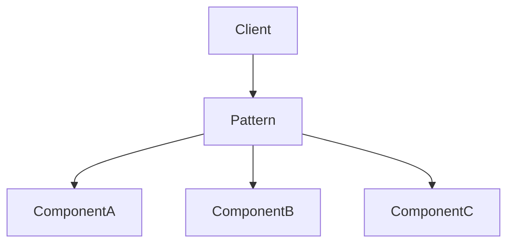

---

## Structure

### UML Diagram

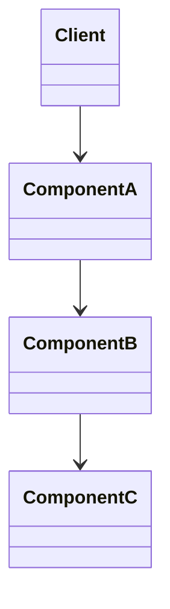

---

## Participants

### Client

Responsibilities:

- Responsibility 1
    
- Responsibility 2
    

### Participant A

Responsibilities:

- Responsibility 1
    
- Responsibility 2
    

### Participant B

Responsibilities:

- Responsibility 1
    
- Responsibility 2
    

---

## Collaboration

### Runtime Interaction

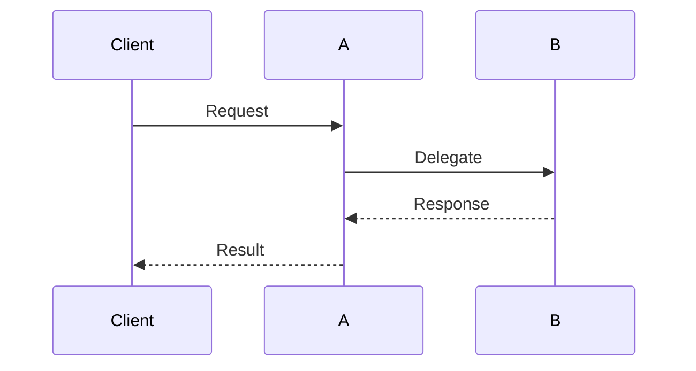

---

## Implementation

### Example

```java
// Example code
```

### Key Points

- Point 1
    
- Point 2
    
- Point 3
    

---

## Object Graph

Show how objects relate at runtime.

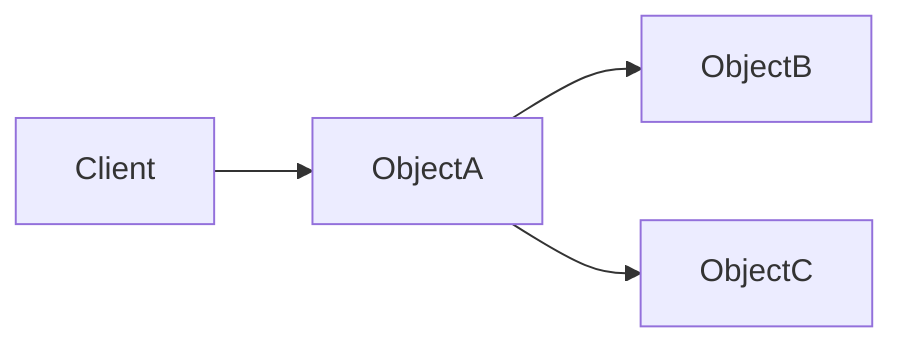

---

## Before Applying Pattern

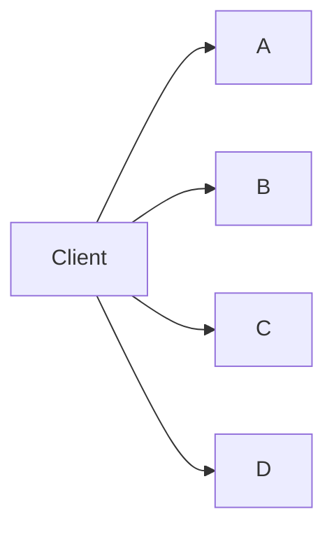

Problems:

- Tight coupling
    
- Repeated logic
    
- Difficult maintenance
    

---

## After Applying Pattern

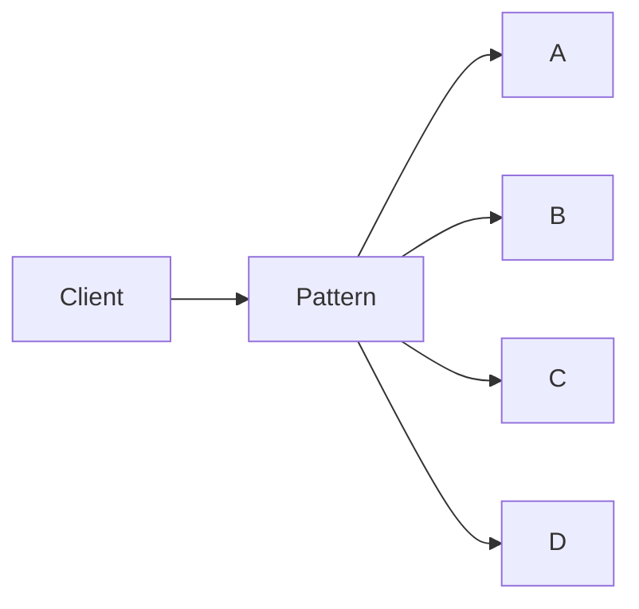

Benefits:

- Lower coupling
    
- Better maintainability
    
- Simpler API
    

---

## Real-World Analogy

### Analogy

Describe the real-world equivalent.

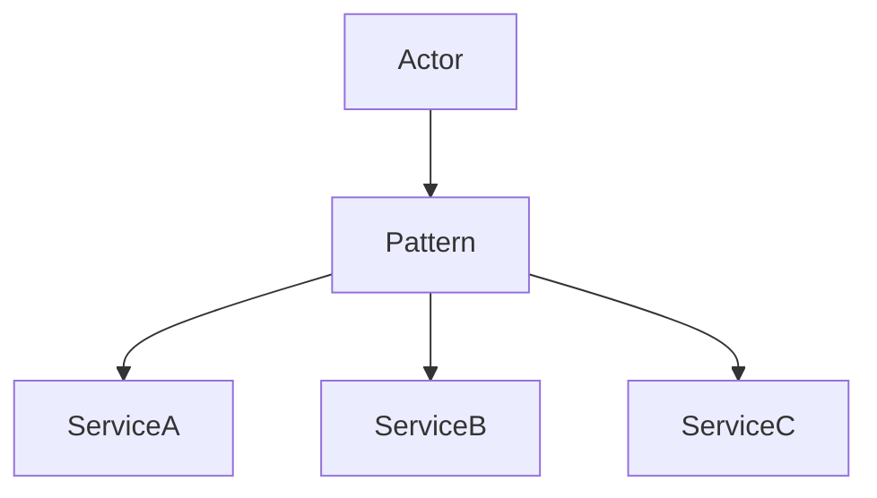

---

## Benefits

### 1. Benefit Name

Explanation.

### 2. Benefit Name

Explanation.

### 3. Benefit Name

Explanation.

---

## Drawbacks

### 1. Drawback Name

Explanation.

### 2. Drawback Name

Explanation.

### 3. Drawback Name

Explanation.

---

## Recognition

You probably need this pattern when:

- Condition 1
    
- Condition 2
    
- Condition 3
    
- Condition 4
    

### Code Smells

- Large switch statements
    
- Tight coupling
    
- Excessive object creation
    
- Repeated workflows
    

---

## Common Use Cases

### Use Case 1

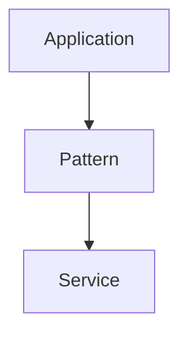

### Use Case 2

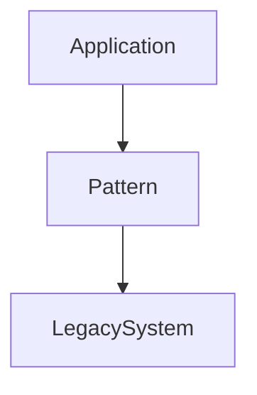

### Use Case 3

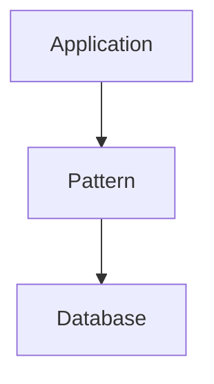

---

## Trade-Offs

|Advantage|Cost|
|---|---|
|Advantage 1|Cost 1|
|Advantage 2|Cost 2|
|Advantage 3|Cost 3|

---

## Comparison with Related Patterns

### vs Pattern A

|{{Pattern Name}}|Pattern A|
|---|---|
|Purpose|Purpose|
|Structure|Structure|
|Use Case|Use Case|

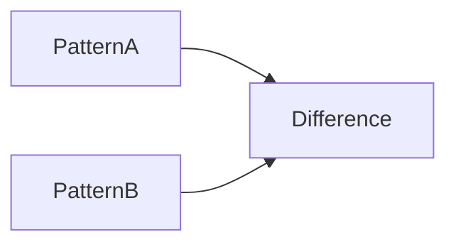

---

### vs Pattern B

|{{Pattern Name}}|Pattern B|
|---|---|
|Purpose|Purpose|
|Structure|Structure|
|Use Case|Use Case|

---

## Refactoring Recipe

1. Identify the problem.
    
2. Locate the varying behavior.
    
3. Extract abstractions.
    
4. Introduce the pattern.
    
5. Move responsibilities.
    
6. Simplify client code.
    

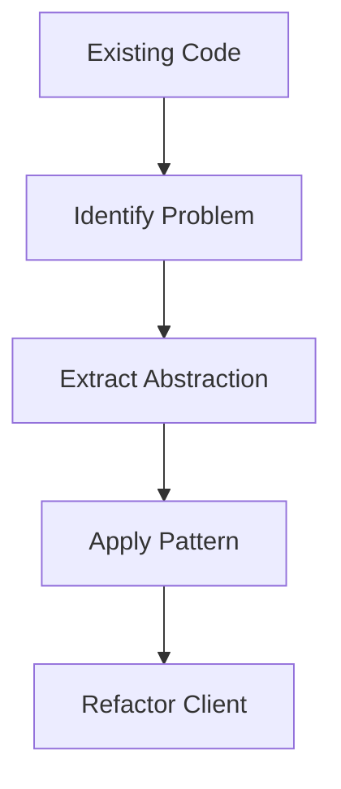

---

## Performance Considerations

|Aspect|Impact|
|---|---|
|CPU|Low / Medium / High|
|Memory|Low / Medium / High|
|Complexity|Low / Medium / High|

Notes:

- Considerations here.
    

---

## Concurrency Considerations

- Thread safety concerns
    
- Synchronization concerns
    
- Shared state concerns
    

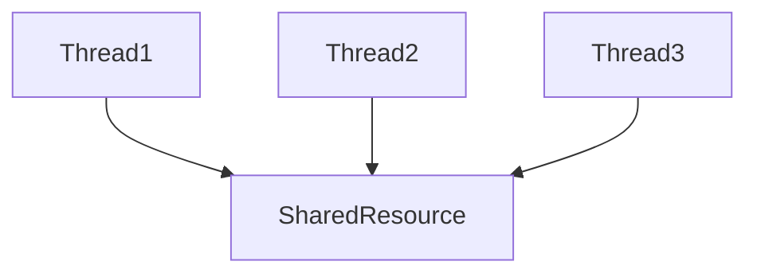

---

## Testing Strategy

### Unit Tests

- Test scenario 1
    
- Test scenario 2
    

### Integration Tests

- Test scenario 1
    
- Test scenario 2
    

### Edge Cases

- Edge case 1
    
- Edge case 2
    

---

## Interview Notes

### When to Mention

- Scenario 1
    
- Scenario 2
    

### Common Interview Question

> Why would you use {{Pattern Name}} instead of {{Related Pattern}}?

Answer:

- Point 1
    
- Point 2
    
- Point 3
    

---

## Rule of Thumb

> One-sentence mental model of the pattern.

---

## Related Patterns

- [[Pattern A]]
    
- [[Pattern B]]
    
- [[Pattern C]]
    

---

## References

- GoF Design Patterns
    
- Head First Design Patterns
    
- Pattern-Oriented Software Architecture